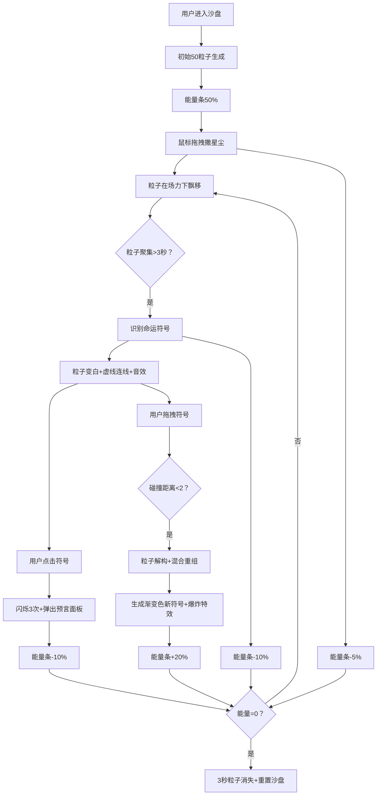

## 1. 产品概述

星尘占卜与命运交织沙盘是一款基于浏览器的3D交互式占卜体验应用，让用户化身为宇宙占星师，在虚拟沙盘中挥洒数字星尘，观察粒子在命运之力的牵引下排列成神秘的命运符号。

- 核心体验：通过撒星尘、观察符号形成、解读运势、融合符号等沉浸式交互，营造神秘的宇宙占卜氛围
- 目标用户：对占星、占卜、神秘学感兴趣的年轻用户，以及追求新奇交互体验的科技爱好者
- 产品价值：将抽象的占星概念转化为可视化、可交互的3D体验，兼具娱乐性与艺术性

## 2. 核心功能

### 2.1 功能模块

1. **星尘粒子系统**：2000个粒子组成的动态粒子系统，支持用户交互撒尘、自动游走、碰撞发光
2. **命运符号识别**：DBSCAN聚类算法识别粒子聚集区，匹配星座/命运之轮/生命之树模板
3. **运势解读系统**：点击符号弹出半透明毛玻璃面板，展示随机命运预言文本
4. **符号拖拽融合**：拖拽两个符号碰撞融合，生成新的渐变色符号与爆炸特效
5. **星尘余烬能量系统**：能量条监控系统状态，归零后自动重置沙盘
6. **宇宙氛围系统**：静态星空、银河粒子带、流星划过等环境效果

### 2.3 页面详情

| 页面名称 | 模块名称 | 功能描述 |
|-----------|-------------|---------------------|
| 沙盘主界面 | 星尘粒子系统 | 2000个粒子的simplex-noise场驱动运动，鼠标拖拽撒尘（30-50粒子/次），粒子碰撞交换颜色并产生发光脉冲 |
| 沙盘主界面 | 命运符号识别 | 每帧检测粒子聚集区（半径1.5内>20粒子），3秒后匹配模板，成功后粒子变白静止、虚线连线动画0.8秒、播放440Hz短音 |
| 沙盘主界面 | 运势解读面板 | 点击符号闪烁3次（0.3秒周期），弹出毛玻璃面板展示200-300字预言，5秒自动淡出，点击外部关闭 |
| 沙盘主界面 | 符号融合系统 | 拖拽符号碰撞（距离<2），粒子解构1秒后混合重组，生成渐变色新符号，触发200粒子爆炸特效2秒 |
| 沙盘主界面 | 能量条系统 | 底部300x6px渐变能量条，撒尘-5%、成形-10%、融合+20%，归零后3秒粒子消失并重置沙盘 |
| 沙盘主界面 | 宇宙背景 | 500颗静态星星、2000粒子银河带（120秒旋转周期）、每10-15秒随机流星划过 |

## 3. 核心流程

用户进入沙盘 → 初始50个粒子从中心生成（能量条50%）→ 鼠标拖拽撒放星尘 → 观察粒子在场力下飘移聚集 → 聚集区稳定3秒后识别命运符号 → 点击符号解读运势预言 → 拖拽两个符号碰撞融合产生新符号 → 能量条动态变化 → 能量归零自动重置沙盘

## 4. 用户界面设计

### 4.1 设计风格

- **主色调**：暗夜紫黑渐变 #0a0a1a → #1a0a2a 径向渐变背景
- **强调色**：蓝紫 #4a2aff、紫红 #ff4aff 渐变用于粒子和能量条
- **符号颜色**：亮白 #ffffff、闪烁时 #ffaa00
- **文字颜色**：淡紫 #e0d0ff
- **字体**：无衬线字体，标签14px白色带0.2px发光，解读面板12px #e0d0ff
- **布局风格**：全屏幕沙盘，无边框，所有UI半透明浮于场景之上
- **视觉特效**：毛玻璃（backdrop-filter: blur(8px)）、柔和辉光（模糊投影4px）、虚线连线动画

### 4.2 页面设计概览

| 页面名称 | 模块名称 | UI元素 |
|-----------|-------------|-------------|
| 沙盘主界面 | 3D场景 | Three.js全景渲染，16:9比例居中，边缘黑边，径向渐变背景 |
| 沙盘主界面 | 星尘粒子 | 0.1-0.3单位大小，紫蓝到紫红随机色，半透明0.6，微弱点光源发光 |
| 沙盘主界面 | 宇宙背景 | 500静态星星+2000银河粒子带+随机流星 |
| 沙盘主界面 | 能量条 | 底部中央，300x6px，圆角3px，#4a2aff→#ff4aff渐变，4px模糊辉光 |
| 沙盘主界面 | 符号标签 | CSS2D渲染，14px白色，0.2px淡紫发光，符号正上方3单位，面向相机 |
| 沙盘主界面 | 解读面板 | 半透明毛玻璃，rgba(26,26,46,0.85)背景，1px白色边框，圆角12px，内边距16px |
| 沙盘主界面 | 微动画 | 点击脉冲、波纹扩散、淡出、粒子爆发，时长0.3-0.8秒 |

### 4.3 响应式

- 桌面端优先设计，画布保持16:9比例居中显示
- 窗口边缘留黑边，确保场景比例不变形
- 支持鼠标旋转缩放视角（OrbitControls）

### 4.4 3D场景指引

- **环境与氛围**：暗夜星空径向渐变背景，银河粒子带缓慢旋转，偶尔流星划过
- **光照设置**：环境光AmbientLight(0x404060, 0.5)，粒子自身带微弱点光源
- **相机设置**：PerspectiveCamera(60, 16/9, 0.1, 1000)，初始位置(0, 0, 15)，OrbitControls支持旋转缩放
- **构图与焦点**：粒子聚集区域为视觉焦点，符号形成时通过连线和发光突出
- **交互与动画**：粒子场力运动0.5-2单位/秒，连线动画0.8秒，符号闪烁0.3秒周期，爆炸特效0.6-2秒
- **性能预算**：总粒子≤2500，特效粒子≤200且生命周期≤2秒，CSS2D标签≤10个，目标60fps
