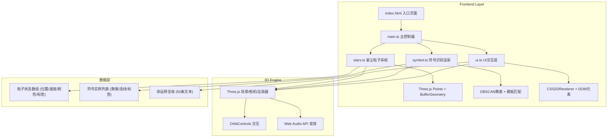
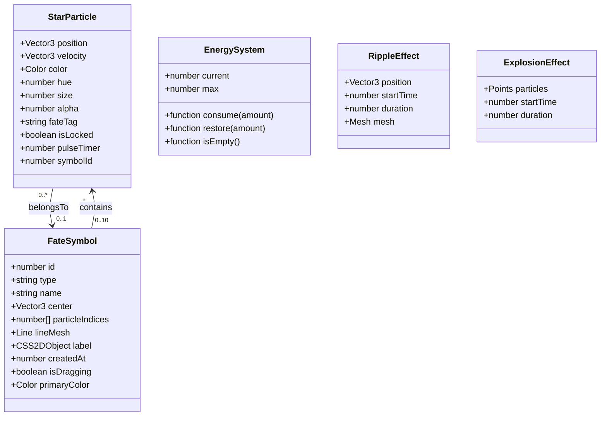

## 1. 架构设计



## 2. 技术描述

- **前端框架**: 原生 TypeScript 5.5.0 + Three.js 0.160.0（不使用React，采用模块化架构）
- **构建工具**: Vite 5.4.0，启用 TypeScript 编译
- **粒子噪声**: simplex-noise 3.0.0，用于粒子自动游走的场力计算
- **UI渲染**: CSS2DRenderer（Three.js官方扩展）用于2D标签，原生DOM+CSS用于能量条和解读面板
- **音效**: Web Audio API 原生 OscillatorNode 生成440Hz短音
- **后端**: 无后端，纯前端单页应用
- **数据**: 所有预言文本内置为常量数组，粒子状态存储于内存中

## 3. 路由定义

| 路由 | 用途 |
|-------|---------|
| / | 沙盘主界面（唯一页面，SPA单页应用） |

## 6. 数据模型

### 6.1 数据模型定义



### 6.2 核心常量定义

```typescript
// 粒子常量
const MAX_PARTICLES = 2000;
const PARTICLE_SIZE_MIN = 0.1;
const PARTICLE_SIZE_MAX = 0.3;
const PARTICLE_ALPHA = 0.6;
const HUE_MIN = 240;
const HUE_MAX = 360;

// 符号识别常量
const CLUSTER_RADIUS = 1.5;
const CLUSTER_MIN_PARTICLES = 20;
const CLUSTER_STABLE_TIME = 3.0; // 秒

// 符号模板
const SYMBOL_TEMPLATES = [
  { type: 'constellation', name: '大熊座', points: [...] },
  { type: 'constellation', name: '猎户座', points: [...] },
  { type: 'wheel', name: '命运之轮', points: [...] },
  { type: 'tree', name: '生命之树', points: [...] }
];

// 命运预言库（50条）
const FORTUNE_TEXTS: string[] = [
  "北斗指引你的前路，紫微星动，近期将有贵人出现在你的事业线上...",
  // ... 共50条
];
```

## 7. 文件结构

```
auto32/
├── .trae/documents/
│   ├── PRD-星尘占卜沙盘.md
│   └── 技术架构-星尘占卜沙盘.md
├── package.json
├── tsconfig.json
├── vite.config.js
├── index.html
└── src/
    ├── main.ts       # 主入口：场景初始化、游戏循环、模块协调
    ├── stars.ts      # 星尘粒子系统：createStars/updateStars/addDust
    ├── symbol.ts     # 符号识别与渲染：detectSymbols/renderSymbol
    └── ui.ts         # UI交互层：标签/面板/能量条
```

## 8. 关键算法

### 8.1 DBSCAN 聚类算法
- 邻域半径 ε = 1.5 单位
- 最小点数 MinPts = 20
- 用于识别粒子聚集候选区

### 8.2 形状匹配算法
- 将候选聚类点归一化到标准坐标系
- 与模板形状进行 Procrustes 分析（旋转/缩放/平移对齐）
- 计算点到点距离的均方误差，阈值内视为匹配成功

### 8.3 Simplex Noise 场驱动
- 3D simplex noise 生成随机场
- 粒子速度 = noise(x,y,t) × 场强系数
- 速度叠加模拟流体飘移效果

### 8.4 粒子碰撞检测
- 空间网格划分（Grid Spatial Hashing）加速
- 碰撞距离 = 粒子大小之和
- 碰撞后交换颜色 + 0.5秒发光脉冲

## 9. 性能优化策略

1. **BufferGeometry + Points**: 使用单个 Points 对象渲染所有粒子，而非独立 Mesh
2. **空间网格**: 碰撞检测和聚类前使用 2×2×2 单位网格空间划分
3. **帧率控制**: requestAnimationFrame + deltaTime 时间步长，物理帧率与渲染帧率解耦
4. **对象池**: 爆炸特效粒子复用 BufferGeometry，避免频繁 GC
5. **标签限制**: CSS2D 标签最多 10 个，超出 LRU 淘汰
6. **粒子上限**: 总粒子严格控制在 2500 以内（星尘 2000 + 银河 2000 背景静态不计入动态预算）
