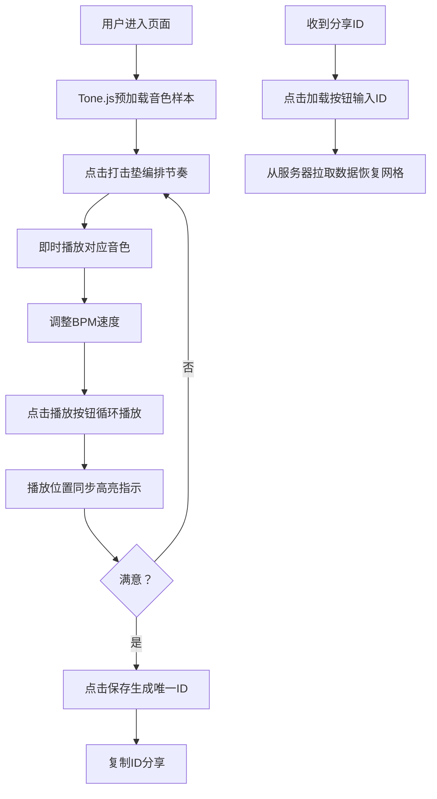

## 1. 产品概述

在线多轨节拍实验室（Beat Lab）是一款基于浏览器的即时音乐创作工具，专为业余音乐创作者设计，让灵感能够像贴便利贴一样在节拍网格上快速落笔，支持即时演奏、循环播放、保存分享。

- **核心价值**：零门槛的节奏创作体验，无需安装专业软件即可在浏览器中完成鼓点编排与混音
- **目标用户**：业余音乐爱好者、Beatmaker、音乐学生、创意工作者

## 2. 核心功能

### 2.1 用户角色
| 角色 | 注册方式 | 核心权限 |
|------|----------|----------|
| 普通用户 | 无需注册，直接使用 | 创建节拍、播放节拍、保存节拍（生成分享ID）、加载他人分享的节拍 |

### 2.2 功能模块
1. **节拍网格编辑器**：16列×8行打击垫矩阵，支持点击切换状态并即时试听音色
2. **播放控制栏**：播放/停止、BPM调速、当前节拍位置指示
3. **保存与加载系统**：保存当前节拍为分享ID，通过ID加载已保存节拍

### 2.3 页面详情
| 页面名称 | 模块名称 | 功能描述 |
|----------|----------|----------|
| 主页面 | 顶部操作区 | 保存按钮（磁盘图标，POST保存数据）、加载按钮（文件夹图标，输入ID加载） |
| 主页面 | 节拍网格区 | 16×8打击垫矩阵，点击切换on/off状态并播放音色，支持播放位置高亮指示 |
| 主页面 | 底部播放控制栏 | 播放/停止按钮、BPM滑块（60-180）、节拍计数显示 |

## 3. 核心流程

**用户创作与分享流程**：
用户进入页面 → 点击打击垫编排节奏（即时播放试听）→ 调整BPM速度 → 点击播放循环试听 → 满意后点击保存生成分享ID → 复制ID分享给朋友 → 朋友通过加载按钮输入ID即可复现节拍

## 4. 用户界面设计

### 4.1 设计风格
- **主色调**：深空蓝黑渐变 `#1a1a2e` → `#16213e`
- **辅助色**：品红 `#ff0080`、青蓝 `#00ffff`（赛博朋克风格）
- **文字色**：亚白 `#e0e0e0`
- **音轨配色**：
  - Kick: 红 `#e74c3c`
  - Snare: 橙 `#e67e22`
  - HiHat: 黄 `#f1c40f`
  - Clap: 绿 `#2ecc71`
  - Tom: 蓝 `#3498db`
  - Cymbal: 紫 `#9b59b6`
  - Bass: 粉 `#e91e63`
  - FX: 青 `#00bcd4`
- **按钮样式**：保存/加载按钮使用品红→青蓝渐变，hover上浮2px带阴影
- **打击垫样式**：50×50px，深灰底色 `#2a2a3a`，微弱0.3px霓虹果冻边框，点击时scale 0.9→1弹性动画（0.15s）
- **字体**：采用现代无衬线字体，数字使用等宽字体增强节拍感

### 4.2 页面设计概览
| 页面名称 | 模块名称 | UI元素 |
|----------|----------|--------|
| 主页面 | 顶部操作区 | 左侧保存按钮（磁盘图标+品红青蓝渐变）、右侧加载按钮（文件夹图标+同渐变）、标题居中 |
| 主页面 | 节拍网格区 | 8行音轨标签（左对齐）+ 16列打击垫矩阵 + 播放位置半透明白色高亮条（0.3透明度） |
| 主页面 | 底部播放控制栏 | 圆形播放/停止按钮（中心三角/方形图标）、自定义BPM滑块（高5px轨道，16px圆形滑杆）、实时BPM数值、当前拍/总拍计数 |

### 4.3 响应式设计
- **桌面端**：16×8网格，垫子50×50px
- **移动端**：12×6网格，垫子40×40px，文字和控件按比例缩小但触控区域保持不变
- **设计原则**：Desktop-first，使用媒体查询适配手机端

## 4.4 性能约束
- 音色预加载延迟：首次点击不超过50ms
- 网格状态更新：≤16ms（避免丢帧）
- CPU占用：Tone.js Transport循环播放时≤20%
- 连续播放：标准硬件上5分钟无卡顿
