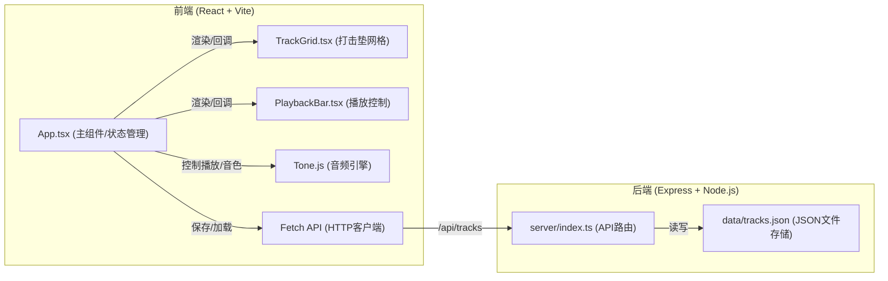
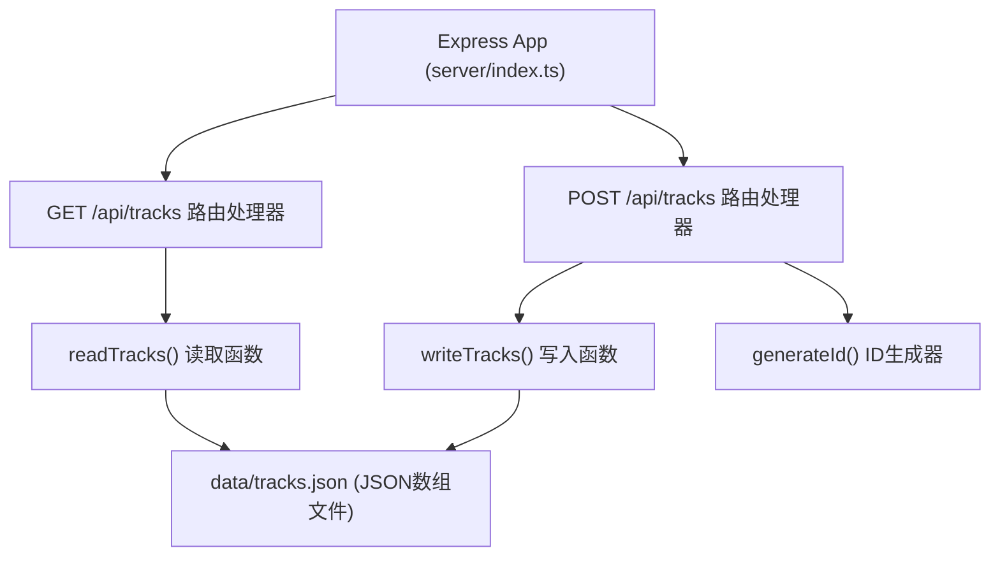
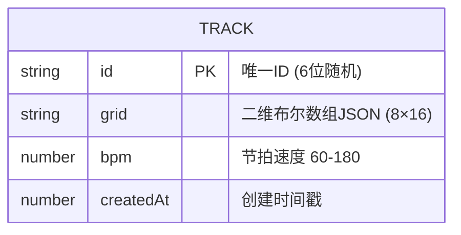

## 1. 架构设计



## 2. 技术描述

- **前端框架**：React@18.2.0 + React-DOM@18.2.0
- **前端构建**：Vite@5.4.0（代理 /api 到本地Express服务）
- **语言**：TypeScript@5.5.0（严格模式，ES2020模块目标，jsx: react-jsx）
- **音频引擎**：Tone.js@14.7.58（Transport循环调度、合成器/采样器）
- **后端框架**：Express@4.18.2
- **后端启动**：ts-node server/index.ts
- **数据存储**：本地JSON文件 data/tracks.json（模拟数据库）
- **状态管理**：React useState/useEffect（App.tsx集中管理）
- **样式方案**：原生CSS（响应式媒体查询、CSS变量、关键帧动画）

## 3. 路由定义

| 路由 | 用途 |
|------|------|
| / | 前端单页应用入口（Vite dev server 提供） |
| GET /api/tracks?id=xxx | 根据ID加载已保存的节拍数据 |
| POST /api/tracks | 保存当前节拍，返回唯一ID |

## 4. API定义

### 4.1 数据类型定义

```typescript
// 节拍网格状态：8行 × 16列 的二维布尔数组
// grid[row][col] = true 表示该垫子被点亮
type TrackGrid = boolean[][];

// 保存的节拍数据结构
interface TrackData {
  id: string;           // 唯一标识符（6位随机字符串）
  grid: TrackGrid;      // 16×8打击垫状态矩阵
  bpm: number;          // BPM速度（60-180）
  createdAt: number;    // 创建时间戳
}

// POST /api/tracks 请求体
interface SaveTrackRequest {
  grid: TrackGrid;
  bpm: number;
}

// POST /api/tracks 响应
interface SaveTrackResponse {
  id: string;
  success: boolean;
}

// GET /api/tracks?id=xxx 响应
interface LoadTrackResponse {
  success: boolean;
  data?: TrackData;
  error?: string;
}
```

### 4.2 音轨配置常量

```typescript
const TRACK_NAMES = [
  'Kick', 'Snare', 'HiHat', 'Clap',
  'Tom', 'Cymbal', 'Bass', 'FX'
];

const TRACK_COLORS = [
  '#e74c3c', '#e67e22', '#f1c40f', '#2ecc71',
  '#3498db', '#9b59b6', '#e91e63', '#00bcd4'
];

// Tone.js合成器配置（每种音色对应不同合成器参数）
const SYNTH_CONFIGS = [
  { type: 'kick', oscillator: { type: 'sine' }, envelope: { attack: 0.001, decay: 0.4, sustain: 0.01, release: 0.5 } },
  { type: 'snare', noise: { type: 'white' }, envelope: { attack: 0.001, decay: 0.2, sustain: 0, release: 0.1 } },
  // ...其余音色配置
];
```

## 5. 服务器架构图



## 6. 数据模型

### 6.1 数据模型定义



### 6.2 数据存储结构

**data/tracks.json** 初始内容：
```json
[]
```

单条记录示例：
```json
{
  "id": "a1b2c3",
  "grid": [
    [true, false, false, false, true, false, false, false, true, false, false, false, true, false, false, false],
    [false, false, true, false, false, false, true, false, false, false, true, false, false, false, true, false],
    [false, false, false, false, false, false, false, false, false, false, false, false, false, false, false, false],
    [false, true, false, false, false, true, false, false, false, true, false, false, false, true, false, false],
    [false, false, false, false, false, false, false, false, false, false, false, false, false, false, false, false],
    [false, false, false, false, false, false, false, false, false, false, false, false, false, false, false, false],
    [true, false, true, false, true, false, true, false, true, false, true, false, true, false, true, false],
    [false, false, false, false, true, false, false, false, false, false, false, false, true, false, false, false]
  ],
  "bpm": 120,
  "createdAt": 1718000000000
}
```

## 7. 文件结构与调用关系

```
项目根目录
├── package.json              # 前后端统一依赖配置 + npm run dev 启动脚本
├── vite.config.js            # Vite构建配置，代理 /api → http://localhost:3001
├── tsconfig.json             # TypeScript严格模式配置
├── index.html                # 入口HTML，深空蓝黑渐变背景
├── src/
│   ├── App.tsx               # 主组件（状态中枢）
│   │   ├── 管理 state: grid, bpm, isPlaying, currentStep
│   │   ├── 初始化 Tone.js Transport + 合成器
│   │   ├── handlePadClick(row, col) → 切换grid状态 + 播放音色
│   │   ├── handlePlayToggle() → 控制Transport start/stop
│   │   ├── handleBpmChange(value) → 更新bpm + Transport.bpm.value
│   │   ├── handleSave() → POST /api/tracks
│   │   ├── handleLoad(id) → GET /api/tracks?id=xxx
│   │   └── 渲染 → TrackGrid + PlaybackBar
│   ├── TrackGrid.tsx         # 纯展示组件（受控）
│   │   Props: grid, currentStep, onPadClick(row, col)
│   │   └── 渲染 8×16 打击垫矩阵 + 位置高亮条
│   └── PlaybackBar.tsx       # 纯展示组件（受控）
│       Props: isPlaying, bpm, currentStep, onPlayToggle, onBpmChange
│       └── 渲染 播放按钮 + BPM滑块 + 节拍计数
├── server/
│   └── index.ts              # Express服务器
│       ├── GET /api/tracks → fs.readFile + 按id查找
│       └── POST /api/tracks → 生成id + fs.readFile + push + fs.writeFile
└── data/
    └── tracks.json           # JSON文件数据库（初始[]）
```

## 8. 性能优化策略

| 优化点 | 实现方案 |
|--------|----------|
| 音色预加载 | App.tsx 的 useEffect 中使用 Tone.js Buffers/Sampler 预创建所有合成器，确保首次点击 ≤50ms |
| 网格渲染性能 | 使用 React.memo 包裹 TrackGrid 和单个 Pad 组件，避免不必要的重渲染 |
| 状态更新性能 | grid 状态切换使用不可变更新（map返回新数组），单次更新 ≤16ms |
| Transport CPU优化 | Tone.js Transport 仅调度已点亮的垫子事件，避免空调度 |
| 动画性能 | 打击垫点击动画使用 CSS transform: scale()（GPU加速），不触发重排 |
| 响应式触控 | 移动端使用 CSS 媒体查询调整尺寸，touch-action: manipulation 消除300ms延迟 |
