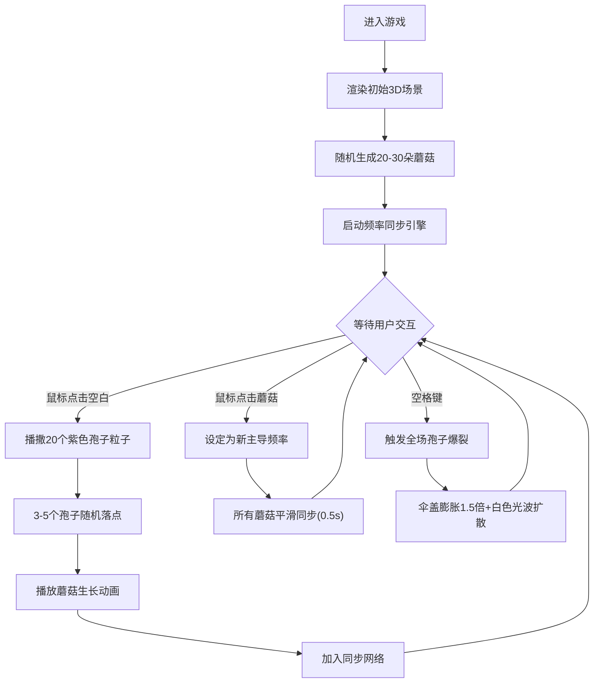

## 1. 产品概述

魔法蘑菇孢子扩散与群体意识共鸣游戏 - 一个沉浸式3D交互体验，用户扮演森林精灵在幽暗发光菌丛中播撒魔法孢子，观察蘑菇生长、频率同步与光舞共鸣。

- 核心目的：创造治愈系、富有艺术感的自然共生模拟体验
- 目标用户：喜欢探索型游戏、自然美学、互动艺术的用户
- 产品价值：通过可视化的群体同步现象，传递自然和谐之美

## 2. 核心功能

### 2.1 用户角色
| 角色 | 注册方式 | 核心权限 |
|------|----------|----------|
| 森林精灵 | 无需注册，直接进入 | 播撒孢子、设定主导频率、释放孢子爆裂 |

### 2.2 功能模块
1. **3D森林场景**：幽暗发光菌丛地面、星空粒子背景、光斑效果
2. **蘑菇系统**：随机生成蘑菇、生长动画、脉动光效、菲涅尔光晕
3. **孢子播撒**：鼠标点击播撒紫色孢子粒子，随机落点生长新蘑菇
4. **群体意识共鸣**：相邻蘑菇频率同步、发光连接线可视化、主导频率设定
5. **孢子爆裂**：空格键触发全场蘑菇膨胀+光波扩散特效
6. **信息面板**：菌群数量、平均共鸣频率、孢子释放计数
7. **小地图**：圆形俯视图，标记所有蘑菇位置和主导蘑菇

### 2.3 页面详情
| 页面名称 | 模块名称 | 功能描述 |
|----------|----------|----------|
| 主界面 | 3D场景渲染 | Three.js渲染森林地面、蘑菇、粒子背景 |
| 主界面 | 交互控制 | 鼠标点击播撒孢子/设主导频率、空格爆裂 |
| 主界面 | HUD面板 | 顶部半透明数据面板、左上角圆形小地图 |
| 主界面 | 悬停反馈 | 鼠标悬停蘑菇时显示淡蓝色提示光晕 |

## 3. 核心流程

### 用户交互主流程
用户进入页面后，看到一片随机散布的发光蘑菇菌丛。用户可以：
1. 点击空白处播撒孢子，观察孢子飞散并生长出新蘑菇
2. 点击已有蘑菇将其设为主导频率，观察其他蘑菇同步光舞
3. 按空格键释放孢子爆裂，触发全场光波脉冲
4. 通过顶部面板实时查看菌群数据，通过小地图观察分布

## 4. 用户界面设计

### 4.1 设计风格
- **主色调**：深黑背景(#000510)、荧光绿(#00ff88)、荧光紫(#aa00ff)、粉紫(#ff88ff)、淡蓝光晕
- **蘑菇伞盖色带**：从#00ff88到#aa00ff的荧光渐变
- **视觉风格**：幽暗神秘、生物发光、有机自然、赛博森林美学
- **字体**：细体数字显示（等宽字体）配合粗体标签
- **动效风格**：平滑脉动、柔和发光、有机生长、流畅过渡

### 4.2 页面设计详情
| 页面名称 | 模块名称 | UI元素 |
|----------|----------|--------|
| 主界面 | 3D场景 | 深褐色微凸曲面地面(5x5)、噪声纹理泥土、随机散布蘑菇、星空粒子背景、土壤光斑 |
| 主界面 | 蘑菇外观 | 半透明球冠伞盖、浅灰圆柱柄、菲涅尔发光边缘、周期性脉动大小和亮度 |
| 主界面 | 连接线 | 发光细线、颜色渐变、宽度0.01、连接距离<1.2的蘑菇 |
| 主界面 | 孢子粒子 | 20个紫色粒子球(#ff88ff)、大小0.02、飞散0.8秒 |
| 主界面 | 顶部面板 | rgba(0,0,0,0.6)背景、圆角8px、显示菌群数量/平均频率/孢子计数 |
| 主界面 | 小地图 | 左上角圆形(半径60px)、半透明俯视图、色点标记蘑菇、星形标记主导 |
| 主界面 | 悬停效果 | 淡蓝色光晕淡入(0.15秒)、提示可交互 |

### 4.3 响应式适配
- 桌面优先设计，默认全屏展示
- 最小宽度800px，低于时内容水平居中偏移
- Canvas自适应窗口大小，保持正确宽高比

### 4.4 3D场景指引
- **环境氛围**：纯黑背景(#000510)、微弱环境光、点光源局部照明
- **灯光设置**：低强度环境光 + 蘑菇自发光 + 地面下光斑
- **相机设置**：透视相机、略微俯视角度、固定距离观察
- **构图焦点**：菌丛中心区域，引导视觉流向密度高的区域
- **交互动画**：蘑菇生长从下往上冒出撑开、脉动大小呼吸感、爆裂光波同心圆扩散
- **后处理**：Bloom发光效果增强荧光质感
- **性能预算**：稳定45FPS以上、交互响应100ms以内
