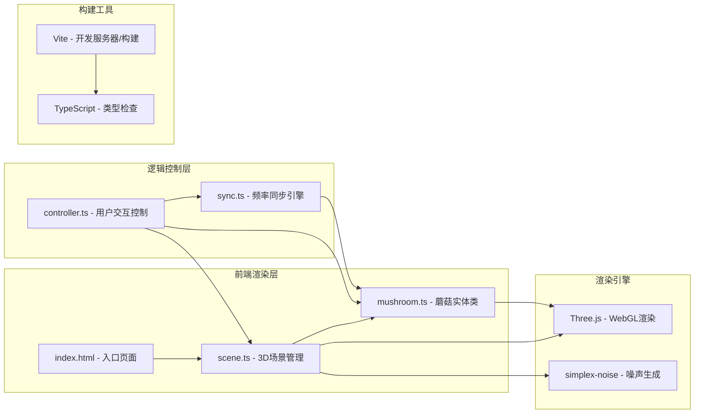

## 1. 架构设计



## 2. 技术说明

- **前端框架**：原生 TypeScript（无UI框架），直接操作DOM和Three.js
- **3D引擎**：Three.js @ 0.160.0
- **噪声库**：simplex-noise @ 3.0.0（用于地面泥土纹理）
- **构建工具**：Vite @ 5.4.0
- **语言**：TypeScript @ 5.5.0（严格模式，ES2020目标）
- **后端**：无（纯前端项目）
- **数据库**：无（纯客户端内存状态）

## 3. 文件结构定义

```
项目根目录/
├── package.json          # 项目依赖和脚本
├── tsconfig.json         # TypeScript配置
├── vite.config.js        # Vite构建配置
├── index.html            # 入口HTML
└── src/
    ├── scene.ts          # 3D场景、相机、灯光、地面、星空背景
    ├── mushroom.ts       # Mushroom类：位置、颜色、频率、脉动、生长动画
    ├── sync.ts           # SyncManager类：频率同步、连接线管理
    └── controller.ts     # Controller类：用户交互、孢子系统、爆裂效果
```

## 4. 模块职责定义

### 4.1 src/scene.ts - 场景模块
**导出对象**：`scene`, `camera`, `renderer`
**核心职责**：
- 初始化Three.js场景、透视相机、WebGL渲染器
- 创建深褐色微凸曲面地面（5x5单位，simplex噪声生成泥土纹理）
- 创建星空粒子背景和土壤缝隙光斑
- 设置灯光（低强度环境光）
- 提供`addMushroomMesh(mesh)`和`removeMushroomMesh(mesh)`方法
- 提供`updateUI(count, avgFreq, spores)`方法更新HUD数据
- 提供`updateMinimap(mushrooms, dominantId)`方法更新小地图
- 响应窗口resize事件

### 4.2 src/mushroom.ts - 蘑菇实体
**导出类**：`Mushroom`
**核心属性**：
- `id: string` - 唯一标识
- `position: THREE.Vector3` - 世界坐标
- `color: THREE.Color` - 伞盖颜色（#00ff88 ~ #aa00ff渐变随机）
- `capRadius: number` - 伞盖底部半径（0.2~0.5）
- `capHeight: number` - 伞盖高度（0.1~0.3）
- `stemHeight: number` - 伞柄高度（0.2~0.5）
- `frequency: number` - 脉动频率（0.8~1.5 Hz）
- `phase: number` - 当前相位（0~2π）
- `targetFrequency: number` - 目标频率（用于平滑过渡）
- `isDominant: boolean` - 是否为主导蘑菇
- `isGrowing: boolean` - 是否处于生长动画中
- `growProgress: number` - 生长进度（0~1）
- `burstProgress: number` - 爆裂动画进度（0~1）

**核心方法**：
- `constructor(position, color, radius, stemHeight)` - 构造函数
- `createMeshes(): { group, cap, stem, glow, hoverGlow, capMat }` - 创建Three.js网格
- `updatePulse(deltaTime)` - 每帧更新脉动相位、大小、发光强度
- `startGrowth()` - 触发生长动画
- `smoothTransitionToFrequency(targetFreq, duration=0.5)` - 平滑过渡到目标频率
- `triggerBurst()` - 触发爆裂膨胀动画
- `setHover(active)` - 设置悬停光晕

### 4.3 src/sync.ts - 同步管理器
**导出类**：`SyncManager`
**核心职责**：
- 维护蘑菇间的连接网络
- 每帧扫描所有蘑菇对，距离<1.2单位时建立连接
- 实现频率同步：经过1~2秒将双方频率调整为平均值
- 创建和更新发光连接线（颜色渐变、宽度0.01）
- 响应主导频率变更，触发全体平滑同步
- 维护连接状态：每对蘑菇的同步进度

**核心方法**：
- `constructor(scene)` - 传入场景引用
- `addMushroom(mushroom)` - 注册新蘑菇
- `removeMushroom(mushroom)` - 移除蘑菇
- `setDominant(mushroom)` - 设置主导蘑菇，触发全体同步
- `update(deltaTime)` - 每帧执行同步逻辑和连接线更新
- `getConnections()` - 获取当前连接列表（供UI使用）

### 4.4 src/controller.ts - 主控制器
**导出类**：`Controller`
**核心职责**：
- 管理所有蘑菇实例数组
- 处理用户交互（鼠标点击、键盘空格）
- 管理孢子粒子系统（播撒动画）
- 管理爆裂光波效果
- 协调scene、mushroom、sync三个模块
- 主循环requestAnimationFrame调度

**核心方法**：
- `constructor()` - 初始化所有模块
- `init()` - 启动游戏，生成初始20~30朵蘑菇
- `handleClick(event)` - 鼠标点击：Raycaster检测蘑菇或播撒孢子
- `handleKeyDown(event)` - 空格触发爆裂
- `spawnSpores(worldPosition)` - 在指定位置播撒孢子粒子
- `spawnMushroom(position)` - 在指定位置生成新蘑菇
- `triggerBurst()` - 全场爆裂效果
- `animate()` - 主循环，调用各模块update
- `updateHUD()` - 更新UI数据

## 5. 关键技术实现要点

### 5.1 菲涅尔光晕实现
使用自定义ShaderMaterial或MeshStandardMaterial配合emissiveMap实现：
- 顶点着色器计算视线与法线夹角
- 片元着色器根据夹角输出边缘发光强度
- 叠加到基础颜色上

### 5.2 频率同步算法
采用Kuramoto模型简化版：
- 每帧对距离<1.2的蘑菇对计算频率差
- 以0.02~0.05的耦合系数缓慢向平均值靠拢
- 1~2秒内完成同步（约60~120帧）
- 主导蘑菇设定时，强制所有蘑菇目标频率=主导频率，0.5秒平滑过渡

### 5.3 性能优化
- 蘑菇数量控制在20~50朵以内
- 连接线使用BufferGeometry批量渲染
- 孢子粒子使用Points而非独立Mesh
- 禁用不必要的阴影计算
- 使用固定时间步长确保动画稳定
