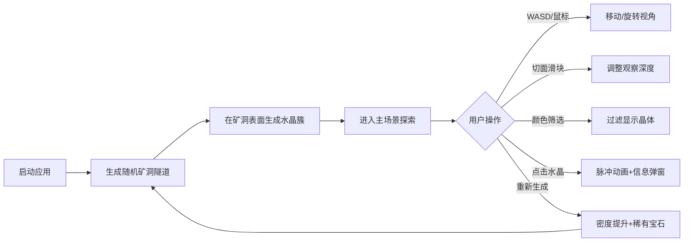

## 1. 产品概述

3D水晶矿脉生成与切面观察应用，面向地质学家和虚拟勘探爱好者，提供沉浸式的地下水晶矿脉随机生成模拟与切面观察体验。

- 主要用途：在浏览器中模拟地下水晶矿脉的随机生成过程，通过切面观察不同深度层的矿物分布与结晶形态
- 目标用户：地质学家、矿业爱好者、教育工作者
- 产品价值：为虚拟勘探提供直观的3D可视化参考，辅助教学和研究

## 2. 核心功能

### 2.1 功能模块

1. **主场景渲染**：3D矿洞隧道系统、随机生成的水晶簇、光照与环境氛围
2. **视图控制**：WASD键盘移动、鼠标拖拽旋转、滚轮缩放、视角切换
3. **交互系统**：水晶点击选中、脉冲放大动画、信息弹窗显示
4. **切面观察**：深度切片滑动条、CT切面效果逐层显示
5. **颜色筛选**：按晶体颜色过滤显示、非选中晶体半透明化
6. **矿脉再生**：重新生成随机矿脉、点击位置附近密度提升、稀有宝石生成

### 2.2 页面详情

| 页面名称 | 模块名称 | 功能描述 |
|---------|---------|---------|
| 主页面 | 3D视口 | 全屏3D矿洞场景渲染，支持鼠标/键盘交互 |
| 主页面 | 控制面板 | 右上角悬浮控制面板，包含视角重置、俯视图切换、重新生成按钮 |
| 主页面 | 切面滑块 | 深度切片滑动条，范围-1到-10，步长0.5 |
| 主页面 | 颜色筛选 | 下拉菜单筛选晶体颜色（全部/紫水晶/翡翠绿/冰蓝） |
| 主页面 | 信息弹窗 | 点击水晶后显示晶体名称、颜色hex、硬度值 |

## 3. 核心流程

用户打开应用 → 自动生成随机3D矿洞和水晶簇 → 通过WASD/鼠标探索场景 → 调整切面滑块观察不同深度 → 使用颜色筛选器聚焦特定矿物 → 点击水晶查看详细信息 → 点击"重新生成"按钮获取新矿脉（点击位置附近密度提升并生成稀有宝石）

## 4. 用户界面设计

### 4.1 设计风格

- **主色调**：深棕色到黑色径向渐变背景（#1a0f0a → #000000），低光照奇幻地质风格
- **辅助色**：紫水晶#8a2be2、翡翠绿#50c878、冰蓝#87ceeb、金色#ffd700（稀有宝石）
- **控制面板**：深亚光质感#1a1a2e，圆角8px，内阴影#00000050，半透明
- **信息弹窗**：深紫色#2d1b4e半透明背景
- **按钮交互**：0.2秒ease-out透明度/缩放过渡

### 4.2 页面设计概述

| 页面名称 | 模块名称 | UI元素 |
|---------|---------|--------|
| 主页面 | 3D视口 | 全屏渲染、径向渐变背景、Phong光照、阴影效果 |
| 主页面 | 控制面板 | 右上角固定、圆角矩形、半透明深色、三个功能按钮 |
| 主页面 | 切面滑块 | 控制面板内、范围-1~-10、步长0.5、暗黑风格滚动条 |
| 主页面 | 颜色筛选 | 控制面板内、下拉菜单、暗黑风格 |
| 主页面 | 信息弹窗 | 跟随鼠标右侧、深紫半透明、显示晶体属性 |

### 4.3 响应式

桌面端优先设计，全屏3D视口，控制面板固定在右上角。

### 4.4 3D场景指导

- **环境氛围**：地下洞穴深棕→黑径向渐变背景，土黄色渐变内壁（#6b4226→#3e2723）
- **光照设置**：环境光强度0.3，左上角平行光强度0.7（开启阴影），右下角暖黄背光#ffeecc强度0.2
- **相机参数**：广角范围0.5-10单位，移动速度2单位/秒
- **构图焦点**：水晶簇为主要视觉焦点，稀有宝石带脉动光晕
- **交互动画**：选中水晶0.4秒脉冲放大1.3倍+旋转90度（TWEEN缓动），切面过渡0.2秒，稀有宝石光晕周期1.5秒
- **性能约束**：≥30fps，晶体总数≤2000，交互响应≤100ms
