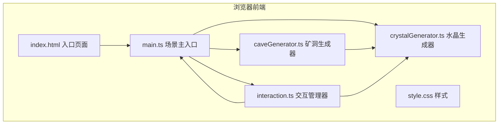

## 1. 架构设计



## 2. 技术说明

- **前端框架**：原生 TypeScript 5.5.0 + Three.js 0.160.0
- **构建工具**：Vite 5.4.0
- **第三方库**：simplex-noise 3.0.0（噪声生成）、@tweenjs/tween.js（动画缓动）
- **渲染方式**：WebGL via Three.js，Phong材质，实时阴影

## 3. 模块职责与数据流向

### 3.1 文件结构

```
.
├── package.json
├── vite.config.js
├── tsconfig.json
├── index.html
└── src/
    ├── main.ts           # 场景初始化、相机、渲染器、控制器
    ├── caveGenerator.ts  # 矿洞隧道与地层纹理生成
    ├── crystalGenerator.ts # 水晶簇与稀有宝石生成
    └── interaction.ts    # 鼠标/键盘交互、控制面板、切面筛选
```

### 3.2 数据流向

| 源模块 | 目标模块 | 数据内容 |
|-------|---------|---------|
| caveGenerator | main.ts | 洞穴Mesh数组、地层颜色映射 |
| caveGenerator | crystalGenerator | 洞穴表面顶点坐标数组 |
| crystalGenerator | main.ts | 晶体Mesh数组、稀有宝石Mesh |
| main.ts | interaction.ts | scene引用、camera引用、renderer引用 |
| interaction.ts | crystalGenerator | 颜色筛选参数、切面深度参数 |
| interaction.ts | main.ts | 相机控制指令、重新生成信号、点击坐标 |

## 4. 核心数据模型

### 4.1 类型定义

```typescript
// 水晶颜色类型
type CrystalColor = 'amethyst' | 'emerald' | 'iceBlue' | 'all';

// 晶体元数据
interface CrystalMetadata {
  name: string;
  colorHex: string;
  hardness: number;
  colorType: CrystalColor;
}

// 矿洞生成参数
interface CaveConfig {
  seed: number;
  depthMin: number;
  depthMax: number;
  tunnelRadius: number;
}

// 水晶生成参数
interface CrystalConfig {
  clusterCount: number;
  crystalsPerCluster: [number, number];
  crystalHeight: [number, number];
  crystalWidth: [number, number];
  densityBoostPoint?: THREE.Vector3;
  densityBoostRadius?: number;
  densityBoostFactor?: number;
}
```

## 5. 性能优化策略

1. **几何体复用**：水晶八面体几何体使用 BufferGeometry 并复用，仅变换矩阵不同
2. **材质共享**：同色晶体共享 MeshPhongMaterial 实例，通过 uniform 变量区分
3. **裁剪优化**：切面筛选通过 clippingPlanes 实现 GPU 级裁剪，而非隐藏对象
4. **实例化渲染**：若晶体数量接近上限，考虑使用 InstancedMesh
5. **帧率控制**：requestAnimationFrame 自适应，逻辑更新与渲染分离
