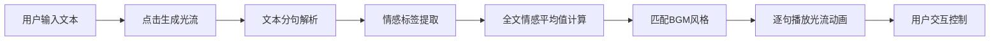

## 1. 产品概述
沉浸式光流视听觉体验Web应用，将枯燥长文转化为动态粒子光流与音乐交织的视听体验，解决文字阅读缺乏沉浸感的问题。
- 目标用户：内容创作者、博客读者、学习型用户
- 核心价值：通过情感驱动的视觉粒子光流与音频同步，让文字"活"起来

## 2. 核心功能

### 2.1 功能模块
1. **文本编辑与解析模块**：Markdown极简工具栏、文本输入、自动分句、情感标签提取
2. **光流可视化模块**：Canvas粒子动画、情感色彩映射、粒子拖尾效果、平滑过渡
3. **音频同步模块**：BGM风格匹配、句子切换音效、关键帧音效
4. **交互控制模块**：视角拖拽旋转、滚轮缩放、播放控制条、进度跳转、速度调节

### 2.2 页面详情
| 页面名称 | 模块名称 | 功能描述 |
|-----------|-------------|---------------------|
| 主页面 | 文本编辑区 | 500-2000字文本输入、Markdown工具栏（加粗/斜体/H1-H3）、分句列表展示 |
| 主页面 | 光流渲染区 | 1200x800 Canvas、情感粒子光流、鼠标交互（旋转/缩放/重置） |
| 主页面 | 底部控制条 | 播放/暂停、上一句/下一句、进度条、速度调节（0.5x/1x/2x） |

## 3. 核心流程
用户输入文本 → 点击"生成光流" → 文本分句并提取情感标签 → 根据全文平均情感选择BGM → 逐句播放粒子光流动画 → 每句3-5秒，切换时平滑过渡 → 用户可随时暂停/跳转/调节速度

## 4. 用户界面设计
### 4.1 设计风格
- 主色调：#0b0e1a（深空蓝黑），辅助色：#1a2040
- 强调色：青蓝色渐变 #00d4ff → #0072ff
- 按钮风格：圆角8px，悬停亮度+10%，0.3秒发光效果（box-shadow）
- 高亮句子：#00d4ff20 半透明背景，0.3秒过渡动画
- 布局：左右两栏（默认左40%文本编辑，右60%光流渲染），可拖拽分隔条
- 响应式：<768px 上下布局（光流在上，文本在下可切换）

### 4.2 页面设计概述
| 页面名称 | 模块名称 | UI元素 |
|-----------|-------------|-------------|
| 主页面 | 文本编辑区 | 深色输入框、极简Markdown工具栏、滚动句子列表 |
| 主页面 | 光流渲染区 | 深色Canvas、鼠标悬浮提示、粒子拖尾光效 |
| 主页面 | 控制条 | 圆角按钮、青蓝渐变进度条、速度选择器 |

### 4.3 响应式
- 桌面端（≥768px）：左右两栏布局，拖拽分隔条调整比例
- 移动端（<768px）：上下堆叠布局，光流区在上，文本区在下可折叠
- 触控优化：增大点击区域，支持触摸滑动切换句子
