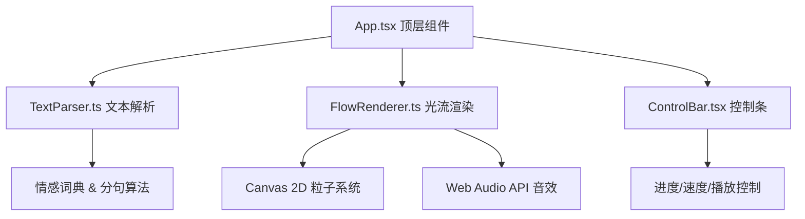

## 1. 架构设计



## 2. 技术描述
- 前端框架：React@18 + TypeScript
- 构建工具：Vite@5 + @vitejs/plugin-react
- 渲染：Canvas 2D API（无需three.js，原生粒子系统）
- 音频：Web Audio API（合成音效，无需外部音频文件）
- 样式：原生CSS（CSS变量主题化）
- 无后端，纯前端应用

## 3. 路由定义
| 路由 | 用途 |
|-------|---------|
| / | 主应用页面（单页应用，无额外路由） |

## 4. 文件结构
```
├── package.json
├── index.html
├── tsconfig.json
├── vite.config.js
└── src/
    ├── main.tsx          # React入口
    ├── App.tsx           # 顶层组件，布局&状态管理
    ├── TextParser.ts     # 文本解析：分句、情感提取
    ├── FlowRenderer.ts   # 光流渲染：Canvas粒子动画+Web Audio
    └── ControlBar.tsx    # 底部控制条组件
```

## 5. 核心数据模型

### 5.1 句子数据结构
```typescript
interface ParsedSentence {
  text: string;
  sentiment: number; // -1 (最负面) 到 +1 (最正面)
  keywords: string[];
}
```

### 5.2 播放状态
```typescript
interface PlaybackState {
  isPlaying: boolean;
  currentIndex: number;
  speed: 0.5 | 1 | 2;
  totalSentences: number;
}
```

### 5.3 粒子数据结构
```typescript
interface Particle {
  x: number;
  y: number;
  vx: number;
  vy: number;
  size: number;
  color: { r: number; g: number; b: number };
  alpha: number;
  trail: { x: number; y: number }[];
}
```
