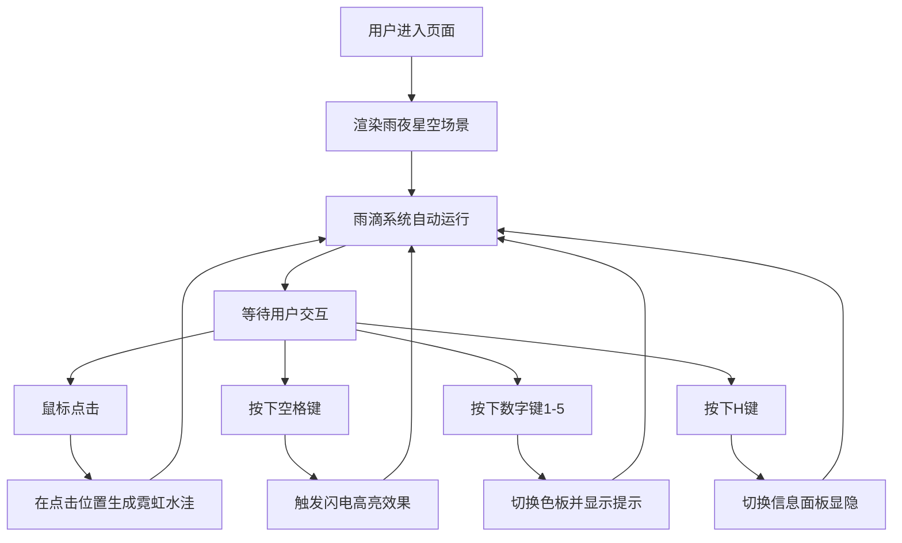

## 1. 产品概述

动态像素风霓虹雨夜倒影交互应用，让用户化身雨夜街头的独行者，通过键盘和鼠标与雨夜场景互动，触发霓虹灯光在水洼中扩散的流光溢彩视听体验。

- 目标用户：喜爱沉浸式视觉体验、像素艺术风格和交互艺术的用户
- 产品价值：提供一个可交互的视觉疗愈场景，让用户在霓虹雨夜中放松身心

## 2. 核心功能

### 2.1 功能模块

1. **主场景页面**：夜空背景、星星、雨滴系统、灯光水洼系统、信息面板

### 2.2 页面详情

| 页面名称 | 模块名称 | 功能描述 |
|-----------|-------------|---------------------|
| 主场景 | 夜空背景 | 深蓝到黑色渐变，全屏自适应，150颗闪烁星星 |
| 主场景 | 雨滴系统 | 动态生成雨滴，带尾迹，受灯光影响变色，上限200颗 |
| 主场景 | 灯光水洼系统 | 鼠标点击生成霓虹水洼，带扩散动画和倒影，上限15个 |
| 主场景 | 闪电效果 | 空格键触发闪电，全局高亮0.3秒 |
| 主场景 | 色板切换 | 数字键1-5切换霓虹灯主题色板，显示提示 |
| 主场景 | 信息面板 | 右上角显示雨滴数、水洼数、FPS，H键切换显隐 |

## 3. 核心流程

用户进入页面后看到雨夜星空场景，雨滴持续落下。用户通过以下方式交互：

## 4. 用户界面设计

### 4.1 设计风格

- **主色调**：深蓝到黑色渐变夜空（#0a0a2e 到 #000005）
- **强调色**：霓虹高饱和色彩（粉色#ff0066、青蓝#00ffcc、橙黄#ffaa00、紫罗兰#aa00ff、天蓝#00ccff）
- **雨滴色**：淡蓝色#aaccff，遇灯光变色
- **字体**：p5.js 默认等宽字体，12px
- **视觉风格**：像素风 + 霓虹发光效果，柔和平滑的动画过渡
- **氛围**：雨夜街头、赛博朋克感、沉浸式疗愈

### 4.2 页面设计概述

| 页面名称 | 模块名称 | UI元素 |
|-----------|-------------|-------------|
| 主场景 | 夜空背景 | 垂直渐变、150颗闪烁星星（#ffffff到#aabbff） |
| 主场景 | 雨滴系统 | 细长椭圆雨滴 + 半透明尾迹，流畅下落动画 |
| 主场景 | 灯光水洼 | 柔和发光边缘、扩散动画、水平倒影细纹 |
| 主场景 | 信息面板 | 半透明深色背景（#111122, 70%）、圆角8px、内边距12px |
| 主场景 | 色板提示 | 顶部短暂显示，0.5秒后消失 |
| 主场景 | 闪电效果 | 白色遮罩快速淡出，颜色瞬间高亮 |

### 4.3 响应式

- 桌面端优先设计，使用 p5.js createCanvas + windowResized 实现全屏自适应
- 任何窗口比例下保持视觉效果完整性
- 鼠标交互为主，支持键盘快捷键

### 4.4 性能要求

- 目标帧率：60FPS
- 雨滴上限：200颗（超出移除最早的）
- 水洼上限：15个（超出移除最早的）
- FPS低于45时自动降低雨滴生成频率
