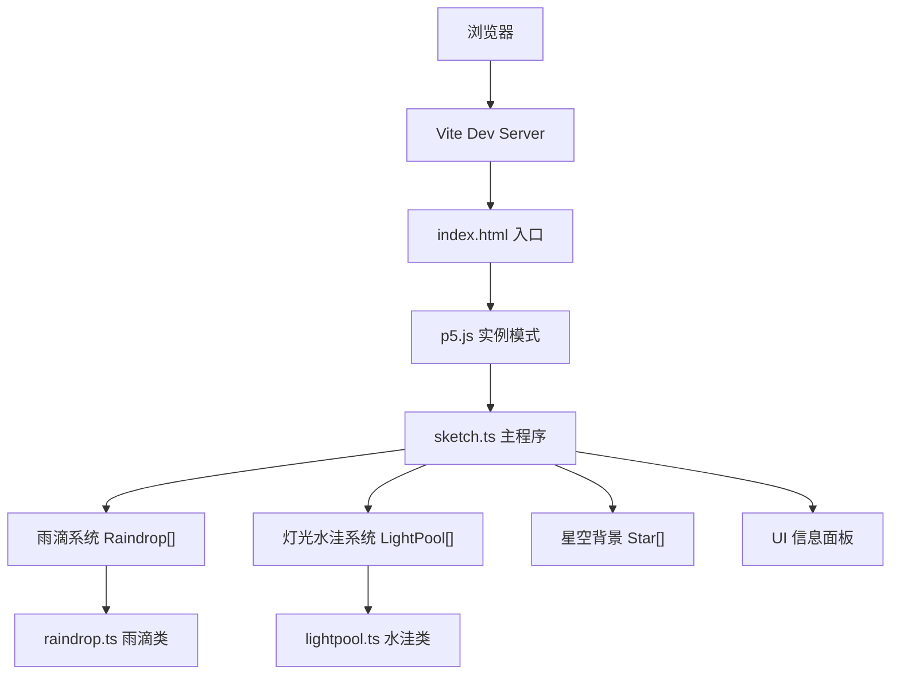

## 1. 架构设计



## 2. 技术描述

- **前端框架**：p5.js@1.9.0（实例模式）
- **语言**：TypeScript@5.5.0（严格模式，ES2020）
- **构建工具**：Vite@5.4.0
- **无后端、无数据库**，纯前端 Canvas 渲染应用

### 文件结构

```
auto42/
├── package.json
├── index.html
├── tsconfig.json
├── vite.config.js
└── src/
    ├── sketch.ts          # 主程序：p5实例、系统管理、绘制循环
    ├── raindrop.ts        # 雨滴类
    └── lightpool.ts       # 灯光水洼类
```

## 3. 核心类设计

### 3.1 Raindrop（雨滴类）

| 属性 | 类型 | 说明 |
|------|------|------|
| x | number | 水平位置 |
| y | number | 垂直位置 |
| vx | number | 水平速度（模拟风） |
| vy | number | 垂直速度 |
| width | number | 雨滴宽度（1-2px） |
| height | number | 雨滴高度（8-12px） |
| trailLength | number | 尾迹长度（20-40px） |
| color | p5.Color | 当前颜色 |
| targetColor | p5.Color | 目标颜色（用于缓动过渡） |
| colorTransition | number | 颜色过渡进度（0-1） |

| 方法 | 说明 |
|------|------|
| update(dt: number) | 更新位置，处理颜色过渡 |
| draw(p: p5) | 绘制雨滴及尾迹 |
| isOffScreen(height: number) | 是否超出屏幕底部 |
| setTargetColor(c: p5.Color) | 设置目标颜色并触发过渡 |

### 3.2 LightPool（灯光水洼类）

| 属性 | 类型 | 说明 |
|------|------|------|
| x | number | 中心x坐标 |
| y | number | 中心y坐标 |
| radius | number | 当前半径 |
| maxRadius | number | 最大半径（35px） |
| color | p5.Color | 水洼颜色 |
| phase | 'expand' \| 'hold' \| 'fade' | 生命周期阶段 |
| age | number | 已存活时间（秒） |
| opacity | number | 当前透明度（0-1） |
| reflectionLines | Line[] | 倒影细纹数组 |

| 方法 | 说明 |
|------|------|
| update(dt: number) | 更新半径、阶段、透明度 |
| draw(p: p5) | 绘制水洼、发光效果、倒影 |
| isDead() | 是否已完全消失 |
| containsPoint(px: number, py: number) | 点是否在水洼范围内 |

### 3.3 Star（星星数据结构，内部定义）

| 属性 | 类型 | 说明 |
|------|------|------|
| x, y | number | 位置 |
| size | number | 大小（1-3px） |
| color | p5.Color | 颜色 |
| twinkleSpeed | number | 闪烁速度 |
| phase | number | 闪烁相位 |

## 4. 交互事件映射

| 事件 | 处理逻辑 |
|------|---------|
| mousePressed（左键） | 在鼠标位置生成 LightPool，从预设色板随机选色 |
| keyPressed（空格） | 触发闪电效果：白色遮罩0.1秒淡出，雨滴变白色，水洼饱和度+30%，持续0.3秒 |
| keyPressed（1-5） | 切换预设主题色板，顶部显示色板名称0.5秒 |
| keyPressed（H） | 切换信息面板显隐状态 |
| windowResized | 调用 resizeCanvas 调整画布尺寸 |

## 5. 性能优化策略

1. **对象池/上限控制**：雨滴上限200，水洼上限15，超出时FIFO移除
2. **动态生成频率**：FPS < 45 时，雨滴生成间隔从 50-100ms 增加到 150-200ms
3. **Canvas 层级优化**：所有元素在单个 Canvas 上绘制，避免 DOM 开销
4. **颜色缓动**：使用线性插值实现0.1-0.2秒的平滑颜色过渡，避免突变
5. **drawingContext 阴影**：仅对水洼使用 Canvas 2D shadowBlur，减少性能消耗
