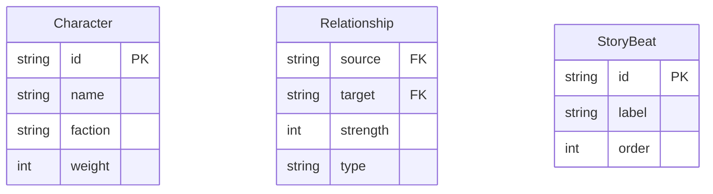

## 1. 架构设计
```mermaid
flowchart LR
    "Browser(React)" --> "Vite Dev Server"
    "Vite Dev Server" --> "Proxy /api"
    "Proxy /api" --> "Express Server"
    "Express Server" --> "data.json(File Storage)"
    "React App" --> "ForceGraph(Canvas + d3-force)"
    "React App" --> "UI Components(Panels, Modals, Toolbars)"
```

## 2. 技术描述
- **前端**：React@18.2.0 + TypeScript@5.5.0 + Vite@5.4.0
- **可视化**：d3-force@3.0.0（力导向布局计算）+ HTML5 Canvas（渲染）
- **后端**：Express@4.18.2 + TypeScript@5.5.0 + cors@2.8.5
- **数据存储**：低延迟JSON文件存储（data.json）
- **状态管理**：React useState/useRef 组件内状态 + 自定义hooks
- **样式方案**：原生CSS（CSS变量 + 动画关键帧），不引入额外CSS框架

## 3. 路由定义
| 路由 | 用途 |
|------|------|
| GET /api/characters | 获取角色列表和关系数据 |
| POST /api/relationships | 新增或更新角色间关系 |

## 4. API定义

### 类型定义
```typescript
// 阵营类型
type Faction = 'ally' | 'enemy' | 'neutral';

// 角色节点
interface Character {
  id: string;
  name: string;
  faction: Faction;
  weight: number; // 1-10
  x?: number;
  y?: number;
  vx?: number;
  vy?: number;
}

// 角色关系
interface Relationship {
  source: string;
  target: string;
  strength: number; // 1-4
  type: Faction;
}

// 剧情节点
interface StoryBeat {
  id: string;
  label: string;
  order: number;
}

// API响应
interface GraphData {
  characters: Character[];
  relationships: Relationship[];
  storyBeats: StoryBeat[];
}
```

### GET /api/characters
**响应：**
```json
{
  "characters": [...],
  "relationships": [...],
  "storyBeats": [...]
}
```

### POST /api/relationships
**请求体：**
```json
{
  "character": { "name": "...", "faction": "ally", "weight": 5 },
  "relationships": [
    { "target": "char_id_1", "strength": 3, "type": "ally" }
  ]
}
```

**响应：**
```json
{
  "success": true,
  "character": { "id": "...", "name": "...", ... }
}
```

## 5. 服务器架构图
```mermaid
flowchart TD
    "Client Request" --> "Express Router"
    "Express Router" --> "GET /api/characters"
    "Express Router" --> "POST /api/relationships"
    "GET /api/characters" --> "Read data.json"
    "POST /api/relationships" --> "Validate Payload"
    "Validate Payload" --> "Write data.json"
    "Write data.json" --> "Return Response"
```

## 6. 数据模型

### 6.1 数据模型定义


### 6.2 初始数据（data.json）
```json
{
  "characters": [
    { "id": "c1", "name": "艾琳娜", "faction": "ally", "weight": 10 },
    { "id": "c2", "name": "马库斯", "faction": "ally", "weight": 8 },
    { "id": "c3", "name": "莉莉丝", "faction": "enemy", "weight": 9 },
    { "id": "c4", "name": "索伦", "faction": "enemy", "weight": 7 },
    { "id": "c5", "name": "盖乌斯", "faction": "neutral", "weight": 6 },
    { "id": "c6", "name": "瑟琳娜", "faction": "ally", "weight": 5 },
    { "id": "c7", "name": "维克托", "faction": "enemy", "weight": 4 },
    { "id": "c8", "name": "艾拉", "faction": "neutral", "weight": 3 }
  ],
  "relationships": [
    { "source": "c1", "target": "c2", "strength": 4, "type": "ally" },
    { "source": "c1", "target": "c3", "strength": 3, "type": "enemy" },
    { "source": "c2", "target": "c6", "strength": 2, "type": "ally" },
    { "source": "c3", "target": "c4", "strength": 4, "type": "enemy" },
    { "source": "c3", "target": "c7", "strength": 3, "type": "enemy" },
    { "source": "c4", "target": "c7", "strength": 2, "type": "enemy" },
    { "source": "c5", "target": "c1", "strength": 2, "type": "neutral" },
    { "source": "c5", "target": "c3", "strength": 1, "type": "neutral" },
    { "source": "c5", "target": "c8", "strength": 3, "type": "neutral" },
    { "source": "c8", "target": "c6", "strength": 1, "type": "neutral" },
    { "source": "c1", "target": "c6", "strength": 2, "type": "ally" }
  ],
  "storyBeats": [
    { "id": "s1", "label": "第一章：相遇", "order": 1 },
    { "id": "s2", "label": "第三章：背叛", "order": 2 },
    { "id": "s3", "label": "第五章：觉醒", "order": 3 },
    { "id": "s4", "label": "第七章：决战", "order": 4 },
    { "id": "s5", "label": "终章：归途", "order": 5 }
  ]
}
```

## 7. 文件结构与调用关系
```
project/
├── package.json               # 项目依赖与脚本
├── vite.config.js             # Vite构建配置(React+TS)
├── tsconfig.json              # TypeScript严格模式配置
├── index.html                 # 入口页面(深色背景+加载动画)
├── data.json                  # JSON数据存储(角色/关系/剧情)
├── server/
│   └── server.ts              # Express后端
│                              #   ↑ 读取/写入 data.json
│                              #   ↓ 提供 /api/characters, /api/relationships
└── src/
    ├── index.tsx              # React入口
    │                          #   ↓ 渲染 <App />
    │                          #   ↓ 初始化 ForceGraph + UI面板
    ├── App.tsx                # 根组件(组合所有子组件)
    │                          #   ↓ 传递 graphData 给 ForceGraph
    │                          #   ↓ 管理模态框/气泡/时间线状态
    ├── ForceGraph.tsx         # 核心力导向图组件
    │                          #   ↑ 接收 characters, relationships props
    │                          #   ↓ 使用 d3-force 计算布局
    │                          #   ↓ Canvas 绘制节点与连线
    │                          #   ↓ 处理鼠标交互(悬停/点击/拖动/滚轮)
    ├── components/
    │   ├── AddCharacterModal.tsx   # 新增角色模态框
    │   │                            #   ↑ 接收 onSubmit 回调
    │   ├── CharacterBubble.tsx      # 角色详情气泡
    │   │                            #   ↑ 接收 character, position props
    │   ├── StoryTimeline.tsx        # 故事时间线工具栏
    │   │                            #   ↑ 接收 storyBeats, onBeatClick
    │   ├── ControlPanel.tsx         # 右侧控制面板
    │   │                            #   ↑ 接收 onAddCharacter
    │   └── ResetViewButton.tsx      # 重置视角按钮
    │                                #   ↑ 接收 onReset callback
    ├── hooks/
    │   ├── useGraphData.ts          # 数据获取hook(fetch /api/characters)
    │   └── useForceSimulation.ts    # d3-force封装hook
    ├── types/
    │   └── index.ts                 # 共享类型定义
    ├── utils/
    │   └── colors.ts                # 颜色映射工具
    └── styles/
        └── global.css               # 全局样式(主题变量/动画/响应式)
```

## 8. 数据流向
```
data.json → server.ts (读取) → GET /api/characters → useGraphData hook → App.tsx state
                                                                              ↓
                                                      ForceGraph.tsx props ←──┘
                                                              ↓
                                                      d3-force simulation
                                                              ↓
                                                      Canvas 渲染帧循环
用户交互(新增角色) → AddCharacterModal → POST /api/relationships → server.ts (写入data.json)
                                                                          ↓
                                                              返回新数据 → App.tsx 更新 state → ForceGraph 重渲染
```
