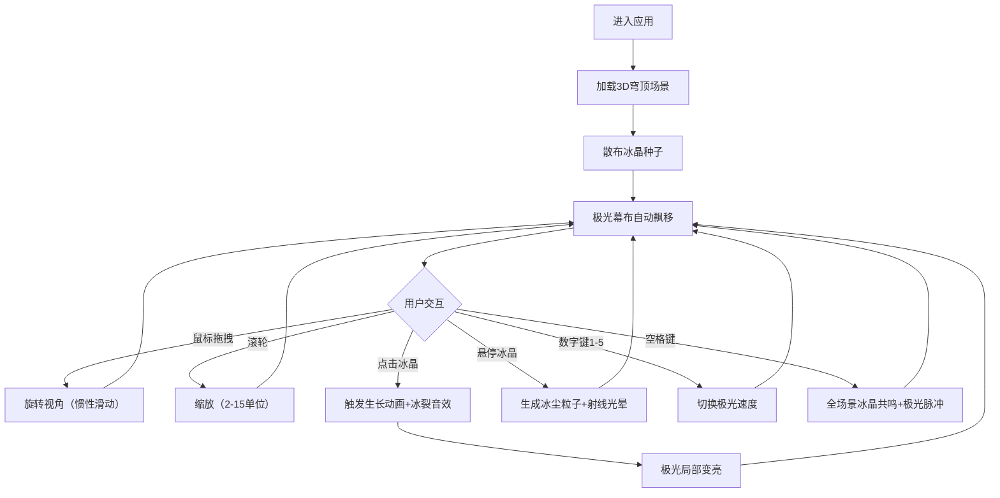

## 1. 产品概述
虚拟极光穹顶交互可视化应用，让用户在浏览器中沉浸式体验冰晶生长、极光飘移与声光共鸣的壮丽极地场景。
- 解决用户无法在真实世界中近距离观察极光弧光、冰晶生长与声光共鸣的问题
- 目标用户：极光爱好者、自然科学学习者、视觉艺术创作者

## 2. 核心特性

### 2.1 功能模块
1. **3D冰原穹顶场景**：深空蓝到极光绿渐变背景、半透明白色冰面、随机散布冰晶种子
2. **冰晶生长系统**：点击冰晶触发2秒生长动画、六棱柱主体+分枝结构、底部光晕
3. **极光幕布系统**：自定义ShaderMaterial动态飘移、颜色渐变、局部变亮响应
4. **粒子与光影系统**：悬停冰尘粒子、射线光晕、Web Audio冰裂音效
5. **交互控制**：鼠标拖拽旋转视角、滚轮缩放、键盘速度切换与共鸣触发
6. **信息面板**：悬浮半透明面板显示极光速度与冰晶总数

### 2.2 页面详情
| 页面名称 | 模块名称 | 功能描述 |
|---------|---------|---------|
| 主场景页 | 3D穹顶场景 | Three.js全屏渲染，支持360度视角旋转与缩放 |
| 主场景页 | 冰晶交互 | 点击生长、悬停粒子、音效反馈 |
| 主场景页 | 极光幕布 | 动态飘移、颜色脉冲、局部响应 |
| 主场景页 | 键盘控制 | 数字键1-5切换速度，空格触发全场景共鸣 |
| 主场景页 | 信息面板 | 左侧悬浮面板实时显示状态 |

## 3. 核心流程
用户进入页面→看到3D冰原穹顶场景→鼠标拖拽旋转视角探索→点击冰晶种子触发生长动画→冰晶生长伴随极光局部变亮与冰裂音效→鼠标悬停冰晶查看冰尘粒子→按数字键调整极光速度→按空格键触发全场景共鸣。

## 4. 用户界面设计

### 4.1 设计风格
- 主色调：冰蓝#A0E0FF、雪白#F0F8FF、深蓝#001A33
- 背景：深空蓝#000820到极光绿#00FF8844垂直渐变
- 面板：半透明白色#FFFFFF33、模糊背景8px、圆角12px、阴影0 4px 12px rgba(0,0,0,0.3)
- 整体：极地沉浸式科幻风格，强调光影与透明感

### 4.2 页面设计概览
| 页面名称 | 模块名称 | UI元素 |
|---------|---------|---------|
| 主场景页 | 3D场景 | 全屏Canvas、穹顶弧面、冰面、冰晶、极光幕布 |
| 主场景页 | 信息面板 | 左侧悬浮、极光速度标签、冰晶数量标签 |
| 主场景页 | 反馈效果 | 连击空格红色光晕、鼠标拖拽惯性 |

### 4.3 响应式适配
- 宽高比 > 16:9：左右留黑边，场景居中
- 宽高比 < 4:3：自动缩小场景scale比例（0.8-1.0）
- 桌面优先，全屏Canvas自适应窗口

### 4.4 3D场景指导
- **环境**：内部穹顶空间，深蓝到极光绿的内发光氛围
- **光照**：环境光+冰晶点光源+极光自发光
- **相机**：PerspectiveCamera，距离范围2-15单位，支持OrbitControls惯性（阻尼0.95）
- **构图**：穹顶包裹式空间，冰晶散布冰面，极光覆盖弧顶
- **交互**：点击、悬停、拖拽、缩放、键盘
- **性能**：粒子数≤200，每帧渲染≤16ms，目标60FPS

## 5. 非功能需求
- **性能**：FPS稳定30+，目标60FPS，无明显卡顿或闪烁
- **兼容性**：现代浏览器支持WebGL2
- **音效**：Web Audio API合成冰裂声，无需外部音频资源
