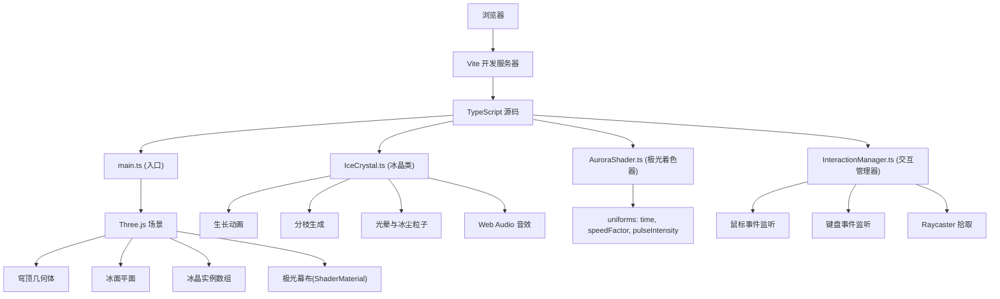

## 1. 架构设计



## 2. 技术栈说明
- **前端框架**：原生 TypeScript（无React/Vue，Three.js直接操作DOM）
- **3D引擎**：three@0.160.0
- **构建工具**：vite@5.4.0
- **TypeScript**：typescript@5.5.0（严格模式，ES2020模块目标）
- **噪声库**：simplex-noise@3.0.0（用于冰晶形状扰动和极光噪声）
- **音效**：Web Audio API原生合成

## 3. 项目文件结构
```
auto47/
├── package.json
├── index.html
├── tsconfig.json
├── vite.config.js
└── src/
    ├── main.ts            # 入口：场景/相机/渲染器初始化，动画循环
    ├── IceCrystal.ts      # 冰晶类：生长、分枝、光晕、粒子、音效
    ├── AuroraShader.ts    # 极光着色器材质：动态纹理、脉冲、局部变亮
    └── InteractionManager.ts  # 交互管理：鼠标/键盘事件、拾取、状态
```

## 4. 核心模块定义

### 4.1 IceCrystal 类
```typescript
class IceCrystal {
  mesh: THREE.Group;
  light: THREE.PointLight;
  particles: THREE.Points;
  baseHeight: number;
  targetHeight: number;
  hue: number;
  isGrowing: boolean;
  isHovered: boolean;
  
  constructor(position: THREE.Vector3, hue: number);
  startGrowth(): void;       // 2秒内生长并播放冰裂音效
  updateHover(state: boolean): void;  // 悬停冰尘粒子控制
  update(delta: number): void;        // 每帧更新动画
  dispose(): void;
}
```

### 4.2 AuroraShader 材质
```typescript
// uniforms:
// - time: number (秒)
// - speedFactor: number (1-5)
// - pulseIntensity: number (0-1)
// - highlightPositions: vec3[] (生长中冰晶位置)
// - highlightColors: vec3[] (对应冰晶颜色)
```
- 顶点着色器：穹顶UV坐标，位置无修改
- 片段着色器：simplex噪声生成极光流动纹理，主色渐变，局部高亮叠加，脉冲白色闪烁

### 4.3 InteractionManager 类
```typescript
class InteractionManager {
  crystals: IceCrystal[];
  auroraSpeed: number;  // 1-5
  raycaster: THREE.Raycaster;
  mouse: THREE.Vector2;
  
  constructor(scene: THREE.Scene, camera: THREE.Camera, renderer: THREE.WebGLRenderer);
  triggerResonance(): void;  // 空格键：全场景共鸣
  setAuroraSpeed(level: number): void;
  update(delta: number): void;
}
```

## 5. 关键技术点

### 5.1 视角控制
- `THREE.OrbitControls` 启用 enableDamping，dampingFactor=0.05（对应阻尼0.95）
- minDistance=2, maxDistance=15，enablePan=false

### 5.2 冰晶生长
- TWEEN或手动线性插值：2秒内Y轴scale从~0.1到目标高度(0.3-0.8)
- 分枝：生长完成后沿径向生成5-8个CylinderGeometry子mesh，末端添加小片状PlaneGeometry
- 光晕：PointLight，颜色淡蓝#88CCFF，距离0.5，强度0.3-0.5

### 5.3 冰裂音效
- Web Audio API: AudioBufferSourceNode + BufferSource（白噪声）+ BiquadFilterNode（带通，500-2000Hz随机中心频率，Q值高）+ GainNode（0.1秒包络）

### 5.4 粒子系统
- 每个冰晶悬停时创建20个Points，围绕冰晶半径0.2圆周分布，每帧旋转0.01弧度
- 全局粒子池管理，总数≤200

### 5.5 响应式
- 监听 window resize
- aspect > 16/9: renderer.setSize 按高度计算宽度，左右居中留黑
- aspect < 4/3: 场景整体scale乘以0.8-1.0插值

## 6. 性能优化
- 冰晶几何体复用（CylinderGeometry共享）
- 粒子使用Points而非多个Mesh
- Shader中噪声计算精简，使用低频次simplex
- 光环/光晕使用AdditiveBlending避免深度排序开销
- 限制Raycaster每帧最多检测一次（mousemove节流）
