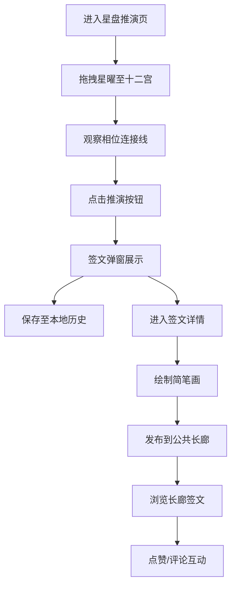

## 1. 产品概述

虚拟古代星盘推演与命运签文分享平台——让用户化身古代占星师，通过在黄道十二宫星盘上放置七政四余星曜，推演个人命运签文，并可绘制简笔画分享至公共长廊。

- 主要目的：提供沉浸式的古代占星文化体验，结合互动式星盘操作和社交分享功能
- 目标用户：对占星文化、传统命理、创意社交感兴趣的年轻用户群体
- 产品价值：融合文化体验、创意表达与社交互动的独特全栈Web应用

## 2. 核心功能

### 2.1 用户角色

| 角色 | 注册方式 | 核心权限 |
|------|----------|----------|
| 普通用户 | 无需注册，匿名使用 | 星盘推演、签文查看、简笔画绘制、签文发布、点赞评论 |

### 2.2 功能模块

1. **星盘推演页**：黄道十二宫Canvas星盘、星曜拖拽放置、相位连接线、推演按钮
2. **签文详情页**：签文完整展示、简笔画画布、发布功能、点赞评论区
3. **公共长廊页**：瀑布流签文卡片展示、搜索浏览、点赞评论计数

### 2.3 页面详情

| 页面名称 | 模块名称 | 功能描述 |
|----------|----------|----------|
| 星盘推演页 | 黄道十二宫星盘 | Canvas绘制三环同心圆、十二宫扇形区域、宫名标签、刻度符号 |
| 星盘推演页 | 星曜列表 | 10颗星曜（日月金木水火土、计都罗睺紫气），支持拖拽到星盘 |
| 星盘推演页 | 相位计算 | 自动计算星曜间角度关系（合相/对冲/三合/刑冲），彩色连接线 |
| 星盘推演页 | 推演按钮 | 点击后调用签文引擎生成签文，弹窗展示 |
| 签文详情页 | 签文展示 | 宣纸风格弹窗，签号、四句七言签文、吉凶等级、关键词标签 |
| 签文详情页 | 简笔画画布 | 300x200像素黑白线条绘制，支持画笔、橡皮擦、清空 |
| 签文详情页 | 发布功能 | 将签文和简笔画提交至公共长廊 |
| 签文详情页 | 互动区 | 点赞按钮（每人限一次）、评论输入框（≤200字）、评论列表 |
| 公共长廊页 | 瀑布流卡片 | 签文缩略图、前两句摘要、点赞数、评论数，悬停上浮效果 |
| 公共长廊页 | 实时更新 | 每10秒轮询最新点赞和评论数据 |

## 3. 核心流程

用户进入首页 → 从星曜列表拖拽星曜放置到黄道十二宫 → 观察星曜相位连接线 → 点击"推演"按钮 → 签文弹窗展示结果（自动保存本地历史）→ 进入签文详情页 → 绘制简笔画配图 → 发布到公共长廊 → 浏览长廊其他签文卡片 → 点赞或评论互动

## 4. 用户界面设计

### 4.1 设计风格

- **主色系**：暗金色与深棕色复古配色
  - 主背景：#1a1208（深棕黑）
  - 星盘区域：#2a1e0c（暗棕）
  - 文字高亮：#f0d9b5（米金色）
  - 弹窗背景：#f5e6c8（宣纸米黄）
  - 弹窗边框：#8b7355（棕色）
- **按钮风格**：推演按钮悬停时发出微弱金色光晕，复古圆角
- **字体**：衬线体营造古典氛围，标题用书法风格字体
- **布局风格**：星盘居中、星曜列表右侧、弹窗中央缩放出现
- **动效**：星曜拖拽半透明拖影+放大、签文弹窗缩放进入、卡片悬停translateY(-4px)、标签淡入淡出

### 4.2 页面设计概览

| 页面名称 | 模块名称 | UI元素 |
|----------|----------|--------|
| 星盘推演页 | 星盘Canvas | 三环同心圆、十二宫扇形、宫名汉字、星曜符号、相位彩色连线 |
| 星盘推演页 | 星曜侧栏 | 10颗星曜图标+名称，窄屏折叠为抽屉式 |
| 星盘推演页 | 推演按钮 | 星盘中心圆形按钮，金色光晕悬停效果 |
| 签文详情页 | 签文弹窗 | 宣纸纹理背景、边框阴影、签号标签、四句七言、吉凶徽章、关键词标签 |
| 签文详情页 | 简笔画画布 | 黑白线条、3px笔刷、橡皮擦/清空按钮 |
| 公共长廊页 | 瀑布流网格 | 卡片悬停上浮、缩略图、摘要、爱心点赞图标、评论图标 |

### 4.3 响应式设计

- Desktop-first设计，适配最小宽度320px
- 窄屏时星曜列表隐藏，改为折叠式侧边栏（汉堡菜单触发）
- 星盘Canvas自动缩放适配视口
- 公共长廊卡片列数响应式调整（桌面3-4列、平板2列、移动1列）
- 触摸设备优化拖拽交互

### 4.4 性能要求

- 星盘交互帧率 ≥ 50FPS
- 签文生成响应时间 ≤ 200ms
- 长廊首屏加载时间 ≤ 500ms
- Canvas渲染优化，避免不必要的重绘
