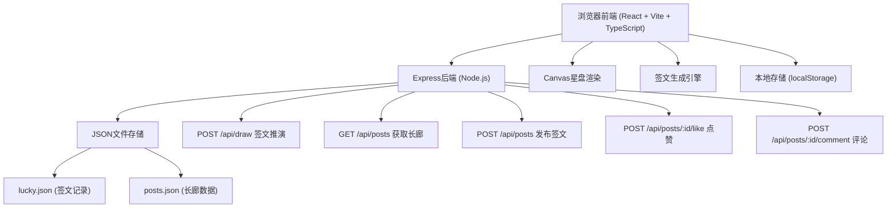
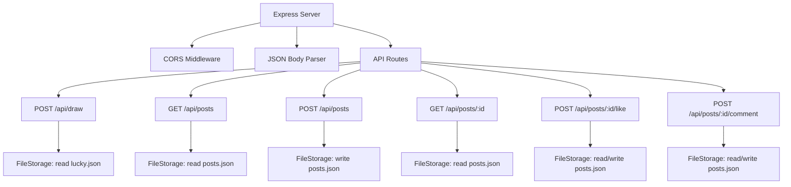
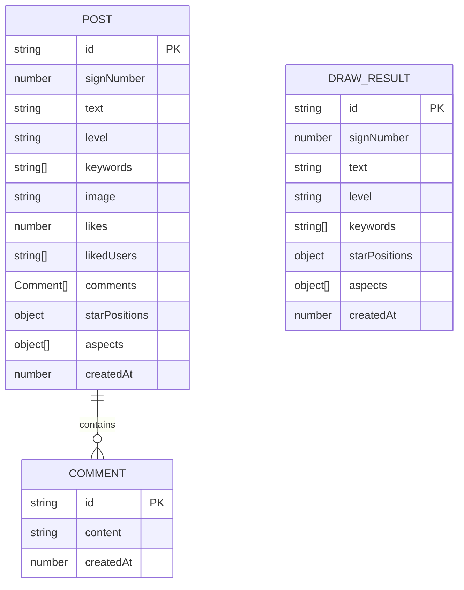

## 1. 架构设计



## 2. 技术描述

- **前端框架**：React@18.2.0 + React-DOM@18.2.0
- **构建工具**：Vite@5.4.0 + @vitejs/plugin-react@4.2.0
- **开发语言**：TypeScript@5.5.0（严格模式，JSX: react-jsx）
- **后端框架**：Express@4.18.2 + CORS@2.8.5
- **数据存储**：JSON文件（低延迟文件存储）
- **工具库**：uuid@9.0.0（生成唯一签号）
- **启动方式**：npm run dev（同时启动前端Vite和后端Express）

## 3. 路由定义

| 路由 | 用途 |
|------|------|
| / | 星盘推演主页 |
| /post/:id | 签文详情页（含简笔画画布、点赞评论） |
| /gallery | 公共长廊页（瀑布流签文卡片） |

## 4. API定义

### 4.1 签文推演接口
```typescript
// POST /api/draw
interface DrawRequest {
  starPositions: Record<string, number>; // 星曜ID -> 宫位编号(0-11)
}

interface Aspect {
  star1: string;
  star2: string;
  angle: number; // 0/90/120/180
  type: 'conjunction' | 'square' | 'trine' | 'opposition';
}

interface DrawResponse {
  id: string; // UUID
  signNumber: number; // 签号
  text: string; // 四句七言签文
  level: '上上' | '上吉' | '中平' | '中下' | '下下';
  keywords: string[]; // 关键词标签
  starPositions: Record<string, number>;
  aspects: Aspect[];
  createdAt: number;
}
```

### 4.2 长廊列表接口
```typescript
// GET /api/posts
interface PostSummary {
  id: string;
  signNumber: number;
  text: string; // 完整签文
  summary: string; // 前两句摘要
  level: string;
  keywords: string[];
  image: string | null; // Base64简笔画
  likes: number;
  comments: number;
  createdAt: number;
}

type PostsResponse = PostSummary[];
```

### 4.3 发布签文接口
```typescript
// POST /api/posts
interface CreatePostRequest {
  signNumber: number;
  text: string;
  level: string;
  keywords: string[];
  starPositions: Record<string, number>;
  aspects: Aspect[];
  image: string | null; // Base64
}

interface CreatePostResponse {
  id: string;
  success: boolean;
}
```

### 4.4 获取单条签文详情
```typescript
// GET /api/posts/:id
interface Comment {
  id: string;
  content: string;
  createdAt: number;
}

interface PostDetail extends PostSummary {
  comments: Comment[];
  starPositions: Record<string, number>;
  aspects: Aspect[];
}
```

### 4.5 点赞接口
```typescript
// POST /api/posts/:id/like
interface LikeRequest {
  userId: string; // 本地存储的匿名用户ID
}

interface LikeResponse {
  likes: number;
  liked: boolean; // 当前用户是否已点赞
}
```

### 4.6 评论接口
```typescript
// POST /api/posts/:id/comment
interface CommentRequest {
  content: string; // ≤200字
}

interface CommentResponse {
  comment: Comment;
  comments: Comment[];
}
```

## 5. 服务器架构图



## 6. 数据模型

### 6.1 数据模型定义



### 6.2 JSON文件结构

**lucky.json** - 签文预设库
```json
{
  "signs": [
    {
      "id": 1,
      "text": "第1签·上上：太阳高照命宫明，万物逢春喜气盈。...",
      "level": "上上",
      "keywords": ["财运", "事业"],
      "combinations": ["sun-1", "moon-2"]
    }
  ]
}
```

**posts.json** - 长廊发布记录
```json
{
  "posts": [
    {
      "id": "uuid",
      "signNumber": 371,
      "text": "第371签·中平：...",
      "level": "中平",
      "keywords": ["情感", "健康"],
      "image": "data:image/png;base64,...",
      "likes": 12,
      "likedUsers": ["user-uuid-1", "user-uuid-2"],
      "comments": [
        { "id": "uuid", "content": "好文！", "createdAt": 1717900000000 }
      ],
      "starPositions": { "sun": 0, "moon": 3 },
      "aspects": [{ "star1": "sun", "star2": "moon", "angle": 90, "type": "square" }],
      "createdAt": 1717900000000
    }
  ]
}
```

### 6.3 核心常量定义

**黄道十二宫**
```typescript
const ZODIAC_HOUSES = [
  { id: 0, name: '命宫', symbol: '♈' },
  { id: 1, name: '财帛宫', symbol: '♉' },
  { id: 2, name: '兄弟宫', symbol: '♊' },
  { id: 3, name: '田宅宫', symbol: '♋' },
  { id: 4, name: '子女宫', symbol: '♌' },
  { id: 5, name: '奴仆宫', symbol: '♍' },
  { id: 6, name: '夫妻宫', symbol: '♎' },
  { id: 7, name: '疾厄宫', symbol: '♏' },
  { id: 8, name: '迁移宫', symbol: '♐' },
  { id: 9, name: '官禄宫', symbol: '♑' },
  { id: 10, name: '福德宫', symbol: '♒' },
  { id: 11, name: '相貌宫', symbol: '♓' },
];
```

**七政四余星曜**
```typescript
const STARS = [
  { id: 'sun', name: '太阳', color: '#FFD700', shape: 'circle' },
  { id: 'moon', name: '月亮', color: '#C0C0C0', shape: 'crescent' },
  { id: 'mercury', name: '水星', color: '#87CEEB', shape: 'hexagon' },
  { id: 'venus', name: '金星', color: '#FFB6C1', shape: 'diamond' },
  { id: 'mars', name: '火星', color: '#FF4500', shape: 'pentagon' },
  { id: 'jupiter', name: '木星', color: '#32CD32', shape: 'triangle' },
  { id: 'saturn', name: '土星', color: '#8B4513', shape: 'square' },
  { id: 'rahu', name: '罗睺', color: '#800080', shape: 'star' },
  { id: 'ketu', name: '计都', color: '#4B0082', shape: 'star' },
  { id: 'ziqi', name: '紫气', color: '#9370DB', shape: 'circle' },
];
```

**相位类型**
```typescript
const ASPECT_TYPES = [
  { angle: 0, type: 'conjunction', name: '合相', color: '#FFD700', tolerance: 8 },
  { angle: 90, type: 'square', name: '刑冲', color: '#FF4500', tolerance: 6 },
  { angle: 120, type: 'trine', name: '三合', color: '#32CD32', tolerance: 6 },
  { angle: 180, type: 'opposition', name: '对冲', color: '#DC143C', tolerance: 6 },
];
```
