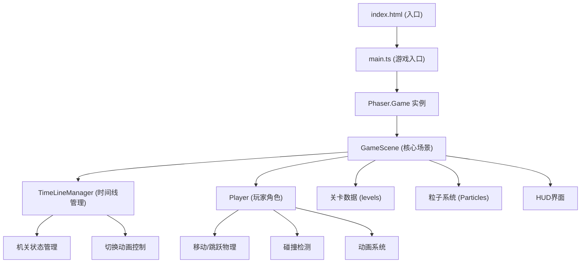

## 1. 架构设计



## 2. 技术选型

- **前端框架**：Phaser 3.80.1（2D游戏引擎）
- **编程语言**：TypeScript（严格模式）
- **构建工具**：Vite 5.x
- **数据存储**：localStorage（进度保存）
- **音频**：Phaser内置音频系统（使用占位音频数据）

## 3. 项目结构

```
e:\solo\VersionFast\tasks\auto49/
├── package.json           # 项目依赖和脚本
├── index.html             # 入口HTML
├── tsconfig.json          # TypeScript配置（严格模式）
├── vite.config.js         # Vite构建配置
├── .trae/
│   └── documents/         # 项目文档
│       ├── PRD.md
│       └── ARCHITECTURE.md
└── src/
    ├── main.ts            # 游戏主入口，Phaser初始化
    ├── scenes/
    │   └── GameScene.ts   # 核心游戏场景
    └── objects/
        ├── TimeLineManager.ts  # 时间线管理器
        └── Player.ts            # 玩家角色类
```

## 4. 核心类定义

### 4.1 TimeLineManager（时间线管理器）

```typescript
// 时间线状态枚举
enum TimelineState {
  PRESENT = 'present',  // 现在
  PAST = 'past'         // 过去
}

interface TimelinePlatform {
  id: string;
  x: number;
  y: number;
  visibleInPresent: boolean;
  visibleInPast: boolean;
  phaserObject?: Phaser.GameObjects.Rectangle;
}

interface TimelineSpike {
  id: string;
  x: number;
  y: number;
  movesInPast: boolean;
  phaserObject?: Phaser.GameObjects.Polygon;
}

// 公共接口
class TimeLineManager {
  currentState: TimelineState;
  switchToPast(scene: Phaser.Scene, onComplete?: () => void): void;
  switchToPresent(scene: Phaser.Scene, onComplete?: () => void): void;
  registerPlatform(platform: TimelinePlatform): void;
  registerSpike(spike: TimelineSpike): void;
  update(time: number, delta: number): void;
}
```

### 4.2 Player（玩家角色）

```typescript
interface PlayerConfig {
  x: number;
  y: number;
  scene: Phaser.Scene;
}

// 公共接口
class Player {
  sprite: Phaser.Physics.Arcade.Sprite;
  lives: number;
  maxLives: number;
  isInvincible: boolean;
  
  create(config: PlayerConfig): void;
  update(cursors: Phaser.Types.Input.Keyboard.CursorKeys, time: number): void;
  takeDamage(): void;
  canDoubleJump(): boolean;
  consumeDoubleJump(): void;
}
```

### 4.3 GameScene（核心场景）

```typescript
// 关卡数据结构
interface LevelData {
  id: number;
  name: string;
  grid: number[][];  // 20x15 网格
  playerStart: { x: number; y: number };
  goalPosition: { x: number; y: number };
  portal?: { x: number; y: number };
  shards: { x: number; y: number }[];
  platforms: TimelinePlatform[];
  spikes: TimelineSpike[];
}

// 游戏存档
interface GameSave {
  currentLevel: number;
  totalShards: number;
  unlockedHidden: boolean;
}
```

## 5. 性能优化策略

- **预加载**：关卡地图数据预加载，避免运行时解析
- **对象池**：粒子系统使用对象池复用，总粒子数≤200
- **纹理图集**：平台使用生成的Canvas纹理，避免重复绘制
- **零卡顿切换**：时间线切换前预计算所有状态，动画使用Phaser Tween
- **帧率监控**：保持55-60FPS，复杂计算分摊到多帧
- **响应式画布**：使用Phaser ScaleManager自动适配
