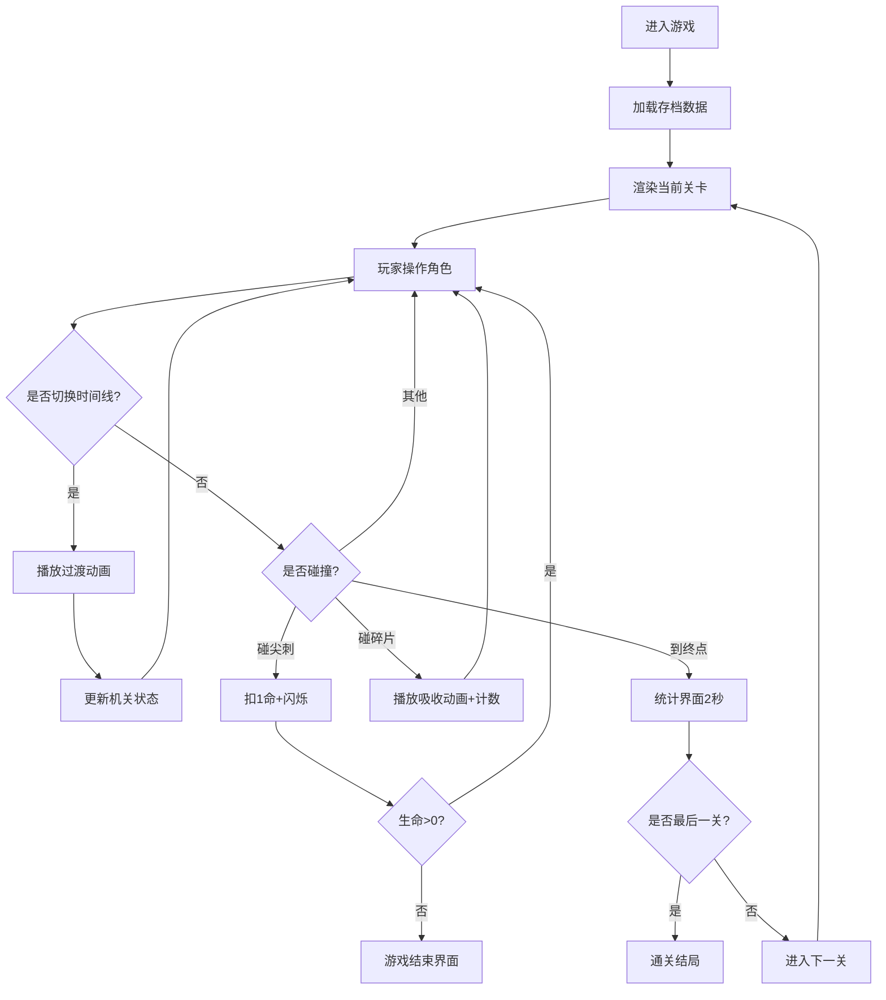

## 1. 产品概述

基于浏览器的时间旅行解谜游戏，玩家通过切换"现在"与"过去"两条时间线，操纵场景机关状态的变化来解谜通关。游戏采用像素风格设计，深蓝色夜空背景，提供沉浸式的时间旅行体验。

- 核心玩法：在两条时间线之间切换，利用不同时间线下平台、陷阱、路径的差异通过关卡
- 目标用户：喜欢解谜、平台跳跃类游戏的玩家
- 产品价值：创新的时间线切换机制带来独特的解谜体验，多关卡和收集元素提供丰富的游戏内容

## 2. 核心功能

### 2.1 功能模块

1. **游戏主场景**：关卡渲染、时间线切换、玩家交互、碰撞检测
2. **时间线管理系统**：管理现在/过去时间线状态，控制机关切换动画和粒子效果
3. **玩家控制系统**：键盘/触摸输入、移动跳跃、二段跳、受伤和生命系统
4. **关卡系统**：5个正式关卡 + 1个隐藏关卡，关卡进度和数据保存
5. **收集系统**：时光碎片收集，解锁隐藏关卡
6. **HUD界面**：生命值显示、碎片计数、时间线状态显示
7. **适配系统**：响应式画布缩放、触摸屏虚拟按钮

### 2.2 功能详情

| 页面/模块 | 子功能 | 功能描述 |
|-----------|--------|---------|
| 游戏场景 | 地图渲染 | 20x15网格地图，32x32像素格子，包含多种机关类型 |
| 游戏场景 | 时间线切换 | 按T键切换到过去，长按T键2秒回到现在，0.5秒粒子过渡动画 |
| 游戏场景 | 机关交互 | 平台出现/消失、尖刺移动、终点开启/关闭 |
| 玩家系统 | 移动控制 | A/D左右移动（200px/s），W跳跃（400力量），空格二段跳 |
| 玩家系统 | 生命系统 | 3条命，碰尖刺扣1命，0命显示游戏结束 |
| 玩家系统 | 动画系统 | 跑步4帧循环、跳跃2帧伸展、受伤闪烁 |
| 关卡系统 | 关卡进度 | 通关后显示统计界面（用时、剩余命、碎片数），自动进入下一关 |
| 关卡系统 | 进度保存 | localStorage保存当前关卡和碎片数量 |
| 收集系统 | 时光碎片 | 每关3个金色菱形碎片，接触后播放吸收动画 |
| 收集系统 | 隐藏关卡 | 集齐15个碎片解锁隐藏关 |
| HUD界面 | 生命值 | 左上角三个心形图标（红/灰） |
| HUD界面 | 碎片计数 | 金色菱形+数字 |
| HUD界面 | 时间线状态 | "现在"/"过去"文本，切换时颜色过渡 |

## 3. 核心流程

玩家进入游戏后从保存的关卡开始，使用键盘或触摸按钮控制角色移动跳跃。在遇到障碍时，通过切换时间线改变场景状态找到通路。收集散落的时光碎片，避开尖刺陷阱，最终到达终点通关。收集全部碎片可解锁隐藏关卡。

## 4. 用户界面设计

### 4.1 设计风格

- **主色调**：深蓝色夜空渐变（顶部#0a0a2e到底部#1a1a4e）
- **强调色**：蓝紫色（时间线切换光晕）、金色（终点、碎片）、红色（尖刺、受伤）
- **按钮风格**：像素风格，半透明触摸按钮
- **字体**：像素风格字体，清晰可读
- **布局**：游戏画布居中，HUD在左上角，触摸按钮在屏幕底部两侧
- **图标**：心形（生命）、菱形（碎片）

### 4.2 界面元素

| 界面元素 | 模块 | UI细节 |
|---------|------|--------|
| 背景 | 游戏场景 | 深蓝色渐变+闪烁星星（透明度0.3-0.8循环） |
| 静态平台 | 游戏场景 | 棕色石砖纹理，8x8像素图块拼接 |
| 可移动平台 | 游戏场景 | 灰色金属色，受时间线影响 |
| 尖刺陷阱 | 游戏场景 | 红色三角形，脉动动画（1.5秒周期） |
| 传送门/终点 | 游戏场景 | 现在：灰色旋转；过去：金色旋转发光 |
| 玩家 | 游戏场景 | 32x48像素小人，蓝色上衣、棕色裤子 |
| 时间线过渡 | 特效 | 蓝紫渐变粒子漩涡效果，0.5秒 |
| 屏幕光晕 | 特效 | 切换时边缘蓝紫色box-shadow，20px-40px扩散 |
| 生命HUD | HUD | 左上角三个心形，红/灰两态 |
| 碎片HUD | HUD | 金色菱形图标+数字计数 |
| 时间线HUD | HUD | "现在"/"过去"文本，0.3秒颜色过渡 |
| 虚拟摇杆 | 触摸屏 | 左侧半透明摇杆，控制移动 |
| 功能按钮 | 触摸屏 | 右侧半透明跳转和时间切换按钮 |

### 4.3 响应式适配

- 桌面优先，画布自动缩放保持16:9比例
- 最小尺寸800x450像素
- 触摸屏自动显示虚拟摇杆和按钮
- 触摸按钮提供触觉反馈（vibration API）
