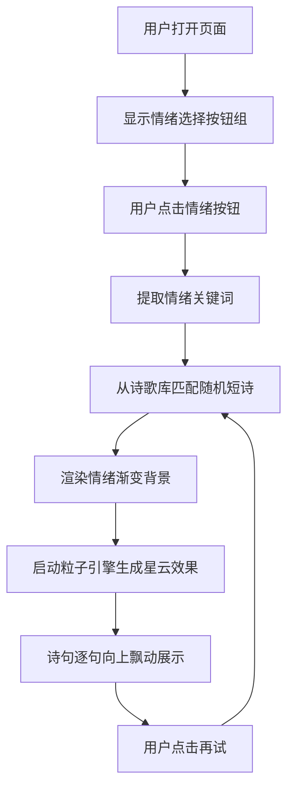

## 1. 产品概述

心情诗歌壁纸是一款根据用户情绪动态生成诗意壁纸的 Web 应用。用户选择当前心情后，系统自动匹配一首短诗，并以渐变抽象画加流动粒子效果呈现为全屏壁纸，诗句如星光般在画布上缓缓飘动。

- 核心价值：将情绪转化为视觉艺术与诗歌的沉浸式体验，为用户提供情感共鸣与心灵慰藉
- 目标用户：追求诗意生活、需要情绪调节、喜欢动态壁纸的年轻用户群体

## 2. 核心功能

### 2.1 功能模块

1. **情绪选择界面**：四个预设情绪按钮（快乐、忧郁、浪漫、宁静），各具独特配色与图标
2. **诗歌匹配引擎**：本地预置诗歌库（每类情绪至少 10 首），根据情绪随机匹配短诗
3. **Canvas 壁纸渲染**：情绪渐变背景 + 星云粒子动画 + 诗句飘动展示
4. **自适应响应系统**：全屏铺满、窗口自适应、横竖屏兼容
5. **刷新机制**：底部"点击再试"按钮，可重新生成同情绪下的新诗与粒子效果

### 2.2 页面详情

| 页面名称 | 模块名称 | 功能描述 |
|-----------|-------------|---------------------|
| 主页面 | 情绪选择按钮组 | 四个圆形毛玻璃按钮，悬浮放大 1.1 倍带光晕，选中状态脉冲动画 |
| 主页面 | Canvas 壁纸画布 | 情绪渐变背景、80 个半透明圆形粒子流动、诗句自底部向上飘动 |
| 主页面 | 刷新按钮 | 底部小字"点击再试"，点击重新生成诗歌与粒子 |

## 3. 核心流程

用户打开页面 → 看到深色背景与四个情绪按钮 → 点击某一情绪按钮 → 系统匹配该情绪下的随机诗歌 → 画布渲染对应情绪的渐变背景 → 粒子引擎启动并生成星云流动效果 → 诗句逐句从底部向上飘动（每句停留 5 秒）→ 用户可点击底部"点击再试"刷新 → 重新匹配诗歌并重绘粒子

## 4. 用户界面设计

### 4.1 设计风格

- **主色调**：深色背景 `#1a1a2e` 衬托彩色渐变
- **情绪色彩映射**：
  - 快乐 → 暖橙黄渐变 `#ff9a56 → #ffd93d`
  - 忧郁 → 冷蓝紫渐变 `#2c3e9e → #6a4c93`
  - 浪漫 → 粉紫色渐变 `#ff6b9d → #c44569`
  - 宁静 → 翠绿蓝渐变 `#00b894 → #0984e3`
- **按钮风格**：圆形半透明毛玻璃（backdrop-filter blur），悬浮放大 1.1 倍带光晕，选中脉冲动画
- **字体**：衬线体展示诗句，无衬线体做辅助文字
- **布局**：全屏 Canvas 融合页面，按钮组 flex 居中，底部刷新文字

### 4.2 页面设计概述

| 页面名称 | 模块名称 | UI 元素 |
|-----------|-------------|-------------|
| 主页面 | 情绪按钮组 | 4 个圆形毛玻璃按钮水平排列，每个带独特情绪色光晕、emoji 图标，hover 放大 1.1x，选中脉冲 |
| 主页面 | Canvas 画布 | 无边框全屏融合，渐变背景 + 半透明粒子流动缩放 + 白色诗句缓慢上飘 |
| 主页面 | 刷新提示 | 底部居中一行半透明白色小字"点击再试"，悬浮时变亮 |

### 4.3 响应式设计

- 桌面端优先，自适应移动端
- Canvas 使用 `window.innerWidth/innerHeight` 全屏铺满
- 按钮组 flex 居中，移动端自动换行
- 监听 `resize` 事件，画布自动重绘并保持粒子比例
- 监听 `orientationchange`，手机横竖屏切换后布局稳定

### 4.4 动效与性能

- 粒子动画使用 `requestAnimationFrame`，目标 60fps，最低 30fps
- 按钮点击反馈延迟 < 100ms
- 诗句每句停留 5 秒后平滑切换下一句
- 粒子约 80 个，颜色半透明，缓慢缩放运动形成星云感
