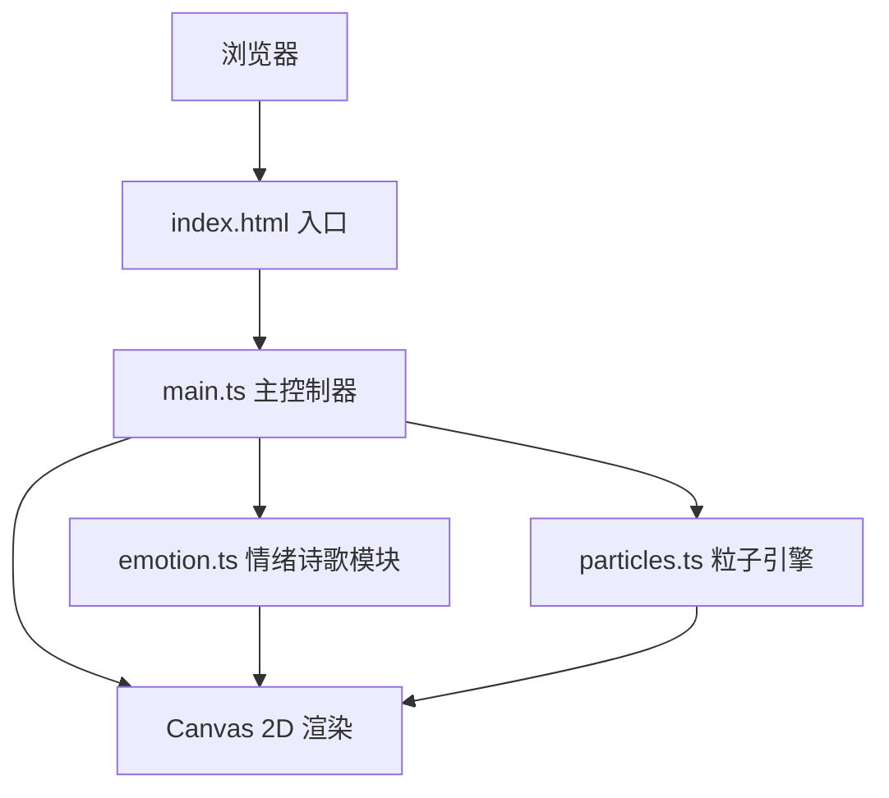

## 1. 架构设计



前端单页应用，无后端服务。采用模块化分层设计：情绪诗歌数据层、粒子引擎层、主控制层、Canvas 渲染层。

## 2. 技术选型说明

- **前端框架**：原生 TypeScript（无 UI 框架），直接操作 DOM 与 Canvas API
- **构建工具**：Vite 5.x，开发端口 3000，热模块替换
- **语言**：TypeScript 5.x，严格模式，target ES2020
- **渲染**：HTML5 Canvas 2D API
- **动画**：`requestAnimationFrame` 驱动 60fps 渲染循环
- **样式**：原生 CSS，使用 CSS 变量管理情绪颜色
- **数据**：本地 TypeScript 模块内置诗歌库，无外部 API 依赖

## 3. 文件结构

```
auto5/
├── package.json          # 项目依赖与脚本
├── tsconfig.json         # TypeScript 严格配置
├── vite.config.js        # Vite 开发配置（端口 3000）
├── index.html            # 入口 HTML，含 Canvas 容器与按钮组
└── src/
    ├── main.ts           # 主入口：初始化、事件绑定、动画循环
    ├── emotion.ts        # 情绪数据与诗歌库
    └── particles.ts      # 粒子引擎：粒子数组、更新、绘制、resize
```

## 4. 核心模块定义

### 4.1 emotion.ts

```typescript
export type EmotionType = 'happy' | 'melancholy' | 'romantic' | 'serene';

export interface EmotionConfig {
  name: string;
  icon: string;
  gradientStart: string;
  gradientEnd: string;
  particleColor: string;
  poems: string[][];  // 每首诗为 string[]，按行存储
}

export function getEmotionConfig(type: EmotionType): EmotionConfig;
export function getRandomPoem(type: EmotionType): string[];
```

诗歌库要求：每种情绪至少预置 10 首短诗，每首诗 2-4 行。

### 4.2 particles.ts

```typescript
export interface Particle {
  x: number;
  y: number;
  vx: number;
  vy: number;
  radius: number;
  baseRadius: number;
  alpha: number;
  scalePhase: number;
  color: string;
}

export class ParticleEngine {
  constructor(canvas: HTMLCanvasElement, particleCount: number, color: string);
  update(deltaTime: number): void;
  draw(ctx: CanvasRenderingContext2D): void;
  resize(): void;
  setColor(color: string): void;
  reset(): void;
}
```

约 80 个粒子，半透明圆形，缓慢随机运动与缩放，形成星云流动感。

### 4.3 main.ts

负责：
- Canvas 初始化与全屏适配
- 情绪按钮事件绑定
- 动画主循环（渐变背景 → 粒子 → 诗句）
- 诗句飘动控制（每句停留 5 秒切换）
- resize / orientationchange 监听
- 刷新按钮逻辑

## 5. 性能指标

- 粒子动画：稳定 60fps，最低保证 30fps
- 按钮点击反馈：延迟 < 100ms
- Canvas 重绘：resize 触发后 1 帧内完成
- 内存：粒子对象复用，resize 时重置而非重建
