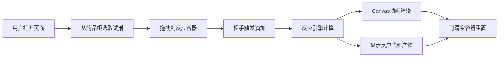

## 1. 产品概述
虚拟化学实验室是一款基于浏览器的交互式化学实验模拟应用，用户可以通过拖拽试剂瓶到反应容器中进行化学实验，实时观察反应现象。
- 主要目的：提供安全、可视化的化学实验教学工具，让学生和化学爱好者能够直观理解化学反应过程
- 目标用户：学生、化学教师、化学爱好者

## 2. 核心功能

### 2.1 功能模块
1. **药品柜模块**：抽屉式UI展示化学试剂，支持拖拽操作
2. **实验台模块**：中央区域放置反应容器（烧杯/试管切换），支持试剂滴加和反应显示
3. **反应引擎模块**：实时计算化学反应产物、颜色变化、温度变化
4. **可视化模块**：Canvas绘制液面动画、气泡粒子、沉淀沉积、温度计
5. **信息展示模块**：反应式展示、产物信息表格

### 2.2 页面详情
| 页面名称 | 模块名称 | 功能描述 |
|---------|---------|---------|
| 实验室主页 | 药品柜抽屉 | 3个抽屉，每个3-4种试剂，0.3秒缓动开关动画 |
| 实验室主页 | 实验台容器 | 烧杯/试管切换，液面上升动画，局部变色效果 |
| 实验室主页 | 温度计 | 0-100°C，红色水银柱平滑升降，30fps更新 |
| 实验室主页 | 反应信息区 | 数学格式反应式、产物表格（名称/状态/颜色） |
| 实验室主页 | 控制按钮 | 清空容器按钮（红色脉冲动画）、容器切换按钮 |

## 3. 核心流程
用户打开页面 → 从左侧药品柜抽屉中选取试剂瓶 → 拖拽试剂瓶到中央实验台反应容器 → 松手触发试剂滴加 → 反应引擎计算化学反应 → 实时渲染液面变化、颜色变化、气泡、沉淀、温度计 → 右侧展示反应式和产物信息 → 可点击清空容器按钮重置实验

## 4. 用户界面设计

### 4.1 设计风格
- **主色**：#2c3e50（深灰蓝）
- **辅色**：#3498db（蓝色）
- **警示色**：#e74c3c（红色，用于清空按钮）
- **按钮样式**：圆角8px，悬停阴影 box-shadow: 0 4px 12px rgba(0,0,0,0.3)
- **背景**：深灰蓝色带细微网格纹理
- **清空按钮**：红色带脉冲呼吸动画
- **布局**：三栏布局（左药品柜、中实验台、右信息区）

### 4.2 页面设计概述
| 页面名称 | 模块名称 | UI元素 |
|---------|---------|---------|
| 实验室主页 | 药品柜抽屉 | 半透明试剂瓶、溶液颜色显示、浓度标签、0.3s缓动动画 |
| 实验室主页 | 反应容器 | 半透明玻璃质感、液面波纹、局部变色扩散、沉淀颗粒 |
| 实验室主页 | 温度计 | 刻度标记、红色水银柱、平滑升降动画 |
| 实验室主页 | 右侧信息 | 数学格式反应式、产物表格 |
| 实验室主页 | 控制按钮 | 圆角设计、悬停阴影、脉冲动画 |

### 4.3 响应式
- 桌面优先设计，适配平板设备
- 最小宽度：600px
- 平板模式下自适应调整布局比例

## 5. 性能要求
- 点击反应后200ms内显示动画开始
- 所有动画保持60fps
- 温度计更新速率30fps
