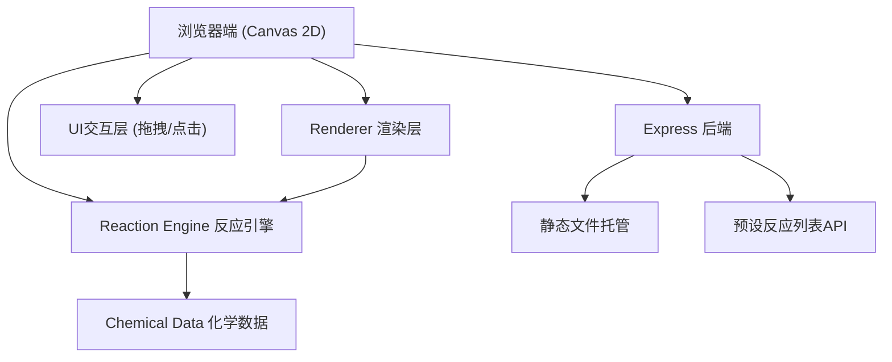

## 1. 架构设计



## 2. 技术描述
- **前端**：TypeScript + 原生 Canvas 2D API（无框架依赖，性能最优）
- **构建工具**：Vite（开发服务器与热更新）
- **后端**：Express@4.18.2（静态文件服务 + API）
- **开发工具**：ts-node（TypeScript执行环境）
- **类型支持**：@types/express、@types/node

## 3. 项目文件结构
```
.
├── package.json
├── tsconfig.json
├── index.html
└── src/
    ├── chemicalData.ts    # 化学试剂数据与反应映射
    ├── reactionEngine.ts  # 核心化学反应算法
    ├── renderer.ts        # Canvas渲染引擎
    └── server.ts          # Express服务器
```

## 4. API定义

### GET /api/reactions
获取预设化学反应列表

**响应格式：**
```typescript
interface Reaction {
  reactants: string[];    // 反应物化学式
  products: Array<{       // 产物列表
    name: string;         // 产物名称
    formula: string;      // 产物化学式
    state: 'aqueous' | 'solid' | 'gas' | 'liquid';  // 状态
    color: string;        // 颜色Hex值
  }>;
  equation: string;       // 反应方程式字符串
  temperatureChange: number;  // 温度变化（正值放热，负值吸热）
  precipitation: boolean;     // 是否产生沉淀
  gasEvolution: boolean;      // 是否产生气体
  colorChange: string | null; // 最终颜色变化
}
```

## 5. 核心数据模型

### 5.1 化学试剂 (Chemical)
```typescript
interface Chemical {
  id: string;
  name: string;           // 中文名称
  formula: string;        // 化学式
  concentration: string;  // 浓度，如 "1mol/L"
  color: string;          // 溶液颜色Hex值
  type: 'acid' | 'base' | 'salt' | 'indicator' | 'other';
  drawer: number;         // 所在抽屉编号
}
```

### 5.2 反应结果 (ReactionResult)
```typescript
interface ReactionResult {
  success: boolean;
  equation: string;
  products: Product[];
  finalColor: string;
  temperatureDelta: number;
  hasPrecipitate: boolean;
  precipitateColor?: string;
  hasGas: boolean;
  precipitateParticles: PrecipitateParticle[];
  bubbles: BubbleParticle[];
}
```

## 6. 渲染数据流
1. 用户拖拽试剂 → UI层捕获事件
2. 触发滴加 → ReactionEngine.calculate() 接收试剂列表
3. 反应引擎匹配反应式 → 计算颜色变化、沉淀参数、温度变化
4. 输出渲染指令（粒子参数、颜色值、温度值）
5. Renderer每帧从引擎获取状态并更新Canvas
