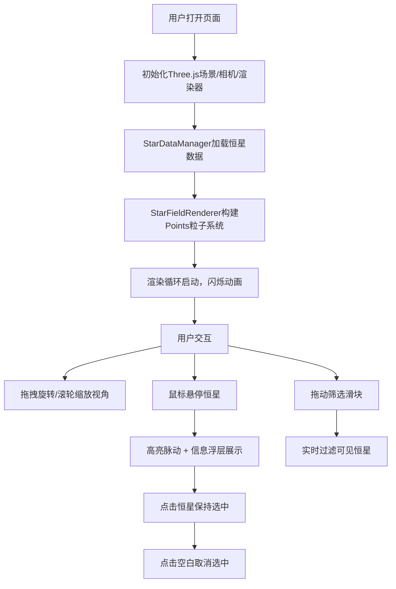

## 1. 产品概述

交互式3D恒星可视化浏览器应用，为天文学爱好者提供沉浸式的恒星探索体验。用户可通过旋转缩放视角观察真实恒星的三维空间分布，获取每颗恒星的亮度、距离、光谱类型等详细信息。

- 核心价值：将抽象的天文数据转化为可交互的三维视觉体验，降低星空探索门槛
- 目标用户：天文学爱好者、学生、科普教育工作者

## 2. 核心特性

### 2.1 功能模块

1. **三维星图主场景**：基于Three.js渲染的2000+颗恒星粒子系统，支持OrbitControls视角控制
2. **恒星信息交互层**：鼠标悬停/点击选中恒星，高亮动画 + 详细信息面板展示
3. **筛选控制面板**：亮度阈值滑块、距离范围滑块，实时过滤可见恒星
4. **响应式UI层**：桌面端右侧浮动面板、移动端底部抽屉，信息浮层科技感展示

### 2.2 页面详情

| 页面名称 | 模块名称 | 功能描述 |
|----------|----------|----------|
| 星图主页 | 3D渲染场景 | 全屏canvas渲染恒星粒子，支持拖拽旋转、滚轮缩放、上下60°视角限制 |
| 星图主页 | 信息浮层 | 左上角展示选中恒星的名称、星等、距离、光谱类型，monospace字体，淡入淡出过渡 |
| 星图主页 | 筛选控制面板 | 右侧半透明毛玻璃面板，亮度阈值(-2~6星等)、距离范围(10~500光年)滑块 |
| 星图主页 | 移动端适配 | 控制面板折叠为底部抽屉式弹出，触屏友好操作 |

## 3. 核心流程

用户打开应用 → 初始化3D场景、相机、渲染器 → 加载并渲染2000颗恒星数据 → 用户拖拽旋转/滚轮缩放观察星图 → 鼠标悬停某颗恒星（高亮+信息展示）→ 点击选中（保持高亮）→ 拖动筛选滑块（实时过滤恒星）→ 点击空白处取消选中

## 4. 用户界面设计

### 4.1 设计风格
- **主色调**：深空蓝 `#0a0e27`（背景），径向渐变至 `#1a1f3a`
- **强调色**：恒星光谱色（O型蓝白 `#9bb0ff`、B型蓝 `#aabfff`、A型白 `#cad7ff`、F型黄白 `#f8f7ff`、G型黄 `#fff4ea`、K型橙 `#ffd2a1`、M型红 `#ffcc6f`）
- **面板效果**：半透明 `rgba(10, 14, 39, 0.75)` + 毛玻璃 `backdrop-filter: blur(12px)`
- **字体**：信息面板使用 monospace 等宽字体，营造科技感
- **动画风格**：筛选面板右侧滑入（0.4s ease-out）、信息切换淡入淡出（0.2s）、恒星悬停放大1.5倍脉动（0.8s周期）

### 4.2 页面设计概览

| 页面名称 | 模块名称 | UI元素 |
|----------|----------|--------|
| 星图主页 | 3D场景 | 全屏canvas，深空径向渐变背景，2000+粒子带发光sprite，透明度0.8~1.0闪烁 |
| 星图主页 | 信息浮层 | 左上角圆角半透明卡片，monospace字体，键值对布局，内容切换淡入淡出 |
| 星图主页 | 控制面板 | 右侧垂直面板，毛玻璃效果，两个滑块带数值标签，触屏优化 |
| 星图主页 | 移动端抽屉 | 底部抽屉把手，上滑展开控制面板，平滑过渡动画 |

### 4.3 响应式设计
- **桌面端（>768px）**：右侧固定半透明控制面板（宽280px），左上角信息浮层
- **移动端（≤768px）**：控制面板折叠为底部抽屉，点击/上滑展开，信息浮层宽度自适应

### 4.4 3D场景指引
- **环境**：深空渐变背景（无HDRI），无需额外光源（粒子自发光）
- **相机**：PerspectiveCamera，fov=60，初始位置(0, 0, 300)，near=0.1，far=2000
- **控制器**：OrbitControls，enableDamping=true，dampingFactor=0.05，minDistance=50，maxDistance=800，minPolarAngle=π/3（60°上限），maxPolarAngle=2π/3（60°下限）
- **粒子**：THREE.Points + THREE.BufferGeometry，每个粒子带自定义大小和颜色，使用Canvas生成的径向渐变sprite纹理实现发光效果
- **动画**：每帧更新粒子透明度实现闪烁（随机周期1~3秒），悬停粒子缩放脉动动画
