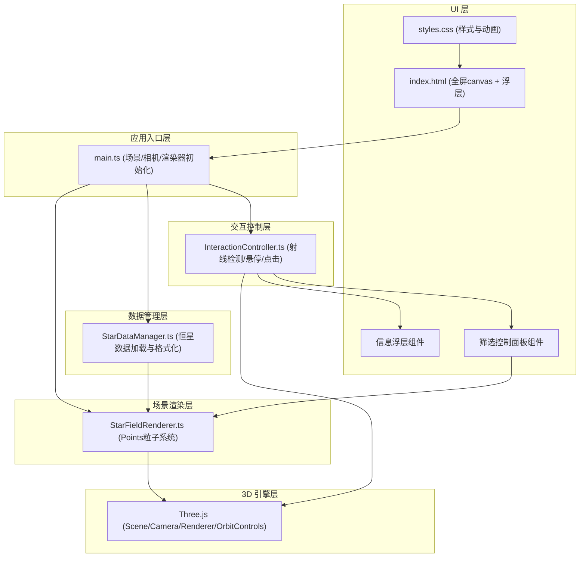

## 1. 架构设计



## 2. 技术选型

- **前端框架**：原生 TypeScript（无React/Vue，符合用户对Three.js直接控制的需求）
- **构建工具**：Vite 5.x（快速热更新、原生ESM支持）
- **3D 引擎**：Three.js 0.160.0 + @types/three
- **控制器**：OrbitControls（Three.js内置）
- **类型系统**：TypeScript 5.x（strict严格模式）
- **样式方案**：原生CSS（backdrop-filter毛玻璃、CSS动画、CSS变量）

## 3. 项目目录结构

```
auto51/
├── index.html                  # 入口HTML，含canvas与UI容器
├── package.json                # 依赖与脚本配置
├── tsconfig.json               # TS严格模式配置
├── vite.config.js              # Vite构建配置
└── src/
    ├── main.ts                 # 应用主入口
    ├── types/
    │   └── star.ts             # 恒星数据类型定义
    ├── data/
    │   └── StarDataManager.ts  # 恒星数据管理
    ├── scene/
    │   └── StarFieldRenderer.ts # 粒子渲染器
    ├── interaction/
    │   └── InteractionController.ts # 交互控制
    └── styles/
        └── main.css            # 全局样式
```

## 4. 核心数据模型

### 4.1 恒星数据类型定义

```typescript
// src/types/star.ts
export type SpectralType = 'O' | 'B' | 'A' | 'F' | 'G' | 'K' | 'M';

export interface StarData {
  id: number;
  name?: string;
  x: number;       // 3D空间坐标X
  y: number;       // 3D空间坐标Y
  z: number;       // 3D空间坐标Z
  magnitude: number; // 星等（数值越小越亮）
  distance: number;  // 距离（光年）
  spectralType: SpectralType;
}

export interface StarFilterOptions {
  minMagnitude: number;  // 亮度阈值（显示低于此星等的恒星）
  maxDistance: number;   // 最大距离（光年）
  minDistance: number;   // 最小距离（光年）
}
```

### 4.2 光谱类型颜色映射

| 光谱类型 | 颜色HEX | 说明 |
|---------|---------|------|
| O | `#9bb0ff` | 蓝白色 |
| B | `#aabfff` | 蓝色 |
| A | `#cad7ff` | 白色 |
| F | `#f8f7ff` | 黄白色 |
| G | `#fff4ea` | 黄色（太阳属此类） |
| K | `#ffd2a1` | 橙色 |
| M | `#ffcc6f` | 红色 |

## 5. 模块接口定义

### 5.1 StarDataManager

```typescript
class StarDataManager {
  stars: StarData[];
  constructor();
  loadStars(count: number): StarData[];       // 生成/加载恒星数据
  sortByDistance(): StarData[];               // 按距离排序
  sortByMagnitude(): StarData[];              // 按亮度排序
  filter(options: StarFilterOptions): StarData[]; // 筛选恒星
}
```

### 5.2 StarFieldRenderer

```typescript
class StarFieldRenderer {
  points: THREE.Points;
  constructor(scene: THREE.Scene, stars: StarData[]);
  setStars(stars: StarData[]): void;           // 更新恒星数据
  applyFilter(options: StarFilterOptions): void; // 应用筛选
  highlightStar(starId: number | null): void;   // 高亮/取消高亮恒星
  update(delta: number): void;                  // 每帧更新（闪烁动画）
  dispose(): void;                              // 资源释放
}
```

### 5.3 InteractionController

```typescript
class InteractionController {
  constructor(
    camera: THREE.PerspectiveCamera,
    renderer: THREE.WebGLRenderer,
    starField: StarFieldRenderer,
    stars: StarData[],
    onHover: (star: StarData | null) => void,
    onClick: (star: StarData | null) => void
  );
  update(): void;  // 射线检测更新
  dispose(): void;
}
```

## 6. 性能优化策略

### 6.1 渲染性能
- 使用单个 `THREE.Points` + `BufferGeometry` 批量渲染所有恒星，避免2000个独立Mesh
- 粒子大小通过 `THREE.PointsMaterial.size` + shader实现屏幕空间一致尺寸
- 发光效果使用Canvas预渲染径向渐变sprite纹理，避免实时计算

### 6.2 筛选性能
- 筛选不重建Geometry，仅通过设置每个顶点的visibility或缩放至0实现
- 使用 typed array (Float32Array) 存储顶点数据，GPU友好

### 6.3 交互性能
- Raycaster检测频率与渲染循环同步，避免独立定时器
- 悬停/点击事件节流（与requestAnimationFrame同步）
- 使用pointer events统一处理鼠标与触屏

### 6.4 FPS目标
- 视角操作：≥45 FPS
- 静态渲染（2000粒子）：≥50 FPS
