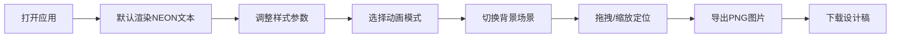

## 1. 产品概述

霓虹灯牌设计工作台是一个基于浏览器的交互式设计工具，解决实体霓虹灯制作前无法快速预览不同字体、颜色、动画和排列组合效果的问题。用户可以实时调整霓虹参数，预览动态效果，并导出高精度PNG设计稿。

- **目标用户**：霓虹灯设计师、广告从业者、DIY爱好者
- **核心价值**：降低设计沟通成本，提升预览效率，减少实体制作返工

## 2. 核心功能

### 2.1 功能模块

1. **中央画布区**：文本显示、实时渲染、拖拽移动、缩放控制
2. **右侧样式面板**：霓虹颜色选择器、发光强度滑块、管径调节滑块
3. **底部动画工具栏**：五种闪烁模式切换按钮
4. **左侧场景面板**：三种虚拟安装背景切换
5. **导出功能**：PNG图片导出（透明背景，保留辉光效果）

### 2.2 页面详情

| 页面名称 | 模块名称 | 功能描述 |
|---------|---------|----------|
| 主工作台 | 中央画布区 | 800x600px画布，显示霓虹灯文本，支持拖拽移动和滚轮缩放（0.5-2.0倍） |
| 主工作台 | 样式面板 | 12种预设霓虹色选择器、发光强度滑块（0.5-3.0倍）、管径滑块（4-16px） |
| 主工作台 | 动画工具栏 | 常亮、呼吸渐变、流水追逐、随机眨眼、频闪五种模式切换 |
| 主工作台 | 场景面板 | 砖墙纹理、黑色亚克力板、磨砂玻璃幕墙三种背景切换 |
| 主工作台 | 导出区 | 导出PNG按钮+下载链接 |

## 3. 核心流程

用户打开应用 → 默认显示"NEON"文本 → 调整颜色/强度/管径参数 → 选择动画模式 → 切换背景场景 → 拖拽/缩放调整位置 → 点击导出PNG → 下载设计稿

## 4. 用户界面设计

### 4.1 设计风格

- **主色调**：深色背景 #1a1a2e，霓虹色点缀
- **面板风格**：毛玻璃效果（rgba(255,255,255,0.08)，backdrop-blur: 16px，边框1px rgba(255,255,255,0.12)）
- **按钮风格**：圆角设计，悬浮时1.02倍微缩放 + 白色描边光晕
- **字体**：显示字体使用 Orbitron（霓虹科技感），正文字体使用 JetBrains Mono
- **布局**：三栏布局，左场景面板280px + 中央画布区 + 右样式面板280px，底部动画工具栏

### 4.2 页面设计概览

| 页面名称 | 模块名称 | UI元素 |
|---------|---------|--------|
| 主工作台 | 场景面板 | 背景缩略图网格（3个），点击选中高亮 |
| 主工作台 | 画布区 | 800x600深色容器，Canvas叠加，拖拽时光标变为grab |
| 主工作台 | 样式面板 | 12色圆形色块网格（带辉光预览）、两条滑块控件 |
| 主工作台 | 动画工具栏 | 5个模式切换按钮，选中状态高亮 + 激活指示器 |
| 主工作台 | 导出按钮 | 位于画布右上角，突出显示 |

### 4.3 响应式设计

- **桌面优先**：默认画布800x600px
- **窄屏适配**：窗口宽度 < 900px时，画布自适应100%宽度，降低分辨率以保持性能
- **触屏优化**：滑块和按钮最小点击区域44x44px

### 4.4 动效规范

- 参数调节过渡：0.2秒平滑过渡
- 模式切换过渡：0.5秒交叉淡入淡出
- 背景切换过渡：1秒渐变过渡
- 悬浮交互：1.02倍缩放 + 光晕描边
- 动画性能：所有模式下帧率 ≥ 55FPS
