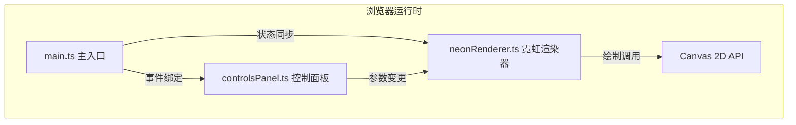

## 1. 架构设计



## 2. 技术描述

- **前端框架**：原生 TypeScript（无UI框架）
- **构建工具**：Vite@5
- **渲染引擎**：Canvas 2D API（原生，无第三方图形库）
- **开发语言**：TypeScript@5（严格模式，目标ES2020）
- **样式方案**：原生CSS + CSS变量（深色主题）

## 3. 核心模块设计

### 3.1 文件组织结构

| 文件路径 | 职责 |
|---------|------|
| `package.json` | 项目依赖、脚本配置 |
| `tsconfig.json` | TypeScript编译配置（严格模式、ES2020） |
| `vite.config.js` | Vite构建配置 |
| `index.html` | 入口HTML，全屏深色背景，主容器结构 |
| `src/main.ts` | 应用主入口：初始化、事件绑定、窗口resize响应式 |
| `src/neonRenderer.ts` | 渲染核心：文本轮廓转管状路径、多层辉光、动画帧循环、PNG导出 |
| `src/controlsPanel.ts` | 控制面板：滑块/颜色/按钮事件监听、状态同步、参数转换 |

### 3.2 模块接口定义

#### NeonRenderer 类

```typescript
interface NeonRenderParams {
    text: string;
    color: string;
    glowIntensity: number;      // 0.5 - 3.0
    tubeWidth: number;          // 4 - 16 (px)
    animationMode: AnimationMode;
    background: BackgroundType;
    position: { x: number; y: number };
    scale: number;              // 0.5 - 2.0
}

type AnimationMode = 'static' | 'breathing' | 'chase' | 'blink' | 'strobe';
type BackgroundType = 'brick' | 'acrylic' | 'glass';

class NeonRenderer {
    constructor(canvas: HTMLCanvasElement);
    setParams(params: Partial<NeonRenderParams>): void;
    start(): void;
    stop(): void;
    exportPNG(): string;  // 返回data URL
}
```

#### ControlsPanel 类

```typescript
interface PanelCallbacks {
    onParamsChange: (params: Partial<NeonRenderParams>) => void;
    onExport: () => void;
}

class ControlsPanel {
    constructor(root: HTMLElement, callbacks: PanelCallbacks);
    setParams(params: Partial<NeonRenderParams>): void;
}
```

## 4. 渲染算法说明

### 4.1 霓虹辉光绘制（多层高斯模糊叠加）

1. **底层辉光**：模糊半径 40px × 强度系数，不透明度 0.3
2. **中层辉光**：模糊半径 20px × 强度系数，不透明度 0.5
3. **顶层辉光**：模糊半径 8px × 强度系数，不透明度 0.8
4. **灯管核心**：无模糊，白色核心 + 颜色描边

### 4.2 动画模式实现

| 模式 | 算法 |
|------|------|
| static | alpha = 1.0 |
| breathing | alpha = 0.5 + 0.5 × sin(2πt / 2000ms) |
| chase | 逐字 alpha，第i字在 t ∈ [i×300ms, i×300ms+500ms] 区间内点亮 |
| blink | 每字独立随机种子，间隔 500-2000ms 随机切换亮灭 |
| strobe | alpha = (t % 200ms) < 100ms ? 1.0 : 0.0 |

### 4.3 投影效果

- 模糊半径：12px
- 偏移量：(2px, 2px)
- 颜色：取霓虹色，不透明度 30%

### 4.4 背景纹理生成

三种背景均使用Canvas程序化生成：
- **砖墙**：重复砖块图案 + 砂浆缝隙 + 噪点纹理
- **黑色亚克力**：深色渐变 + 细微反射高光
- **磨砂玻璃**：半透明渐变 + 高斯模糊噪点

## 5. 性能优化策略

1. **离屏Canvas缓存**：静态背景纹理预渲染到离屏canvas，每帧直接贴图
2. **脏矩形渲染**：仅重绘文本变化区域（全屏动画模式下仍全量重绘）
3. **requestAnimationFrame**：使用系统刷新率同步，避免掉帧
4. **响应式降级**：窗口宽度<900px时降低canvas内部分辨率
5. **参数平滑过渡**：使用线性插值在0.2s内过渡参数，避免突变
