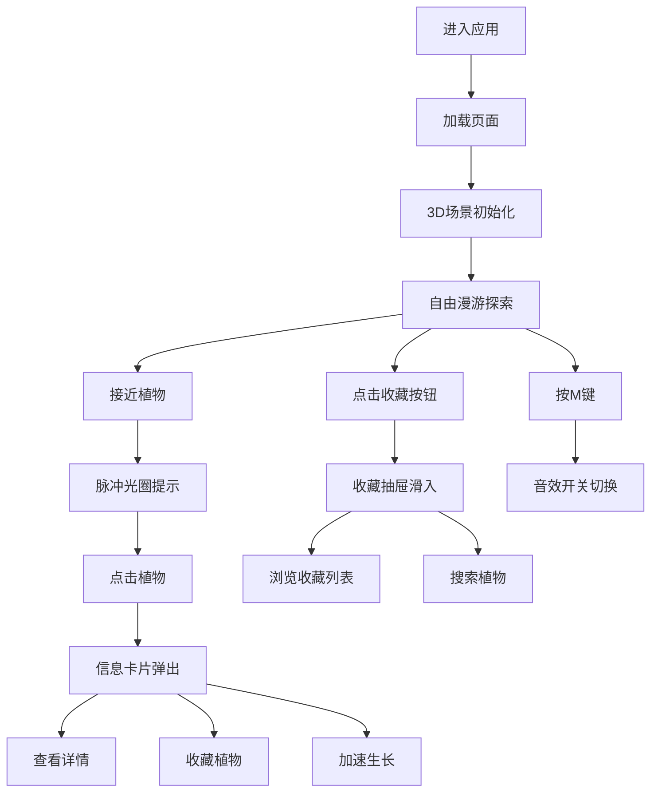

## 1. 产品概述
沉浸式虚拟植物园漫步应用，让用户无法亲身前往植物园时也能获得身临其境的植物探索体验。
- 主要目的：通过3D交互技术模拟真实植物园探索，提供植物科普知识和沉浸式漫游体验
- 目标用户：植物爱好者、学生、自然探索者、无法外出的人群
- 市场价值：填补线上虚拟植物探索的空白，提供教育与娱乐结合的体验

## 2. 核心功能

### 2.1 用户角色
| 角色 | 注册方式 | 核心权限 |
|------|----------|----------|
| 普通用户 | 无需注册，直接使用 | 3D漫游、植物查看、收藏管理、搜索 |

### 2.2 功能模块
1. **3D植物园场景**：第一人称视角漫游，4个主题展区，WASD移动控制
2. **植物交互系统**：近距离提示、信息弹窗、收藏功能、加速生长
3. **收藏管理**：收藏列表抽屉、模糊搜索、时间排序
4. **植物生长模拟**：动态生长曲线、开花状态、加速生长
5. **环境氛围系统**：背景音乐、萤火虫粒子、蒲公英种子
6. **UI界面**：展区名称提示、音量控制、移动指引

### 2.3 页面详情
| 页面名称 | 模块名称 | 功能描述 |
|-----------|-------------|---------------------|
| 主场景 | 3D渲染区 | 全屏Three.js场景，4个植物展区，玩家自由漫游 |
| 主场景 | 展区名称 | 左上角显示当前所在展区名称，淡入切换 |
| 主场景 | 控制栏 | 右上角收藏按钮和音量滑块 |
| 主场景 | 移动提示 | 底部WASD指引，3秒后渐隐 |
| 信息卡片 | 植物详情 | 植物名称、学名、原产地、生长习性、收藏按钮、加速生长 |
| 收藏抽屉 | 收藏列表 | 右侧滑入，时间倒序，缩略图、名称、收藏时间 |
| 收藏抽屉 | 搜索功能 | 输入框模糊搜索，网格展示搜索结果 |

## 3. 核心流程
用户进入应用后，首先看到加载页面"植物园正在生长中..."，加载完成后进入3D植物园主场景。用户使用WASD键在场景中漫游探索，鼠标拖拽控制视角方向。当接近植物时出现脉冲光圈提示，点击植物弹出信息卡片查看详情，可选择收藏或加速生长。点击右上角书本图标打开收藏抽屉，查看已收藏植物并支持搜索。按M键可控制音效开关。

## 4. 用户界面设计

### 4.1 设计风格
- **主色调**：深绿色 #2E5B3A
- **辅色调**：米白色 #F5F0E6
- **强调色**：暖棕色 #D4A373
- **按钮风格**：圆角设计，悬浮放大1.05倍加阴影
- **字体**：中文优雅衬线字体搭配无衬线正文字体
- **布局风格**：全屏3D场景 + 悬浮式UI控件
- **图标风格**：自然简约线条风格

### 4.2 页面设计概述
| 页面名称 | 模块名称 | UI元素 |
|-----------|-------------|-------------|
| 加载页 | 加载提示 | 深绿背景，"植物园正在生长中..."文字，0.5秒淡入 |
| 主场景 | 展区名称 | 左上角浅色半透明文字，16px，0.3秒淡入切换 |
| 主场景 | 控制栏 | 右上角书本图标(40px，翻页动画) + 自定义音量滑块 |
| 主场景 | 移动提示 | 底部WASD图标组合，半透明，3秒后渐隐 |
| 信息卡片 | 详情弹窗 | 毛玻璃效果(12px模糊)，圆角12px，宽度320px，中心缩放0.5→1.0，0.3秒 |
| 收藏抽屉 | 侧边栏 | 右侧滑入，0.4秒ease-out，搜索框 + 网格列表 |
| 收藏抽屉 | 列表项 | 64x64圆形缩略图，淡入动画，悬浮缩放0.95→1.0 |

### 4.3 响应式设计
- 桌面端优先设计，移动端自动适配
- 触摸控制替代鼠标点击和拖拽
- UI元素根据屏幕尺寸自动调整位置和大小

### 4.4 3D场景设计
- **环境**：圆形植物园约100平方米，深棕色土壤纹理地面
- **光照**：自然光 + 柔和环境光，模拟白天户外光照
- **相机**：第一人称视角，高度1.6单位，移动速度3单位/秒
- **视角控制**：鼠标拖拽水平旋转，角度范围-30°~+30°，移动时带0.1单位镜头晃动
- **展区设置**：4个展区(热带雨林、沙漠多肉、高山草甸、温带森林)各约20平方米，半透明篱笆分隔
- **性能预算**：1080p下30FPS+，粒子≤200个，每植物≤100三角面片
