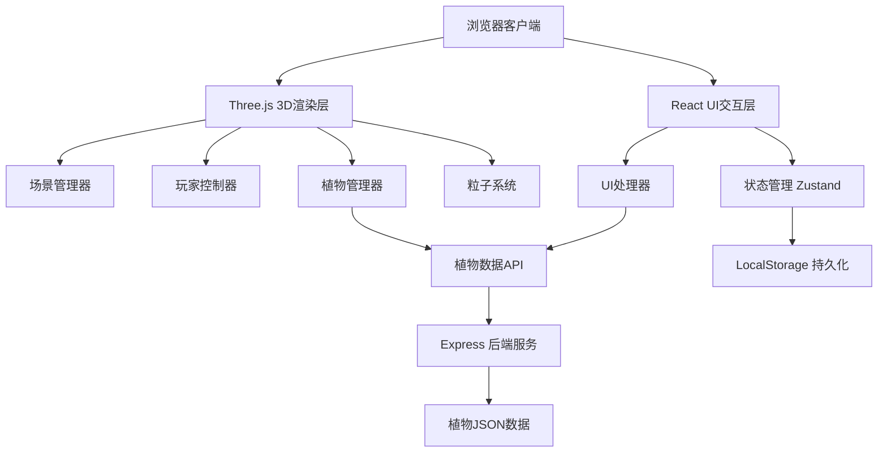
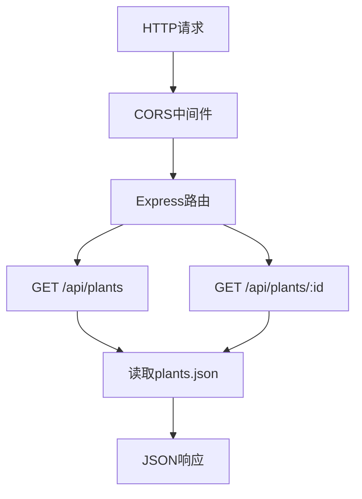
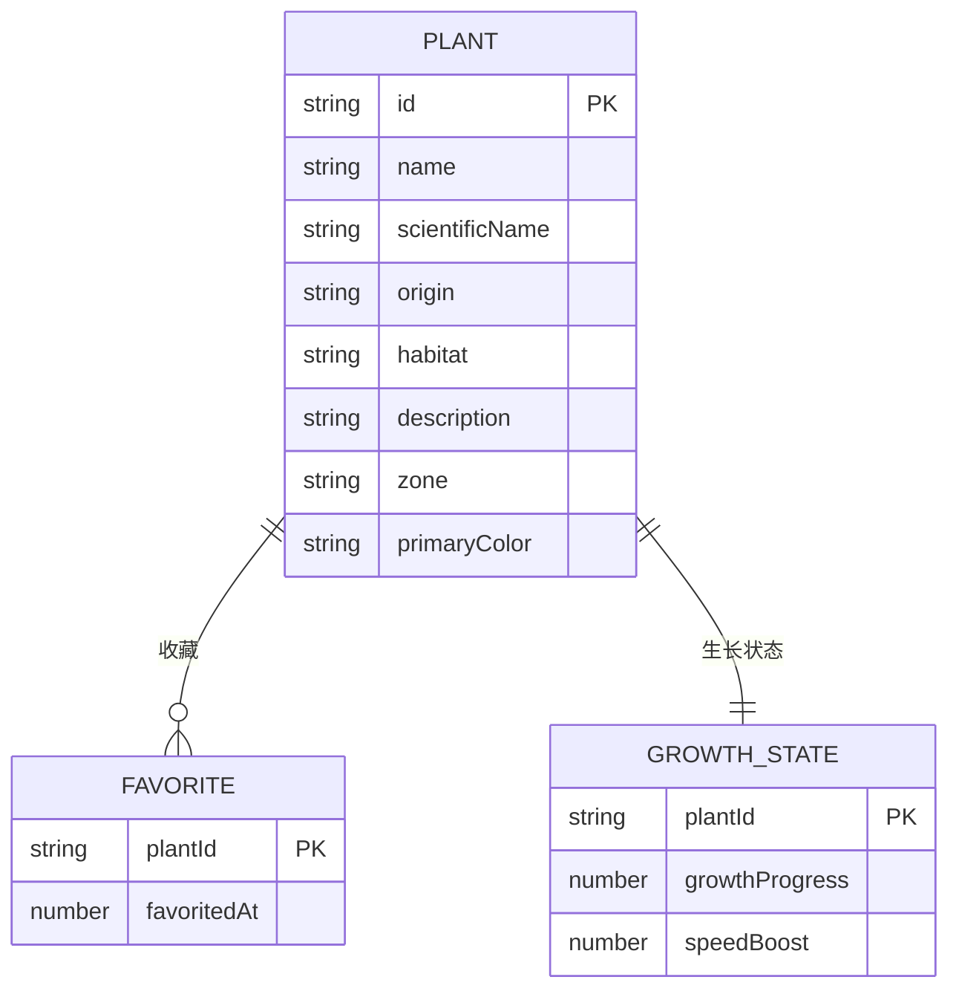

## 1. 架构设计



## 2. 技术说明
- **前端框架**：React@18 + TypeScript
- **3D引擎**：Three.js@0.160.0
- **构建工具**：Vite
- **状态管理**：Zustand
- **后端服务**：Express@4 + CORS
- **数据存储**：LocalStorage（前端）、JSON文件（后端）
- **音频处理**：Web Audio API

## 3. 路由定义
| 路由 | 用途 |
|-------|---------|
| / | 主场景页面，包含3D植物园和所有UI交互 |

## 4. API定义

### 4.1 类型定义
```typescript
interface Plant {
  id: string;
  name: string;
  scientificName: string;
  origin: string;
  habitat: string;
  description: string;
  zone: 'rainforest' | 'desert' | 'alpine' | 'temperate';
  position: { x: number; z: number };
  primaryColor: string;
  flowerColor?: 'pink' | 'purple';
}

interface FavoritePlant {
  plantId: string;
  plant: Plant;
  favoritedAt: number;
}

interface PlantGrowthState {
  plantId: string;
  growthProgress: number; // 0-1
  speedBoost: number; // seconds
}
```

### 4.2 API接口
| 方法 | 路径 | 描述 | 响应 |
|------|------|------|------|
| GET | /api/plants | 获取所有植物列表 | Plant[] |
| GET | /api/plants/:id | 获取单株植物详情 | Plant |

## 5. 服务器架构



## 6. 数据模型

### 6.1 ER图



### 6.2 前端数据结构（LocalStorage）
- `vf_favorites`: 收藏植物列表 `FavoritePlant[]`
- `vf_growth`: 植物生长状态 `Record<string, PlantGrowthState>`
- `vf_volume`: 音量设置 `number` (0-1)
- `vf_muted`: 静音状态 `boolean`

## 7. 文件结构

```
/
├── package.json
├── index.html
├── tsconfig.json
├── vite.config.js
├── src/
│   ├── main.ts              # 应用入口
│   ├── App.tsx              # React根组件
│   ├── PlantManager.ts      # 植物数据和生长管理
│   ├── PlayerController.ts  # 玩家控制
│   ├── UIHandler.ts         # UI管理
│   ├── components/
│   │   ├── InfoCard.tsx     # 植物信息卡片
│   │   ├── FavoritesDrawer.tsx # 收藏抽屉
│   │   ├── VolumeControl.tsx   # 音量控制
│   │   └── ZoneIndicator.tsx   # 展区指示
│   ├── hooks/
│   │   ├── useAudio.ts      # 音频hook
│   │   └── useFavorites.ts  # 收藏管理hook
│   ├── store/
│   │   └── useStore.ts      # Zustand状态管理
│   ├── utils/
│   │   ├── plants.ts        # 植物数据
│   │   └── helpers.ts       # 工具函数
│   └── types/
│       └── index.ts         # 类型定义
└── server/
    ├── index.js             # Express服务器
    └── plants.json          # 植物数据
```
