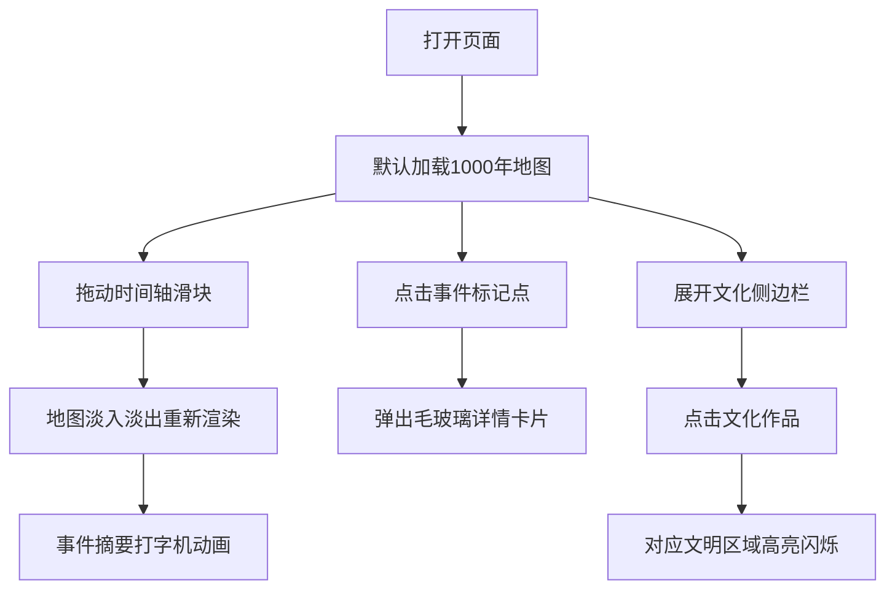

## 1. 产品概述

时间轴历史地图是一款基于浏览器的交互式历史学习工具，让用户如同翻阅动态历史书一般，通过时间轴探索不同年代的世界文明疆域、重大事件和文化成就。

- 目标用户：历史爱好者、学生、教育工作者
- 核心价值：以可视化方式呈现人类文明演进，降低历史学习门槛

## 2. 核心功能

### 2.1 功能模块

1. **主地图视图**：展示世界地图，根据选中年代渲染对应文明疆域多边形
2. **时间轴控件**：横向滑块控制年代（公元0-2000年，步长50年），显示当前年份与重大事件摘要
3. **事件标记系统**：地图上散布圆形标记点，点击弹出毛玻璃详情卡片
4. **文化代表作侧边栏**：按世纪分类展示文学、建筑、绘画代表作，支持折叠展开

### 2.2 页面详情

| 页面名称 | 模块名称 | 功能描述 |
|-----------|-------------|---------------------|
| 主界面 | 世界地图 | Leaflet暗色无标签底图，D3渲染文明疆域色块（80%透明度，1px实线边界） |
| 主界面 | 时间轴滑块 | 横向range滑块（0-2000年，步长50年），圆角手柄，切换时0.5s淡入淡出过渡 |
| 主界面 | 事件摘要 | 显示当前年份全球重大事件摘要，打字机动画逐字出现 |
| 主界面 | 事件标记点 | 圆形图标（直径12px），点击弹出毛玻璃详情卡片（背景模糊12px，2px发光边框，0.3s缩放动画） |
| 主界面 | 文化侧边栏 | 宽280px可折叠，按世纪分类展示文化代表作，选中触发文明区域高亮闪烁（亮度1.2倍，1Hz，3秒） |

## 3. 核心流程

用户打开页面 → 默认展示公元1000年地图（宋、拜占庭、阿拉伯帝国等文明）→ 拖动时间轴滑块 → 地图重新渲染对应年代疆域（0.5s淡入淡出）→ 事件摘要打字机动画显示 → 点击事件标记点查看详情 → 展开侧边栏浏览文化代表作 → 点击作品触发对应文明区域高亮

## 4. 用户界面设计

### 4.1 设计风格

- **主色调**：深褐色仿羊皮纸背景 `#4A3728`，金色点缀 `#D4AF37`
- **字体**：Georgia 衬线字体，营造古典书籍质感
- **面板样式**：半透明深色底 `rgba(30,20,15,0.85)`，金色边框，发光阴影
- **动画效果**：0.3-0.5秒平滑过渡，打字机效果，缩放弹出，高亮闪烁

### 4.2 页面设计概览

| 页面名称 | 模块名称 | UI元素 |
|-----------|-------------|-------------|
| 主界面 | 地图容器 | 全屏Leaflet地图，暗色底图，文明色块带透明度 |
| 主界面 | 时间轴区域 | 顶部横向滑块，金色圆角手柄，底部年份与事件摘要 |
| 主界面 | 事件卡片 | 毛玻璃效果，发光边框，缩放动画，关闭按钮 |
| 主界面 | 侧边栏 | 右侧280px宽，折叠按钮，世纪分组列表，选中高亮 |

### 4.3 响应式设计

- **桌面端（1280px以上）**：全功能布局，横向时间轴在顶部，侧边栏在右侧
- **移动端（768px以下）**：时间轴变为垂直滑块，地图自适应缩放，侧边栏变为底部滑动抽屉

### 4.4 性能要求

- 每次年代切换后地图渲染在500ms内完成
- 使用CSS过渡动画避免JS主线程阻塞
- 多边形数据预加载，切换时仅更新样式属性
