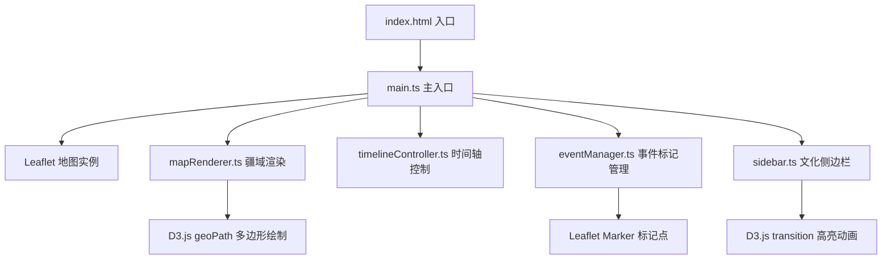

## 1. 架构设计



## 2. 技术说明

- **前端框架**：原生 TypeScript（无UI框架）
- **地图渲染**：Leaflet@1.9.4 + @types/leaflet
- **数据可视化**：D3.js@7.8.5 + @types/d3
- **构建工具**：Vite@5 + TypeScript
- **状态管理**：模块级变量 + 事件回调
- **样式方案**：原生CSS + CSS变量 + CSS动画

## 3. 模块划分

### 3.1 文件结构

| 文件 | 职责 |
|------|------|
| `package.json` | 项目依赖与脚本配置 |
| `index.html` | 入口HTML，全屏地图容器，加载Leaflet CSS |
| `tsconfig.json` | TypeScript严格模式，ESNext模块 |
| `vite.config.js` | Vite构建配置 |
| `src/main.ts` | 初始化Leaflet地图，加载子模块，协调各组件 |
| `src/mapRenderer.ts` | 根据年代渲染疆域多边形，D3 geoPath绘制，0.5s淡入动画 |
| `src/timelineController.ts` | 管理时间轴滑块与事件摘要，打字机动画 |
| `src/eventManager.ts` | 管理事件标记点，毛玻璃详情卡片与缩放动画 |
| `src/sidebar.ts` | 文化代表作侧边栏，折叠展开，文明区域高亮闪烁 |

### 3.2 数据模型

```typescript
interface Civilization {
  id: string;
  name: string;
  color: string;
  startYear: number;
  endYear: number;
  geometry: GeoJSON.Polygon | GeoJSON.MultiPolygon;
}

interface HistoricalEvent {
  id: string;
  title: string;
  year: number;
  lat: number;
  lng: number;
  description: string;
  imageUrl: string;
  civilizationId: string;
}

interface CulturalWork {
  id: string;
  name: string;
  creator: string;
  year: number;
  century: number;
  category: 'literature' | 'architecture' | 'painting';
  description: string;
  civilizationId: string;
}

interface YearSummary {
  year: number;
  summary: string;
}
```

## 4. 关键实现点

### 4.1 地图渲染
- Leaflet地图使用CartoDB暗色无标签瓦片底图
- D3.geoPath将GeoJSON多边形投影到Leaflet容器SVG层
- 切换年代时通过opacity属性实现0.5s淡入淡出过渡

### 4.2 时间轴控制
- 原生`<input type="range">`实现，自定义CSS样式（金色圆角手柄）
- change事件触发年代更新，debounce处理避免频繁重绘
- 打字机动画使用setTimeout逐字追加文本

### 4.3 事件标记
- Leaflet divIcon渲染12px圆形标记点
- 详情卡片使用`backdrop-filter: blur(12px)`实现毛玻璃
- `transform: scale()` + transition实现0.3s ease-out缩放动画
- 点击外部区域关闭卡片（事件委托）

### 4.4 侧边栏交互
- CSS transform: translateX() 实现0.3s滑入动画
- 点击作品时通过D3.transition改变对应文明区域path的filter: brightness()属性
- 使用CSS @keyframes实现1Hz闪烁，持续3秒后自动移除

### 4.5 响应式适配
- 媒体查询检测屏幕宽度
- 移动端：时间轴改为垂直布局，侧边栏改为底部抽屉（transform: translateY）
