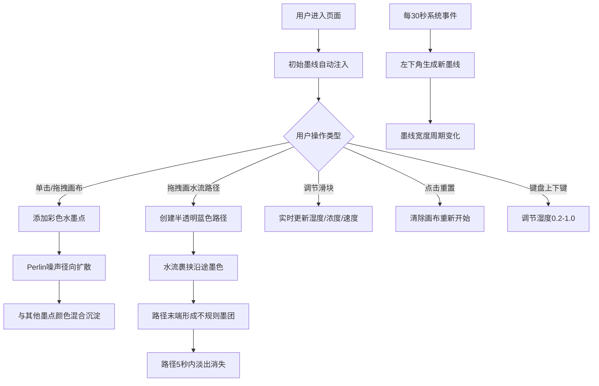

## 1. 产品概述

虚拟水墨画卷轴交互应用，模拟真实宣纸上墨汁与颜料的扩散、渗透、流动等艺术效果，为用户提供沉浸式的水墨创作体验。

- 解决用户无法在真实宣纸上实时观察墨汁流动、分叉、沉淀并与颜料自然交融的问题
- 面向艺术爱好者、设计师、教育工作者，提供数字化水墨创作工具

## 2. 核心功能

### 2.1 功能模块

1. **主画布模块**：纵向卷轴式宣纸画布，600px固定宽度，动态扩展高度，宣纸纹理背景
2. **水墨点系统**：点击/拖拽添加彩色水墨点，Perlin噪声扰动边缘的径向扩散，颜色混合与沉淀
3. **水流路径系统**：鼠标拖拽创建水流路径，裹挟沿途墨色流动，路径末端形成墨团，5秒淡出
4. **自动墨线系统**：每30秒自动生成新墨线，宽度周期变化（2px→4px→2px，10秒周期）
5. **控制面板模块**：湿度、墨色浓度、颜料扩散速度三个滑块，重置按钮

### 2.2 页面详情

| 页面名称 | 模块名称 | 功能描述 |
|-----------|-------------|---------------------|
| 主页面 | 标题栏 | 楷体"水墨画卷"标题，居中显示，字号24px |
| 主页面 | 宣纸画布 | 600px宽度纵向卷轴，米白渐变背景带纸纤维噪点 |
| 主页面 | 控制面板 | 右侧80px宽半透明深灰面板，三个滑块+重置按钮 |
| 主页面 | 自动墨线 | 从顶部缓缓注入的初始墨线，每30秒新增一条 |

## 3. 核心流程

用户打开应用 → 看到初始墨线从顶部缓缓注入 → 单击/拖拽添加彩色水墨点 → 水墨点径向扩散并与其他点颜色混合 → 拖拽鼠标绘制水流路径 → 水流裹挟墨色流动形成墨团 → 调节控制面板参数或点击重置

## 4. 用户界面设计

### 4.1 设计风格

- **主色调**：米白 #f5f0e1 → #faf6eb 渐变（宣纸）、墨黑 #1a1a1a、深灰 #2c2c2c
- **点缀色**：红 #c0392b、蓝 #2980b9、绿 #27ae60、橙 #f39c12（颜料色）
- **字体**：楷体标题（KaiTi/STKaiti），系统默认字体辅助
- **风格**：温润典雅的东方美学，留白充足，卷轴式布局
- **交互细节**：自定义毛笔光标，滑块弹性动画（0.15s ease-out）

### 4.2 页面设计概述

| 页面名称 | 模块名称 | UI元素 |
|-----------|-------------|-------------|
| 主页面 | 标题 | 楷体24px #2c3e50，居中，顶部60px留白 |
| 主页面 | 画布区域 | 600px宽居中，左右各80px留白，宣纸纹理渐变 |
| 主页面 | 控制面板 | 右侧固定80px宽，#2c2c2ccc半透明深灰，圆角 |
| 主页面 | 滑块控件 | 三个纵向滑块，颜色分别为#3498db/#2c3e50/#e74c3c |
| 主页面 | 重置按钮 | 红色#e74c3c，悬停变亮#ff6b6b |
| 主页面 | 水流路径 | 10px宽半透明蓝色#00aaff44，5秒淡出 |

### 4.3 响应式

桌面端优先，固定画布宽度600px，左右留白自适应，控制面板固定右侧。

### 4.4 性能要求

- 60FPS帧率
- 支持100个水墨点同时扩散与混合计算
- 使用 requestAnimationFrame 和 Canvas 2D API
