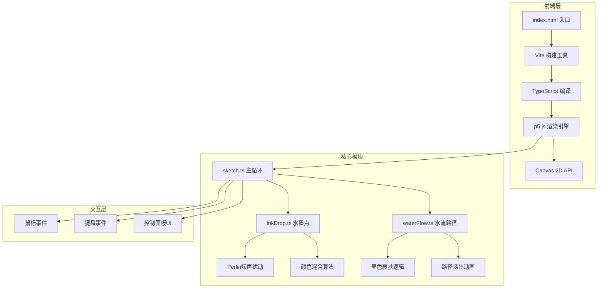

## 1. 架构设计



## 2. 技术说明

- **前端框架**：p5.js@1.9.0（Canvas 2D渲染）
- **编程语言**：TypeScript@5.5.0（严格模式，ES2020）
- **构建工具**：Vite@5.4.0
- **初始化方式**：手动配置Vite + TypeScript项目

## 3. 项目文件结构

| 文件路径 | 作用 |
|-------|---------|
| package.json | 项目依赖与脚本配置 |
| index.html | 入口HTML页面，全屏Canvas容器 |
| tsconfig.json | TypeScript严格模式配置 |
| vite.config.js | Vite构建配置 |
| src/sketch.ts | 主绘制循环，管理水墨点阵列、扩散逻辑、事件处理 |
| src/inkDrop.ts | 水墨点类：位置、半径、颜色、湿度、扩散速度、Perlin噪声边缘 |
| src/waterFlow.ts | 水流路径类：路径点管理、墨色裹挟、末端墨团、淡出效果 |

## 4. 核心数据模型

### 4.1 InkDrop 水墨点

```typescript
interface InkDrop {
  x: number;
  y: number;
  initialRadius: number;      // 初始半径 8-15px
  currentRadius: number;      // 当前扩散半径
  targetRadius: number;       // 目标扩散半径
  color: { r: number; g: number; b: number };  // RGB颜色
  opacity: number;            // 基础透明度 0.8
  humidity: number;           // 所在位置湿度 0.2-1.0
  diffusionSpeed: number;     // 扩散速度系数
  diffusionProgress: number;  // 扩散进度 0-1
  startTime: number;          // 创建时间戳
  isComplete: boolean;        // 是否已完成扩散
}
```

### 4.2 WaterFlow 水流路径

```typescript
interface WaterFlow {
  path: { x: number; y: number }[];  // 路径点数组
  pathWidth: number;                 // 路径宽度 10px
  trappedInk: InkDrop[];             // 裹挟的墨点
  flowProgress: number;              // 流动进度 0-1
  flowSpeed: number;                 // 流动速度 20px/s
  opacity: number;                   // 当前透明度
  fadeStartTime: number;             // 开始淡出时间
  isFading: boolean;                 // 是否正在淡出
  endBlot: {                         // 末端墨团
    x: number;
    y: number;
    radius: number;
    colors: { r: number; g: number; b: number; a: number }[];
  } | null;
}
```

### 4.3 InkLine 自动墨线

```typescript
interface InkLine {
  x: number;                         // X位置
  startY: number;                    // 起始Y
  currentY: number;                  // 当前延伸Y
  targetY: number;                   // 目标Y
  baseWidth: number;                 // 基础宽度
  widthPhase: number;                // 宽度变化相位
  colorStart: { r: number; g: number; b: number };
  colorEnd: { r: number; g: number; b: number };
}
```

## 5. 核心算法

### 5.1 Perlin噪声扰动边缘

使用p5.js内置 `noise()` 函数，对水墨点边缘8-12像素进行扰动：

```
for each angle θ in [0, 2π]:
    noiseValue = noise(x * 0.01, y * 0.01, time * 0.001)
    perturbedRadius = baseRadius + (noiseValue - 0.5) * 2 * perturbationAmount
```

### 5.2 颜色混合算法

RGB线性插值，权重为各自扩散半径的倒数：

```
weightA = 1 / radiusA
weightB = 1 / radiusB
totalWeight = weightA + weightB
mixedR = (colorA.r * weightA + colorB.r * weightB) / totalWeight
mixedG = (colorA.g * weightA + colorB.g * weightB) / totalWeight
mixedB = (colorA.b * weightA + colorB.b * weightB) / totalWeight
沉淀色块: saturation += 20%, size = overlapArea * 0.3
```

### 5.3 墨色裹挟逻辑

沿水流路径采样，检测路径范围内的水墨点，将其颜色沿路径向末端迁移：

```
for each point in waterFlow.path:
    for each inkDrop in inkDrops:
        if distance(point, inkDrop) < pathWidth + inkDrop.radius:
            将inkDrop颜色添加到trappedInk
            沿路径进度逐步迁移至末端
```

## 6. 性能优化策略

- 使用离屏Canvas缓冲层，避免每帧完全重绘
- 水墨点扩散完成后转为静态像素数据
- requestAnimationFrame驱动，每帧计算时间控制在16ms以内
- 对象池复用InkDrop和WaterFlow实例，减少GC开销
