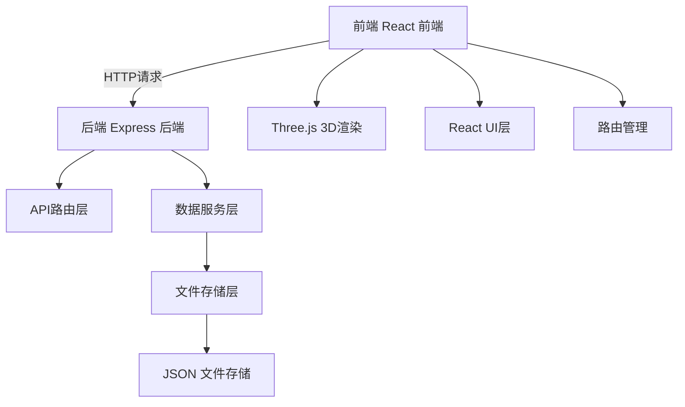
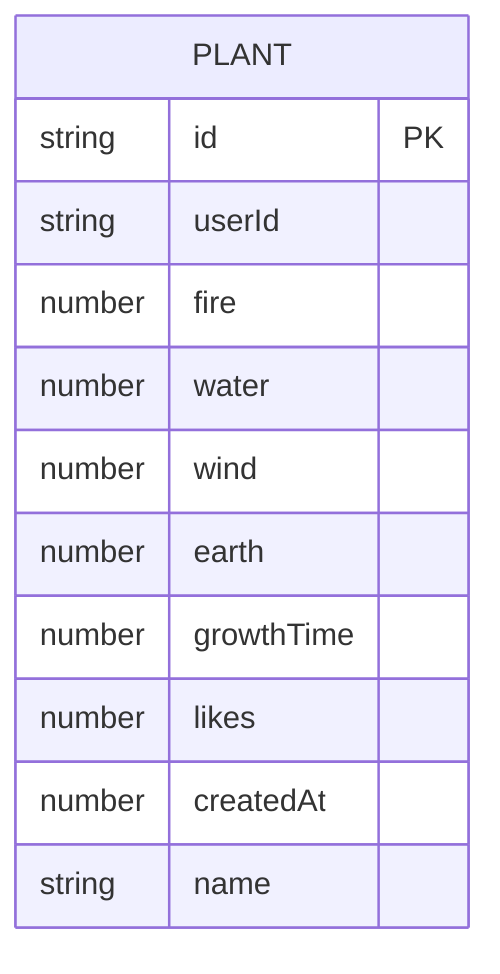

## 1. 架构设计



## 2. 技术说明
- 前端：React@18.2.0 + TypeScript@5.5.0 + Three.js@0.160.0 + Vite@5.4.0
- 构建工具：Vite@5.4.0
- 后端：Express@4.18.2 + cors@2.8.5
- 数据存储：低延迟JSON文件
- 状态管理：React useState/useContext（轻量级场景）

## 3. 路由定义
| 路由 | 用途 |
|-------|---------|
| / | 首页培育台 |
| /greenhouse | 公共温室 |

## 4. API定义

### 4.1 TypeScript类型

```typescript
// 元素类型
type ElementType = 'fire' | 'water' | 'wind' | 'earth'

// 元素配比
interface ElementRatio {
  fire: number
  water: number
  wind: number
  earth: number
}

// 植物数据
interface PlantData {
  id: string
  userId: string
  ratio: ElementRatio
  growthTime: number
  likes: number
  createdAt: number
  name: string
}

// 种子状态
interface SeedState {
  id: string
  droplets: ElementType[]
  stage: 'seed' | 'sprouting' | 'growing' | 'mature'
  plantId?: string
}
```

### 4.2 API接口

| 方法 | 路径 | 描述 | 请求 | 响应 |
|------|------|------|------|------|
| GET | /api/plants | 获取排行榜植物 | 无 | PlantData[] |
| POST | /api/plants | 创建新植物 | { ratio, userId } | PlantData |
| POST | /api/plants/:id/like | 点赞植物 | 无 | { likes: number } |
| GET | /api/users/:userId/plants | 获取用户植物 | 无 | PlantData[] |

## 5. 后端架构


## 6. 数据模型

### 6.1 ER图



### 6.2 数据存储结构
JSON文件结构 (data/plants.json
```json
{
  "plants": [
    {
      "id": "uuid",
      "userId": "user-uuid",
      "ratio": {
        "fire": 2,
        "water": 1,
        "wind": 1,
        "earth": 1
      },
      "growthTime": 5000,
      "likes": 10,
      "createdAt": 1717986918,
      "name": "Flame Lily"
    }
  ]
}
```
