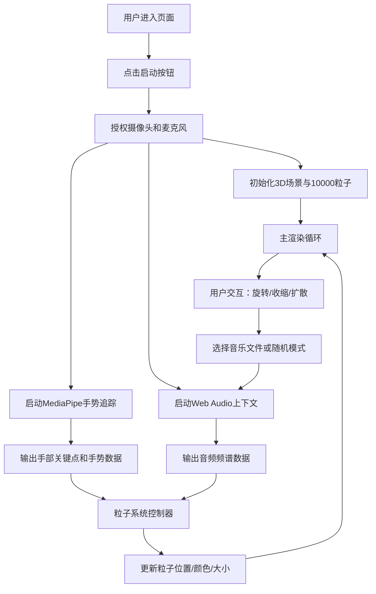

## 1. 产品概述

音乐粒子雕塑交互可视化应用，让观众通过手势控制由上万粒子构成的动态雕塑，粒子随音乐节奏和手势方向产生色彩与形态变化。面向数字艺术展观众和音乐可视化爱好者，打造沉浸式视听交互体验。

## 2. 核心功能

### 2.1 功能模块

1. **主场景页面**：3D粒子云渲染、手势交互、音频可视化、控制面板

### 2.2 页面详情

| 页面名称 | 模块名称 | 功能描述 |
|---------|---------|---------|
| 主场景页面 | 3D粒子云 | 10000个粒子动态渲染，支持手势控制旋转、收缩/扩散 |
| 主场景页面 | 手势识别 | MediaPipe手部追踪，识别手腕角度、握拳/张开、双手距离 |
| 主场景页面 | 音频解析 | Web Audio API频谱分析，支持本地MP3/WAV文件和麦克风输入 |
| 主场景页面 | 控制面板 | 选择音乐、随机模式切换、音量调节 |
| 主场景页面 | HUD显示 | FPS计数器、音频频谱柱状图、摄像头预览 |

## 3. 核心流程

用户进入页面 → 点击启动按钮授权摄像头和麦克风 → 系统初始化粒子云、手势追踪和音频上下文 → 用户通过手势控制粒子形态 → 用户选择音乐文件或启用随机模式 → 粒子随音频和手势实时变化 → 实时显示FPS和频谱

## 4. 用户界面设计

### 4.1 设计风格

- **主色调**：纯黑背景(#000000)，粒子RGB三色渐变（红#FF0000→#FF8888、绿#00FF00→#88FF88、蓝#0000FF→#8888FF），球壳淡蓝色
- **按钮风格**：半透明毛玻璃背景，悬停1.05倍缩放，0.2s过渡
- **字体**：现代无衬线字体，白色半透明
- **布局**：全屏canvas沉浸体验，控件悬浮于画面边缘
- **动效**：粒子闪烁、光晕呼吸、按钮微交互

### 4.2 页面设计概览

| 页面名称 | 模块名称 | UI元素 |
|---------|---------|--------|
| 主场景页面 | 顶部控制条 | 毛玻璃半透明(rgba(0,0,0,0.6))、50px高度、"选择音乐"按钮、"随机模式"按钮、音量滑块(0-100) |
| 主场景页面 | 摄像头预览 | 右上角200x150px小窗口、镜像显示、识别成功后四角淡蓝色光晕 |
| 主场景页面 | FPS计数器 | 左下角白色半透明14px字体 |
| 主场景页面 | 频谱柱状图 | 右下角64条竖条、宽3px间距1px、红到蓝渐变、60%透明度 |
| 主场景页面 | 3D场景 | 半透明线框球壳(半径10单位)、粒子云、手势光晕(半径2单位) |

### 4.3 响应性

- 桌面端优先设计，canvas自适应窗口大小（最小宽度800px）
- 触控设备通过摄像头手势交互，无需额外触控适配

### 4.4 3D场景指导

- **环境**：纯黑背景，无HDRI，营造深空沉浸感
- **光照**：粒子自发光(Additive Blending)，无需额外光源
- **相机**：PerspectiveCamera，初始距离球壳外，平滑跟随手势旋转
- **构图**：粒子云居中，球壳包裹，光晕点缀手势位置
- **交互**：手势驱动旋转/收缩/扩散，音频驱动颜色/大小，粒子碰球壳反弹闪烁
- **后处理**：Additive混合实现粒子辉光效果
- **性能预算**：10000粒子@60fps，2000粒子@120fps，手势延迟<100ms，音频延迟<50ms
