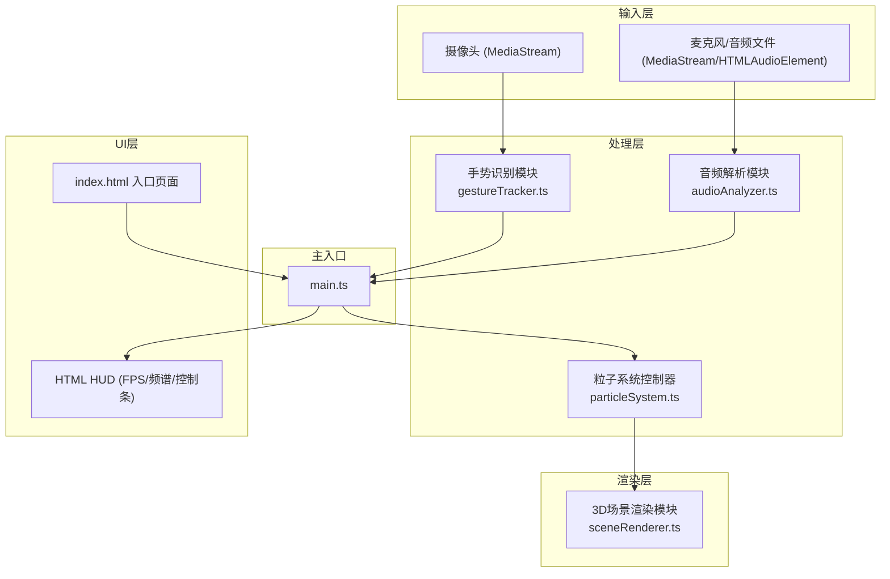

## 1. 架构设计



## 2. 技术描述

- **前端框架**：TypeScript (严格模式, ES2020)
- **构建工具**：Vite
- **3D渲染**：Three.js@0.160.0
- **手势识别**：MediaPipe Hands@0.4.1675469240 + TensorFlow.js@4.17.0
- **音频处理**：Web Audio API (原生)
- **无后端**，纯前端浏览器应用

## 3. 模块与数据流向

| 模块文件 | 输入 | 输出 | 职责 |
|---------|------|------|------|
| main.ts | 用户交互、初始化事件 | 驱动各模块、主循环 | 协调所有子模块，建立数据管道 |
| gestureTracker.ts | 摄像头视频帧 | 手部关键点、手腕角度、握拳状态、双手距离、手掌速度 | MediaPipe Hands推理，手势语义计算 |
| audioAnalyzer.ts | 麦克风流/音频文件流 | 64频段频谱数组、低/中/高频能量、平均音量 | FFT频谱分析、三频段能量计算、归一化 |
| particleSystem.ts | 手势数据、音频数据 | 粒子位置数组、颜色数组、大小数组 | 10000粒子状态更新、旋转/收缩/扩散动画、音频响应 |
| sceneRenderer.ts | 粒子数据、手势位置 | Three.js渲染帧 | 粒子云渲染、球壳线框、光晕、反弹闪烁、相机控制 |

## 4. 核心数据结构

```typescript
// 手势数据
interface GestureData {
  handsDetected: number;          // 检测到手的数量 0-2
  wristAngles: [number?, number?]; // 左右手腕角度(度)
  palmSpeeds: [number?, number?];  // 手掌移动速度(px/s)
  isFist: [boolean?, boolean?];    // 是否握拳
  handsDistance?: number;          // 双手距离(像素)
  handPositions: Array<{ x: number; y: number; z: number }>; // 手部3D位置(归一化)
  landmarks: Array<Array<{ x: number; y: number; z: number }>>; // 21个关键点
}

// 音频数据
interface AudioData {
  spectrum: Float32Array;          // 64频段归一化能量 0-1
  bassEnergy: number;              // 低频(20-250Hz)能量 0-1
  midEnergy: number;               // 中频(250-2000Hz)能量 0-1
  highEnergy: number;              // 高频(2000-20000Hz)能量 0-1
  averageVolume: number;           // 平均音量 0-1
}

// 粒子状态
interface Particle {
  basePosition: THREE.Vector3;     // 初始位置
  currentPosition: THREE.Vector3;  // 当前位置
  velocity: THREE.Vector3;         // 速度向量
  colorBand: 'bass' | 'mid' | 'high'; // 所属频段
  baseColor: THREE.Color;          // 基础颜色
  flashTimer: number;              // 闪烁计时器(秒)
}
```

## 5. 性能优化策略

- **粒子批量渲染**：使用 `THREE.Points` + `BufferGeometry` 一次性提交所有粒子到GPU，避免逐粒子draw call
- **TypedArray数据**：位置、颜色、大小均使用 `Float32Array` 存储，直接映射到GPU缓冲区
- **手势节流**：MediaPipe推理降频到30fps，渲染保持60fps，使用插值平滑手势数据
- **音频降采样**：FFT size=64（而非默认1024），减少计算量同时满足可视化需求
- **粒子动态增减**：通过修改 `BufferGeometry.drawRange` 实现粒子数量平滑过渡，避免重新分配内存

## 6. 性能指标要求

| 指标 | 目标值 | 测量方式 |
|-----|-------|---------|
| 10000粒子帧率 | ≥60fps | Chrome DevTools Performance面板 |
| 2000粒子帧率 | ≥120fps | Chrome DevTools Performance面板 |
| 手势识别延迟 | ≤100ms | 摄像头帧时间戳到粒子响应时间差 |
| 音频解析延迟 | ≤50ms | 音频输入到频谱输出时间差 |
