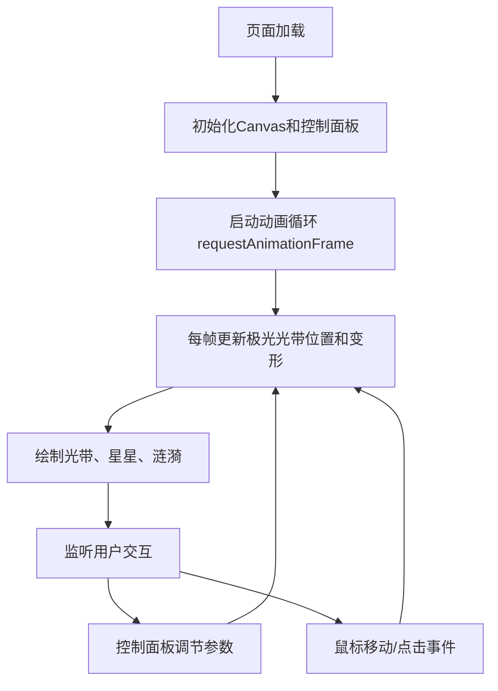

## 1. 产品概述

动态极光投影效果应用，为无法亲临极光现场的用户提供沉浸式夜空极光视觉体验。通过Canvas实时渲染动态极光光带，配合鼠标交互和控制面板，让用户在浏览器中感受大自然的壮观景象。

- 核心价值：将北极光奇观带入室内，提供可交互、可调节的沉浸式视觉体验
- 目标用户：极光爱好者、自然景观欣赏者、需要视觉放松的用户

## 2. 核心功能

### 2.1 功能模块

1. **极光动画系统**：多光带正弦波变形渲染、自上而下流动、实时帧率保持
2. **交互控制面板**：颜色预设切换、速度调节、光带数量调节、一键重置
3. **鼠标交互反馈**：水平位置偏移效果、点击涟漪扩散
4. **视觉增强效果**：星星闪烁、发光模糊滤镜

### 2.2 功能详情

| 模块名称 | 功能描述 |
|----------|----------|
| 极光渲染 | 3-5条半透明彩色光带，正弦波变形，振幅50-150px，频率0.5-2Hz |
| 流动动画 | 光带自上而下流动，速度0.5-3.0倍可调，默认1.0倍 |
| 发光效果 | CSS filter: blur(8px) + drop-shadow 边缘发光 |
| 颜色切换 | 4种预设颜色（绿#00ff88、紫#8a2be2、粉#ff69b4、蓝#00bfff），0.5秒渐变过渡 |
| 速度控制 | 滑块调节流动速度，范围0.5-3.0，步长0.1 |
| 数量控制 | 滑块调节光带数量，范围3-5，步长1 |
| 重置功能 | 一键恢复所有参数为默认值 |
| 鼠标偏移 | 极光随鼠标水平位置偏移，偏移量为距屏幕中心距离的10% |
| 点击涟漪 | 点击产生圆形光波扩散，半径0-400px，持续1.5秒 |
| 星星闪烁 | 光带附近随机出现2-4px白色光点，亮度0.3-1.0脉冲变化 |

## 3. 核心流程

## 4. 用户界面设计

### 4.1 设计风格

- **主色调**：夜空深蓝渐变（顶部#0a0a2e，底部#1a1a4e）
- **强调色**：极光蓝绿渐变（#00ff88 → #00bfff）
- **按钮样式**：圆角8px，半透明背景，悬停透明度从0.1升至0.3
- **字体**：'Segoe UI', system-ui, sans-serif，白色半透明 rgba(255,255,255,0.8)
- **视觉氛围**：沉浸式夜空主题，毛玻璃控制面板，发光效果

### 4.2 页面设计概览

| 区域 | UI元素 | 样式说明 |
|------|--------|----------|
| 全屏背景 | Canvas画布 | 深蓝渐变夜空，全屏覆盖 |
| 右下角控制面板 | 毛玻璃浮动面板 | rgba(255,255,255,0.1) + blur(12px) |
| 控制面板-颜色按钮 | 4个圆形/方形按钮 | 预设颜色，点击切换，0.5秒过渡 |
| 控制面板-速度滑块 | 水平滑块 | 轨道半透明白色，手柄圆形白色12px，悬停16px |
| 控制面板-数量滑块 | 水平滑块 | 同上样式 |
| 控制面板-重置按钮 | 圆角按钮 | 极光蓝绿渐变背景 |

### 4.3 响应式设计

- **桌面端**（≥768px）：右下角浮动控制面板，完整展示所有控件
- **移动端**（<768px）：底部弹出式工具栏，点击右下角箭头展开/收起
- **最小适配**：宽度320px，高度480px
- **画布自适应**：Canvas始终为窗口100%宽高，使用rem/vw单位

## 5. 性能要求

- **帧率**：1920x1080分辨率下稳定30FPS以上
- **加载时间**：页面加载≤2秒，压缩后资源总大小<500KB
- **渲染优化**：仅使用原生Canvas API和requestAnimationFrame，无外部动画库
