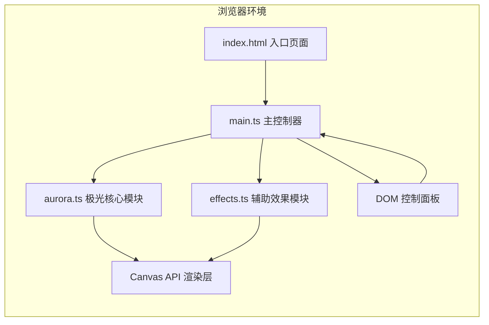

## 1. 架构设计



## 2. 技术说明

- **前端框架**：原生 TypeScript + Vite 构建
- **渲染引擎**：HTML5 Canvas 2D API + requestAnimationFrame
- **样式方案**：原生 CSS（毛玻璃、渐变、动画过渡）
- **无外部动画库**：完全使用原生API实现动画

## 3. 文件结构

```
auto62/
├── package.json          # 项目配置，依赖：typescript、vite
├── index.html            # 入口页面，Canvas容器和背景样式
├── tsconfig.json         # TypeScript严格模式配置，ES2020目标
├── vite.config.js        # Vite构建配置
└── src/
    ├── main.ts           # 主入口：初始化Canvas、控制面板、动画循环
    ├── aurora.ts         # 极光核心：光带参数、变形算法、渲染逻辑
    └── effects.ts        # 辅助效果：星星、涟漪、鼠标事件管理
```

## 4. 核心模块设计

### 4.1 Aurora 模块 (src/aurora.ts)

```typescript
interface AuroraBand {
  id: number;
  color: string;
  baseY: number;
  amplitude: number;      // 50-150px
  frequency: number;      // 0.5-2Hz
  phase: number;          // 正弦波相位
  opacity: number;        // 透明度 0.3-0.7
  speed: number;          // 流动速度
  width: number;          // 光带宽度
}

class Aurora {
  bands: AuroraBand[];
  speedMultiplier: number;  // 0.5-3.0
  bandCount: number;        // 3-5
  primaryColor: string;     // 当前主色
  mouseOffset: number;      // 鼠标水平偏移

  update(deltaTime: number): void;
  render(ctx: CanvasRenderingContext2D): void;
  setPrimaryColor(color: string): void;
  setSpeed(multiplier: number): void;
  setBandCount(count: number): void;
  setMouseOffset(offset: number): void;
  reset(): void;
}
```

### 4.2 Effects 模块 (src/effects.ts)

```typescript
interface Star {
  x: number;
  y: number;
  size: number;           // 2-4px
  opacity: number;        // 0.3-1.0
  pulseSpeed: number;
  pulsePhase: number;
  lifeTime: number;       // 剩余生命时间
}

interface Ripple {
  x: number;
  y: number;
  radius: number;
  maxRadius: number;      // 400px
  color: string;
  opacity: number;
  lifeTime: number;       // 1.5秒
  totalTime: number;
}

class EffectsManager {
  stars: Star[];
  ripples: Ripple[];
  canvas: HTMLCanvasElement;

  update(deltaTime: number, auroraBands: AuroraBand[]): void;
  render(ctx: CanvasRenderingContext2D): void;
  addRipple(x: number, y: number, color: string): void;
  bindMouseEvents(canvas: HTMLCanvasElement, callbacks: {...}): void;
}
```

### 4.3 主入口 (src/main.ts)

```typescript
class AuroraApp {
  canvas: HTMLCanvasElement;
  ctx: CanvasRenderingContext2D;
  aurora: Aurora;
  effects: EffectsManager;
  lastTime: number;
  animationId: number;

  init(): void;
  setupCanvas(): void;
  setupControls(): void;
  animate(currentTime: number): void;
  handleResize(): void;
}
```

## 5. 性能优化策略

1. **Canvas分层**：可考虑离屏Canvas预渲染静态元素（当前需求简单，暂不需要）
2. **帧率控制**：使用 requestAnimationFrame + deltaTime 计算，确保动画速度与帧率无关
3. **对象池**：星星和涟漪对象复用，避免频繁GC
4. **渐变缓存**：颜色渐变过渡时使用插值计算而非每帧重建
5. **脏矩形**：如需要可优化只重绘变化区域（当前全屏重绘，复杂度可接受）

## 6. 控制面板 DOM 结构

```html
<div id="control-panel" class="control-panel">
  <div class="control-section">
    <label>极光颜色</label>
    <div class="color-presets">
      <button class="color-btn" data-color="#00ff88"></button>
      <button class="color-btn" data-color="#8a2be2"></button>
      <button class="color-btn" data-color="#ff69b4"></button>
      <button class="color-btn" data-color="#00bfff"></button>
    </div>
  </div>
  <div class="control-section">
    <label>流动速度 <span id="speed-value">1.0</span>x</label>
    <input type="range" id="speed-slider" min="0.5" max="3.0" step="0.1" value="1.0">
  </div>
  <div class="control-section">
    <label>光带数量 <span id="count-value">4</span></label>
    <input type="range" id="count-slider" min="3" max="5" step="1" value="4">
  </div>
  <button id="reset-btn" class="reset-btn">重置</button>
  <button id="toggle-btn" class="toggle-btn">▼</button>
</div>
```
