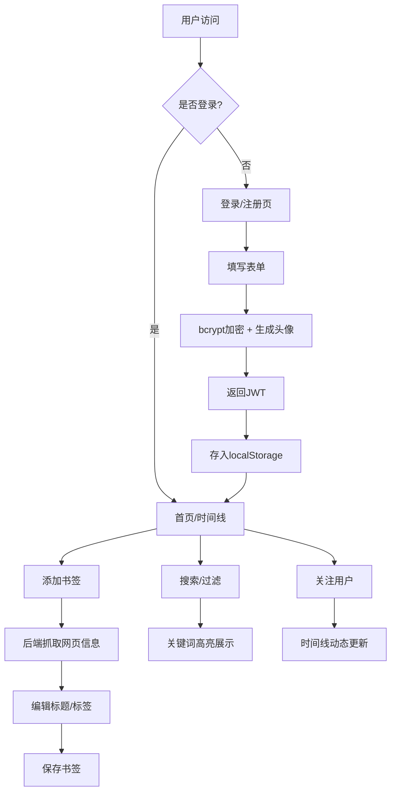

## 1. 产品概述

BookMarkHub 是一个基于浏览器的在线书签管理与社交分享平台，帮助用户收藏、整理和发现优质网页内容，并通过社交关注机制构建兴趣社区。

- 核心价值：提供轻量级、跨设备的书签管理体验，结合社交功能让优质内容被更多人发现
- 目标用户：内容创作者、知识工作者、重度互联网用户

## 2. 核心功能

### 2.1 用户角色

| 角色 | 注册方式 | 核心权限 |
|------|---------|----------|
| 普通用户 | 邮箱密码注册 | 收藏书签、管理分类、关注用户、浏览时间线 |

### 2.2 功能模块

1. **认证模块**：用户注册、登录、JWT令牌鉴权、自动生成头像
2. **书签管理**：添加书签（自动抓取页面信息）、编辑、删除、收藏点赞
3. **分类搜索**：标签云分类、标签过滤、实时搜索（高亮关键词）
4. **社交功能**：用户搜索、关注/取关、时间线动态、用户个人主页
5. **分享功能**：短链接生成、一键复制、Toast提示

### 2.3 页面详情

| 页面名称 | 模块名称 | 功能描述 |
|----------|---------|----------|
| 登录/注册页 | 表单模块 | 邮箱密码输入、表单验证、注册自动生成头像 |
| 首页（书签列表） | 搜索栏、书签列表、侧边栏 | 实时搜索、无限滚动（20条/页）、标签云过滤、关注列表 |
| 添加书签弹窗 | URL输入、表单编辑 | 自动抓取网页标题和描述、标签选择（最多3个）、创建新标签 |
| 时间线页 | 双栏布局、书签流、关注面板 | 左侧70%展示关注用户新书签（倒序）、右侧30%关注管理 |
| 用户主页 | 头像、昵称、书签集合 | 展示该用户所有公开书签 |

## 3. 核心流程

### 3.1 主要用户流程

1. **新用户注册流程**：用户填写邮箱和密码 → 系统使用bcrypt加密密码 → 基于用户名首字母+随机颜色生成头像 → 返回JWT令牌 → 前端存入localStorage → 跳转首页
2. **添加书签流程**：用户粘贴URL → 后端抓取网页标题和meta描述 → 用户编辑标题/选择标签 → 保存书签 → 刷新列表
3. **浏览时间线流程**：用户登录 → 系统查询所有关注用户 → 按时间倒序拉取新书签 → 瀑布流展示
4. **搜索过滤流程**：用户输入关键词（300ms防抖）→ 匹配标题和描述 → 高亮关键词展示结果；或点击标签云 → 过滤该标签下所有书签

## 4. 用户界面设计

### 4.1 设计风格

- **主色调**：浅色主题，背景色 #f0f4f8，卡片背景白色，文字深灰 #2d3748
- **导航栏**：渐变蓝色 #667eea 到 #764ba2，高度60px，固定顶部带阴影
- **卡片样式**：圆角矩形（圆角12px），卡片间距16px，悬停上升3px + 加深阴影（transition 0.3s ease）
- **标签云**：圆角背景，点击时背景变为主色蓝色、文字变白
- **字体**：使用现代无衬线字体，建立清晰的字号层级（标题18px、正文14px、辅助文字12px）
- **图标**：使用lucide-react图标库

### 4.2 页面设计概览

| 页面名称 | 模块名称 | UI元素 |
|----------|---------|--------|
| 登录/注册页 | 居中卡片 | 白色圆角卡片、渐变按钮、表单输入带focus效果 |
| 首页 | 导航栏 | 固定顶部、渐变背景、左侧Logo、右侧头像+昵称 |
| 首页 | 搜索栏 | 圆角输入框、搜索图标、防抖输入 |
| 首页 | 书签卡片 | 淡入动画、标题+URL+描述、收藏图标（缩放点赞动画）、分享按钮 |
| 首页 | 侧边栏 | 标签云（字体大小/颜色按数量动态变化，最多20个）、底部关注列表 |
| 时间线页 | 双栏布局 | 左侧70%书签流（含发布者头像昵称）、右侧30%关注面板 |

### 4.3 响应式适配

- **桌面端**（≥1024px）：完整三栏布局，侧边栏常驻
- **平板端**（768px-1023px）：侧边栏可折叠，卡片两列
- **移动端**（<768px）：导航栏变汉堡菜单，侧边栏隐藏为抽屉，卡片宽度100%单列，触控优化

### 4.4 动画与交互

- 书签卡片淡入加载（stagger动画延迟）
- 收藏图标点击缩放动画（scale 1.0 → 1.3 → 1.0）
- Toast提示从底部滑入，2秒后自动消失
- 标签切换平滑过渡，无闪烁
- 页面路由切换淡入淡出

## 5. 性能要求

- 首屏渲染（20条书签）≤ 1.5秒
- 搜索响应时间 < 500毫秒
- 标签过滤切换无闪烁
- 无限滚动流畅加载
