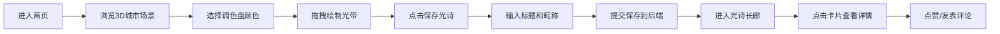

## 1. 产品概述

城市夜间灯光诗篇涂鸦与分享全栈应用，用户可在虚拟3D城市天际线上即兴创作动态光诗，并将作品永久保存在公共画廊中供他人点赞评论。

- 主要目的：提供沉浸式的赛博朋克风格夜间城市涂鸦体验，让用户以霓虹光带为画笔在3D城市场景中创作"光诗"
- 解决问题：用户无法在沉浸式3D环境中创作、保存和分享夜间城市主题的涂鸦艺术
- 目标用户：艺术爱好者、赛博朋克文化爱好者、创意表达用户

## 2. 核心功能

### 2.1 用户角色

| 角色 | 注册方式 | 核心权限 |
|------|----------|----------|
| 普通用户 | 无需注册，输入昵称即可创作 | 浏览光诗、创作文字、保存光诗、点赞、评论 |

### 2.2 功能模块

1. **首页（3D城市场景）**：低多边形建筑夜景、调色盘涂鸦、保存光诗、导航入口
2. **光诗长廊页**：光诗列表展示、卡片网格、搜索浏览
3. **光诗详情页**：3D场景重现、点赞功能、评论系统

### 2.3 页面详情

| 页面名称 | 模块名称 | 功能描述 |
|----------|----------|----------|
| 首页 | 3D城市场景 | Three.js渲染低多边形建筑，随机高度2-6单位，颜色渐变#2a2a3a到#0a0a2a，窗口灯光#ffcc44闪烁，夜空渐变#0a001a到#0a0a3a，深色网格地面 |
| 首页 | 视角控制 | 鼠标拖拽旋转(0-360度)，滚轮缩放(5-20单位距离) |
| 首页 | 调色盘 | 左上角按钮，展开6种霓虹色(#ff0066/#00ff88/#4488ff/#ffaa00/#cc44ff/#ffffff) |
| 首页 | 光带绘制 | 选色后拖拽鼠标绘制发光粒子光带，粒子半径0.08，透明度0.7-1.0，间距≤0.2单位，3秒后飘散消失 |
| 首页 | 保存光诗 | 右下角按钮，弹窗输入标题昵称，序列化场景数据POST到后端 |
| 光诗长廊 | 卡片列表 | 2列网格，卡片200x300px，缩略图+标题+昵称+点赞+时间，悬停上浮3px放大1.02倍 |
| 光诗详情 | 场景重现 | 加载JSON数据重新渲染3D城市与光带，粒子0.5秒渐显动画 |
| 光诗详情 | 点赞 | 心形按钮，PUT请求增加点赞数 |
| 光诗详情 | 评论 | 时间线样式，输入框最多100字，圆形头像占位符 |

## 3. 核心流程

用户进入首页 → 浏览3D城市夜景 → 选择调色盘颜色 → 拖拽鼠标绘制光带涂鸦 → 点击保存光诗 → 输入标题昵称提交 → 进入光诗长廊浏览作品 → 点击卡片查看详情 → 点赞/发表评论

## 4. 用户界面设计

### 4.1 设计风格

- 主色调：暗蓝#0a0a2a、霓虹粉#ff0066、电光绿#00ff88
- 按钮风格：1px霓虹边框（跟随当前选色），悬停时box-shadow发散发光
- 模态框：半透明黑色rgba(0,0,0,0.7)，圆角12px，0.2秒淡入动画
- 字体：深色赛博朋克风格，简洁现代的无衬线字体
- 图标风格：lucide-react线性图标，配合霓虹发光效果

### 4.2 页面设计概览

| 页面名称 | 模块名称 | UI元素 |
|----------|----------|--------|
| 首页 | 3D场景区域 | 全屏Canvas，建筑随机分布，灯光闪烁动画 |
| 首页 | 调色盘 | 左上角圆形按钮，点击展开横向色条，选中色高亮 |
| 首页 | 保存按钮 | 右下角霓虹边框按钮，点击弹出模态框 |
| 首页 | 长廊入口 | 底部文字按钮，赛博朋克发光效果 |
| 光诗长廊 | 卡片网格 | 2列布局，卡片阴影+圆角+悬停动效 |
| 光诗详情 | 场景容器 | 顶部3D场景区，底部点赞与评论区 |
| 光诗详情 | 评论区 | 时间线布局，左侧圆形头像，右侧评论内容 |

### 4.3 响应式设计

- 桌面端优先设计
- 屏幕宽度<768px时：光诗卡片改为单列布局，调色盘按钮移至屏幕顶部中央
- 3D场景自适应容器大小
- 触控设备优化拖拽与缩放体验

### 4.4 3D场景指引

- 环境氛围：赛博朋克夜间城市，深紫到墨蓝渐变夜空
- 光照设置：环境光弱照明，建筑窗口自发光，粒子使用PointLight或自发光材质
- 相机设置：PerspectiveCamera，初始距离适中，OrbitControls限制旋转和缩放范围
- 构图：建筑错落分布，地面网格提供空间参考，光带粒子悬浮于城市上空
- 交互动画：绘制时光带粒子拖尾渐变，飘散时透明度衰减；粒子重现时从透明渐显
- 性能：粒子上限2000，超量自动淘汰最早粒子；帧率≥30fps
