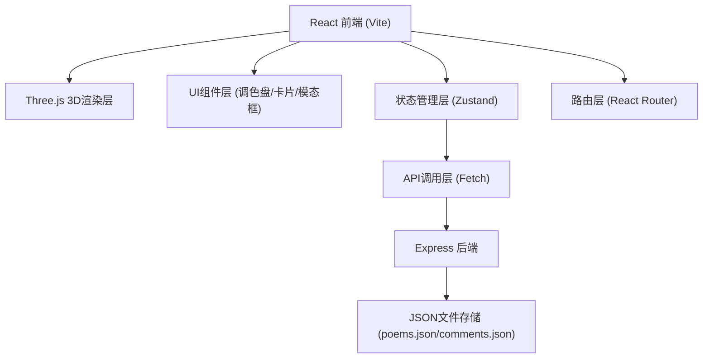
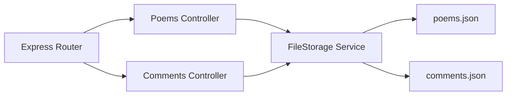
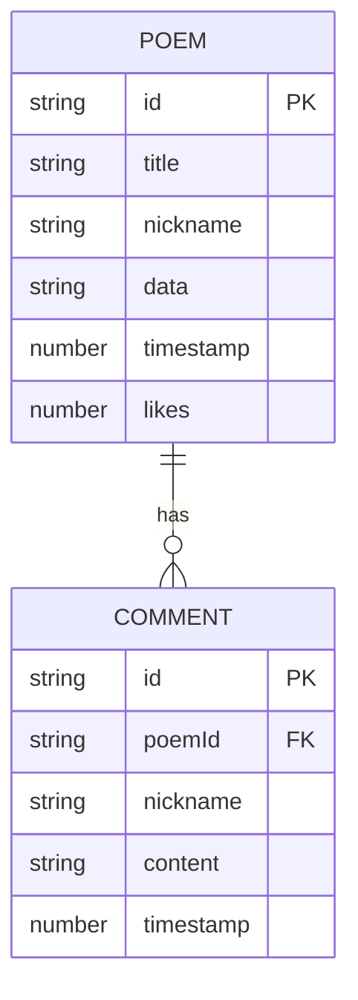

## 1. 架构设计



## 2. 技术说明

- 前端框架：React 18.2.0 + TypeScript 5.5.0
- 构建工具：Vite 5.4.0 + @vitejs/plugin-react 4.2.0
- 3D渲染：Three.js 0.160.0
- 路由：React Router DOM
- 状态管理：Zustand
- 图标：lucide-react
- 后端：Express 4.18.2 + CORS 2.8.5
- 数据存储：JSON文件 (server/data/poems.json, server/data/comments.json)
- 样式：CSS Modules / 内联样式（赛博朋克风格）

## 3. 路由定义

| 路由 | 页面组件 | 用途 |
|------|----------|------|
| / | HomePage | 首页，3D城市涂鸦场景 |
| /gallery | GalleryPage | 光诗长廊，展示所有光诗卡片列表 |
| /poem/:id | PoemDetailPage | 光诗详情页，重现场景+点赞+评论 |

## 4. API定义

### 类型定义

```typescript
interface Building {
  x: number;
  z: number;
  height: number;
  color: string;
  windows: { row: number; col: number; lit: boolean }[];
}

interface Particle {
  x: number;
  y: number;
  z: number;
  color: string;
  opacity: number;
  createdAt: number;
}

interface LightStroke {
  id: string;
  color: string;
  particles: Particle[];
  createdAt: number;
}

interface Poem {
  id: string;
  title: string;
  nickname: string;
  data: string; // JSON string of { buildings: Building[], strokes: LightStroke[] }
  timestamp: number;
  likes: number;
}

interface Comment {
  id: string;
  poemId: string;
  nickname: string;
  content: string;
  timestamp: number;
}

interface PoemSceneData {
  buildings: Building[];
  strokes: LightStroke[];
}
```

### API接口

| 方法 | 路径 | 描述 | 请求体 | 响应 |
|------|------|------|--------|------|
| GET | /api/poems | 获取所有光诗列表 | - | Poem[] |
| POST | /api/poems | 保存新光诗 | { title, nickname, data } | Poem |
| GET | /api/poems/:id | 获取单条光诗详情（含评论） | - | { poem: Poem, comments: Comment[] } |
| PUT | /api/poems/:id/like | 增加点赞数 | - | { likes: number } |
| POST | /api/poems/:id/comments | 添加评论 | { nickname, content } | Comment |

## 5. 后端架构图



## 6. 数据模型

### 6.1 数据模型定义



### 6.2 存储文件结构

**server/data/poems.json**
```json
[
  {
    "id": "uuid",
    "title": "光诗标题",
    "nickname": "作者昵称",
    "data": "{\"buildings\":[...],\"strokes\":[...]}",
    "timestamp": 1700000000000,
    "likes": 0
  }
]
```

**server/data/comments.json**
```json
{
  "poem-uuid": [
    {
      "id": "comment-uuid",
      "poemId": "poem-uuid",
      "nickname": "评论者昵称",
      "content": "评论内容",
      "timestamp": 1700000000000
    }
  ]
}
```
