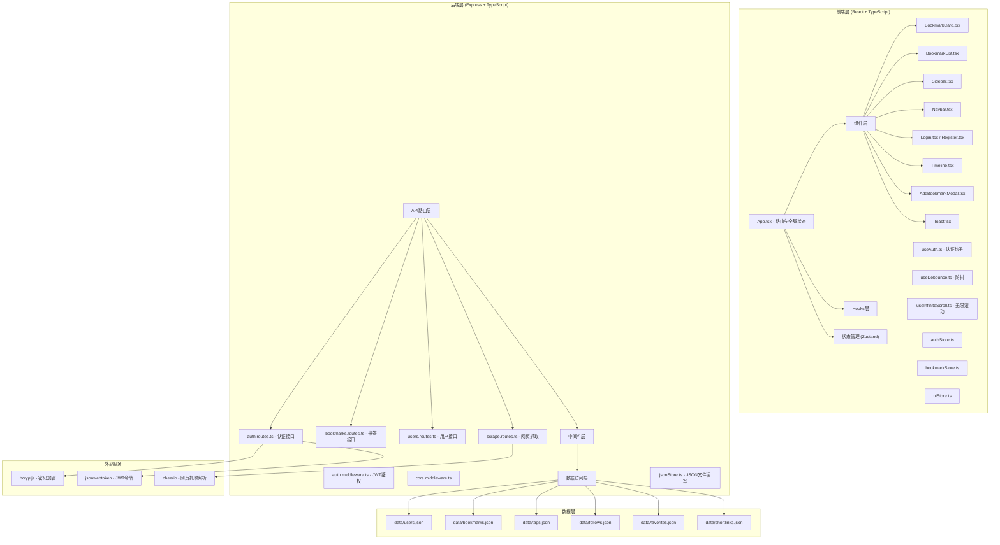
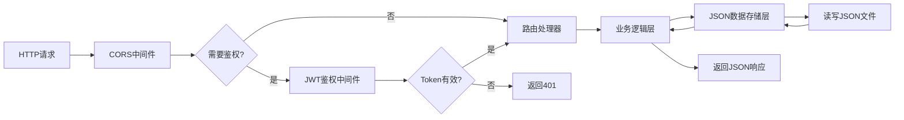
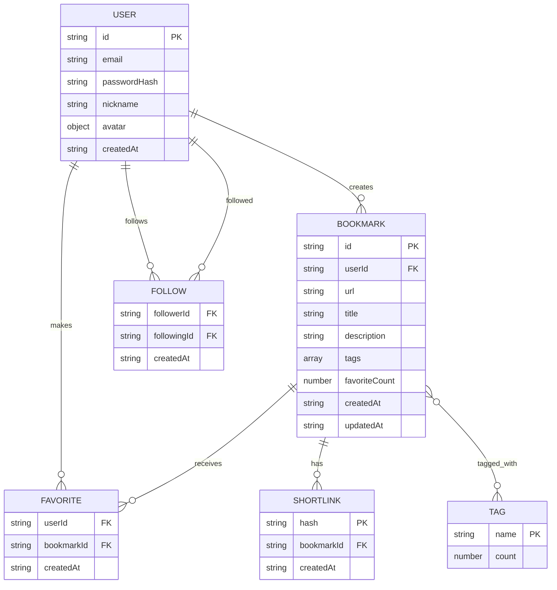

## 1. 架构设计



## 2. 技术说明

### 2.1 技术栈
- **前端框架**：React 18 + TypeScript
- **构建工具**：Vite 5 + @vitejs/plugin-react
- **状态管理**：Zustand（轻量级状态管理）
- **路由**：React Router DOM 6
- **样式**：CSS Modules + 全局CSS变量（不使用Tailwind，按用户需求自定义样式）
- **图标**：lucide-react
- **HTTP客户端**：fetch API（原生，减少依赖）

### 2.2 后端技术栈
- **Web框架**：Express 4 + TypeScript
- **密码加密**：bcryptjs
- **JWT认证**：jsonwebtoken
- **网页抓取**：node-fetch + cheerio
- **数据存储**：本地JSON文件（data/目录）
- **CORS处理**：cors中间件

### 2.3 开发工具
- TypeScript严格模式
- Vite HMR热更新
- 前后端并发启动（concurrently）

## 3. 路由定义

### 3.1 前端路由

| 路由路径 | 页面组件 | 说明 |
|---------|---------|------|
| /login | Login.tsx | 登录页面 |
| /register | Register.tsx | 注册页面 |
| / | Home.tsx | 首页 - 我的书签列表 |
| /timeline | Timeline.tsx | 时间线 - 关注用户动态 |
| /user/:userId | UserProfile.tsx | 用户主页 - 该用户的书签集合 |

### 3.2 后端API路由

| 方法 | 路径 | 说明 | 鉴权 |
|-----|------|------|------|
| POST | /api/auth/register | 用户注册 | 否 |
| POST | /api/auth/login | 用户登录 | 否 |
| GET | /api/auth/me | 获取当前用户信息 | 是 |
| GET | /api/bookmarks | 获取书签列表（分页） | 是 |
| POST | /api/bookmarks | 创建新书签 | 是 |
| PUT | /api/bookmarks/:id | 更新书签 | 是 |
| DELETE | /api/bookmarks/:id | 删除书签 | 是 |
| POST | /api/bookmarks/:id/favorite | 收藏/取消收藏书签 | 是 |
| GET | /api/tags | 获取所有标签 | 是 |
| GET | /api/users | 搜索用户 | 是 |
| GET | /api/users/:id | 获取用户信息 | 是 |
| GET | /api/users/:id/bookmarks | 获取用户的书签 | 是 |
| POST | /api/users/:id/follow | 关注用户 | 是 |
| DELETE | /api/users/:id/follow | 取消关注 | 是 |
| GET | /api/users/:id/followers | 获取粉丝列表 | 是 |
| GET | /api/users/:id/following | 获取关注列表 | 是 |
| GET | /api/timeline | 获取时间线动态 | 是 |
| POST | /api/scrape | 抓取网页标题和描述 | 是 |
| POST | /api/bookmarks/:id/share | 生成短链接 | 是 |
| GET | /s/:hash | 短链接重定向 | 否 |

## 4. API定义

### 4.1 类型定义

```typescript
// 共享类型定义 shared/types.ts

interface User {
  id: string;
  email: string;
  passwordHash: string;
  nickname: string;
  avatar: {
    letter: string;
    color: string;
  };
  createdAt: string;
}

interface PublicUser {
  id: string;
  nickname: string;
  avatar: {
    letter: string;
    color: string;
  };
}

interface Bookmark {
  id: string;
  userId: string;
  url: string;
  title: string;
  description: string;
  tags: string[];
  favoriteCount: number;
  createdAt: string;
  updatedAt: string;
}

interface Tag {
  name: string;
  count: number;
}

interface Follow {
  followerId: string;
  followingId: string;
  createdAt: string;
}

interface Favorite {
  userId: string;
  bookmarkId: string;
  createdAt: string;
}

interface ShortLink {
  hash: string;
  bookmarkId: string;
  createdAt: string;
}

// API 响应类型
interface ApiResponse<T> {
  success: boolean;
  data?: T;
  error?: string;
}

interface LoginResponse {
  token: string;
  user: PublicUser;
}

interface BookmarkListResponse {
  bookmarks: Bookmark[];
  hasMore: boolean;
  total: number;
}
```

## 5. 服务器架构



## 6. 数据模型

### 6.1 数据模型关系图



### 6.2 JSON文件结构

**data/users.json**
```json
{
  "users": [
    {
      "id": "uuid-string",
      "email": "user@example.com",
      "passwordHash": "bcrypt-hash",
      "nickname": "用户名",
      "avatar": {
        "letter": "U",
        "color": "#667eea"
      },
      "createdAt": "2024-01-01T00:00:00.000Z"
    }
  ]
}
```

**data/bookmarks.json**
```json
{
  "bookmarks": [
    {
      "id": "uuid-string",
      "userId": "user-id",
      "url": "https://example.com",
      "title": "网页标题",
      "description": "网页描述",
      "tags": ["前端", "React"],
      "favoriteCount": 0,
      "createdAt": "2024-01-01T00:00:00.000Z",
      "updatedAt": "2024-01-01T00:00:00.000Z"
    }
  ]
}
```

**data/follows.json**
```json
{
  "follows": [
    {
      "followerId": "user-id-1",
      "followingId": "user-id-2",
      "createdAt": "2024-01-01T00:00:00.000Z"
    }
  ]
}
```

**data/favorites.json**
```json
{
  "favorites": [
    {
      "userId": "user-id",
      "bookmarkId": "bookmark-id",
      "createdAt": "2024-01-01T00:00:00.000Z"
    }
  ]
}
```

**data/shortlinks.json**
```json
{
  "shortlinks": [
    {
      "hash": "aB3xY",
      "bookmarkId": "bookmark-id",
      "createdAt": "2024-01-01T00:00:00.000Z"
    }
  ]
}
```

## 7. 项目文件结构

```
.
├── package.json
├── tsconfig.json
├── tsconfig.server.json
├── vite.config.js
├── index.html
├── data/                          # JSON数据存储
│   ├── users.json
│   ├── bookmarks.json
│   ├── follows.json
│   ├── favorites.json
│   └── shortlinks.json
├── src/
│   ├── client/                    # 前端代码
│   │   ├── App.tsx
│   │   ├── main.tsx
│   │   ├── index.css
│   │   ├── components/
│   │   │   ├── BookmarkCard.tsx
│   │   │   ├── BookmarkList.tsx
│   │   │   ├── Sidebar.tsx
│   │   │   ├── Navbar.tsx
│   │   │   ├── Toast.tsx
│   │   │   ├── TagCloud.tsx
│   │   │   ├── AddBookmarkModal.tsx
│   │   │   ├── UserAvatar.tsx
│   │   │   └── FollowingList.tsx
│   │   ├── pages/
│   │   │   ├── Login.tsx
│   │   │   ├── Register.tsx
│   │   │   ├── Home.tsx
│   │   │   ├── Timeline.tsx
│   │   │   └── UserProfile.tsx
│   │   ├── hooks/
│   │   │   ├── useAuth.ts
│   │   │   ├── useDebounce.ts
│   │   │   └── useInfiniteScroll.ts
│   │   ├── store/
│   │   │   ├── authStore.ts
│   │   │   ├── bookmarkStore.ts
│   │   │   └── uiStore.ts
│   │   ├── utils/
│   │   │   ├── api.ts
│   │   │   └── helpers.ts
│   │   └── types/
│   │       └── index.ts
│   └── server/                    # 后端代码
│       ├── index.ts
│       ├── routes/
│       │   ├── auth.routes.ts
│       │   ├── bookmarks.routes.ts
│       │   ├── users.routes.ts
│       │   └── scrape.routes.ts
│       ├── middleware/
│       │   └── auth.ts
│       └── utils/
│           ├── jsonStore.ts
│           └── helpers.ts
└── shared/                        # 共享类型
    └── types.ts
```
