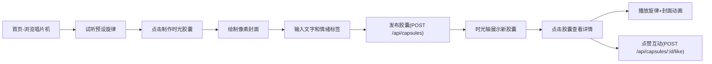

## 1. 产品概述

像素唱片机 - 音乐时光胶囊是一个怀旧像素风格的Web应用，让用户可以将8-bit电子旋律、手绘像素动画封面和情绪色彩组合成交互式唱片机体验，并在社区时间轴上分享与回味。

- 目标用户：喜欢复古电子音乐、像素艺术和创意表达的年轻用户群体
- 产品价值：提供独特的音乐可视化创作体验，结合听觉与视觉的双重表达

## 2. 核心功能

### 2.1 功能模块

1. **首页唱片机区**：像素风唱片机展示、预设旋律试听、波形动画叠加
2. **像素画板编辑区**：16x16像素网格绘制、霓虹色彩选择、画笔大小控制
3. **时光胶囊制作区**：文字描述输入、情绪标签选择、胶囊发布
4. **社区时光轴区**：胶囊缩略图横向滚动、胶囊详情弹窗、点赞互动

### 2.2 页面详情

| 页面名称 | 模块名称 | 功能描述 |
|---------|---------|---------|
| 首页 | 唱片机展示 | CSS绘制方形黑胶唱片(260px)，30rpm匀速旋转，同心圆纹理，随机暖色中心标签 |
| 首页 | 预设旋律列表 | 左侧5段8-bit电子乐(2-5秒)，点击试听，Canvas波形动画(#ff66cc→#66ffcc渐变) |
| 制作页 | 像素画板 | 16x16网格(每格10px)，背景#2a2a3a，6种霓虹色，3种画笔(1/2/4px) |
| 制作页 | 封面动画 | 自动生成5帧淡入淡出循环动画 |
| 制作页 | 胶囊发布 | 50字文字描述，5种情绪标签选择，POST提交数据 |
| 时光轴 | 胶囊列表 | 胶片strip样式横向滚动，40x40px缩略图，按时间倒序排列 |
| 时光轴 | 胶囊详情 | 120x120px封面动画弹出，旋律播放，文字+情绪展示 |
| 时光轴 | 点赞功能 | 心形按钮，同用户限一次，点赞数实时更新 |

## 3. 核心流程

用户主要流程：浏览首页唱片机 → 试听预设旋律 → 点击制作时光胶囊 → 绘制像素封面 → 输入文字和情绪 → 发布胶囊 → 在时光轴回味自己和他人的胶囊 → 点赞互动

## 4. 用户界面设计

### 4.1 设计风格

- **主色调**：深紫#0a0a1a → 暗蓝#1a1a3a 垂直渐变背景
- **辅助色**：半透明暗灰#1a1a1acc(唱片机区)，霓虹绿#00ff8844(画板边框)
- **强调色**：#ff0066→#ff66cc渐变按钮，文字#ccccdd，交互#66ccff
- **霓虹色板**：#ff0066、#00ff88、#66ccff、#ffcc00、#ff66cc、#00ffff
- **按钮样式**：扁平圆角矩形，悬停亮度+20%，点击缩小0.95倍+白色光晕
- **动画过渡**：统一0.3s ease-out
- **字体风格**：像素风/复古等宽字体

### 4.2 页面设计概述

| 页面名称 | 模块名称 | UI元素 |
|---------|---------|-------|
| 首页 | 唱片机区 | 半透明圆角容器(12px)，CSS绘制唱片，Canvas波形叠加 |
| 首页 | 旋律列表 | 左侧纵向排列，点击项高亮，霓虹边框指示播放中 |
| 制作页 | 像素画板 | 发光霓虹绿外框，清晰网格线，左侧工具栏(颜色+画笔) |
| 制作页 | 发布区 | 文字输入框(50字限制)，情绪标签单选组，渐变发布按钮 |
| 时光轴 | 胶片strip | 深灰胶片纹理，横向滚动，40x40px胶囊卡片 |
| 弹窗 | 胶囊详情 | 居中模态框，120x120px动画播放，文字描述，情绪标签，点赞按钮 |

### 4.3 响应式设计

- 桌面端(≥600px)：横向布局，唱片机+旋律列表左右排列
- 移动端(<600px)：纵向堆叠，唱片机缩放至80%，画板占满宽度
- 触控优化：增大点击热区，支持触控绘画

### 4.4 性能要求

- FCP < 1.5秒
- 交互响应延迟 < 100ms
- 唱片机转盘帧率 ≥ 30fps
