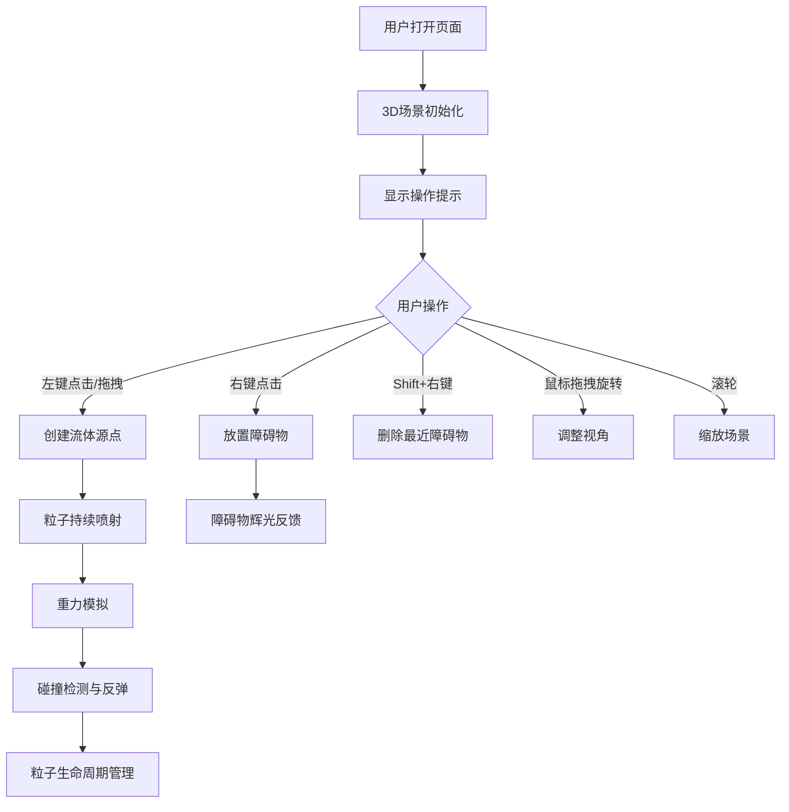

## 1. 产品概述

基于浏览器的3D流体动力学模拟交互沙盘，让用户通过鼠标交互在三维空间中创建流体源点和障碍物，实时观察粒子流在重力与碰撞影响下的动态扩散过程。面向科研演示、教育可视化和艺术创作场景。

- 核心价值：提供沉浸式3D流体模拟体验，无需安装即可在浏览器中运行
- 目标用户：教育工作者、科研人员、视觉艺术家、技术爱好者

## 2. 核心功能

### 2.1 用户角色
| 角色 | 注册方式 | 核心权限 |
|------|---------|---------|
| 普通用户 | 无需注册 | 自由交互创建源点与障碍物，观察流体模拟 |

### 2.2 功能模块
1. **3D场景渲染模块**：深空渐变背景、半透明网格地面、边界光晕
2. **粒子系统模块**：最多2000个粒子，生命周期管理，重力模拟，碰撞反弹
3. **流体源点模块**：点击/拖拽创建，持续喷射粒子，5秒后自动消失
4. **障碍物模块**：右键放置球形障碍物，碰撞辉光反馈，最多15个
5. **交互控制模块**：OrbitControls视角控制，鼠标点击拖拽交互
6. **UI监控模块**：粒子数/障碍物数/FPS实时显示，性能降级警告

### 2.3 页面详情
| 页面名称 | 模块名称 | 功能描述 |
|---------|---------|---------|
| 主场景页 | 3D渲染区域 | 全屏Canvas渲染流体模拟场景，支持视角旋转缩放 |
| 主场景页 | 左上角UI面板 | 实时显示粒子数、障碍物数、FPS、快捷键提示 |
| 主场景页 | 交互反馈层 | 点击脉冲光环、源点消失粒子环、碰撞辉光效果 |

## 3. 核心流程

用户打开页面 → 看到深空3D场景和操作提示 → 左键点击/拖拽创建流体源点 → 粒子从源点喷射并受重力下落 → 粒子与地面/障碍物碰撞反弹 → 右键放置障碍物阻挡粒子流 → Shift+右键删除障碍物 → 观察整个流体动态过程

## 4. 用户界面设计

### 4.1 设计风格
- **主色调**：深空蓝黑渐变（#000011 → #112244）
- **强调色**：蓝色(0,100,255)、紫色(150,0,255)、红色(255,50,50)粒子渐变
- **粒子风格**：从蓝→紫→红的生命周期色彩过渡，大小随速度变化
- **UI风格**：半透明无干扰，科幻实验室暗色调
- **字体**：monospace等宽字体，16px主字号
- **交互反馈**：脉冲光环、辉光、粒子环动画

### 4.2 页面设计概述
| 页面名称 | 模块名称 | UI元素 |
|---------|---------|--------|
| 主场景页 | 3D渲染区 | 全屏Canvas、深空渐变背景、网格地面、边界光晕、粒子、障碍物、源点 |
| 主场景页 | UI面板 | 粒子数（白色）、障碍物数（蓝色）、FPS（绿色背景/红色预警）、快捷键提示（半透灰） |
| 主场景页 | 动效层 | 点击脉冲光环(0.2s)、源点消失粒子环(0.3s)、碰撞辉光(0.1s)、粒子拖尾(0.2s) |

### 4.3 响应性
- 桌面端优先，全屏自适应
- Canvas随窗口大小自动调整
- 鼠标交互为主，支持触控设备基础操作

### 4.4 3D场景指引
- **环境**：深空渐变背景，无HDRI，自发光粒子营造氛围
- **光照**：环境光+方向光，障碍物使用Phong高光材质
- **相机**：初始位置(10,8,10)朝向原点，OrbitControls旋转限制垂直-30°~80°，缩放0.5x~5x
- **构图**：原点为场景中心，20x20地面平面，视觉焦点在粒子流运动区域
- **交互**：左键创建源点、右键放置障碍、Shift+右键删除、拖拽旋转、滚轮缩放
- **后处理**：粒子Additive blending产生辉光效果
- **性能预算**：1080p下1000粒子≥55fps，2000粒子≥45fps
