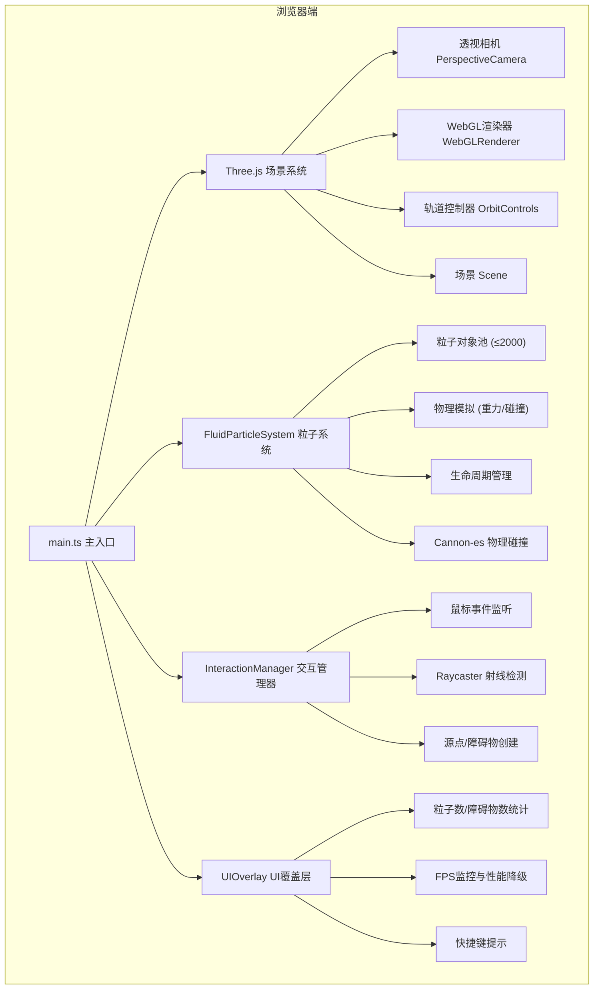

## 1. 架构设计



## 2. 技术描述
- **前端框架**：TypeScript + Vite（原生Three.js，无React/Vue）
- **3D渲染**：Three.js@0.160.0
- **物理引擎**：Cannon-es@0.20.0（粒子碰撞检测）
- **初始化工具**：Vite vanilla-ts 模板
- **后端**：无（纯前端应用）
- **数据库**：无

## 3. 项目文件结构
```
auto66/
├── package.json
├── index.html
├── tsconfig.json
├── vite.config.js
└── src/
    ├── main.ts
    ├── FluidParticleSystem.ts
    ├── InteractionManager.ts
    └── UIOverlay.ts
```

## 4. 核心模块与API定义

### 4.1 FluidParticleSystem
```typescript
interface Particle {
  position: THREE.Vector3;
  velocity: THREE.Vector3;
  age: number;
  lifespan: number;
  size: number;
  isOnGround: boolean;
  groundTime: number;
  trail: THREE.Vector3[];
}

class FluidParticleSystem {
  constructor(scene: THREE.Scene, world: CANNON.World);
  update(deltaTime: number): void;
  emitParticle(position: THREE.Vector3, direction: THREE.Vector3): void;
  getParticleCount(): number;
  setEmitRateMultiplier(multiplier: number): void;
}
```

### 4.2 InteractionManager
```typescript
interface FluidSource {
  position: THREE.Vector3;
  direction: THREE.Vector3;
  age: number;
  lifespan: number;
  emitRate: number;
  lastEmitTime: number;
}

interface Obstacle {
  mesh: THREE.Mesh;
  body: CANNON.Body;
  glowIntensity: number;
  createdAt: number;
}

class InteractionManager {
  constructor(
    scene: THREE.Scene,
    camera: THREE.Camera,
    renderer: THREE.WebGLRenderer,
    particleSystem: FluidParticleSystem,
    world: CANNON.World
  );
  update(deltaTime: number): void;
  getObstacleCount(): number;
  getSourceCount(): number;
}
```

### 4.3 UIOverlay
```typescript
class UIOverlay {
  constructor(container: HTMLElement);
  update(particleCount: number, obstacleCount: number, fps: number): void;
  showPerformanceDegraded(): void;
  hidePerformanceDegraded(): void;
}
```

## 5. 关键技术实现

### 5.1 粒子渲染优化
- 使用 `THREE.Points` + `BufferGeometry` 批量渲染所有粒子
- 采用 `AdditiveBlending` 实现粒子辉光效果
- 预分配BufferGeometry最大容量（2000粒子），避免频繁内存分配

### 5.2 物理碰撞
- Cannon-es 管理地面平面和障碍物的刚体碰撞体
- 粒子采用简化碰撞检测（距离检测 vs 球体/平面），避免每粒子创建Cannon刚体
- 地面碰撞：y≤0时反弹（restitution 0.3）+ 随机扰动
- 障碍物碰撞：粒子与球心距离≤半径+粒子半径时沿法线反弹（restitution 0.5）

### 5.3 性能降级策略
- FPS采样：每500ms计算一次平滑FPS
- 当FPS<40时：粒子发射速率降至50%，UI显示"性能降级"警告
- FPS恢复≥50持续3秒后：自动恢复正常发射速率

### 5.4 交互反馈动画
- 脉冲光环：使用 `THREE.RingGeometry` + 自定义Shader实现缩放淡出
- 源点消失环：环形粒子爆发，0.3秒内扩散淡出
- 碰撞辉光：障碍物材质emissive强度插值衰减
- 粒子拖尾：每粒子存储最近N个位置，用Line渲染渐隐轨迹
