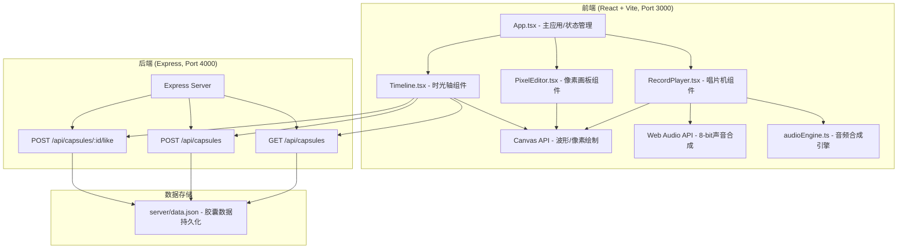
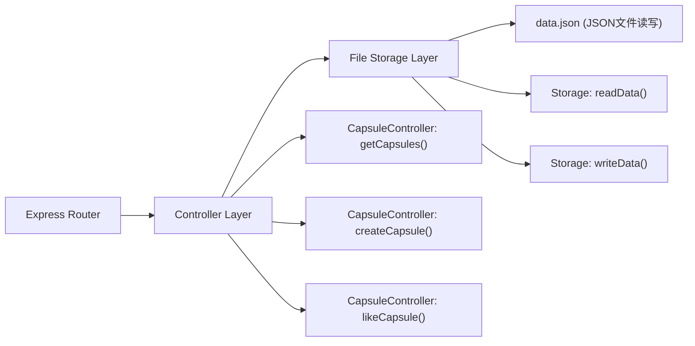
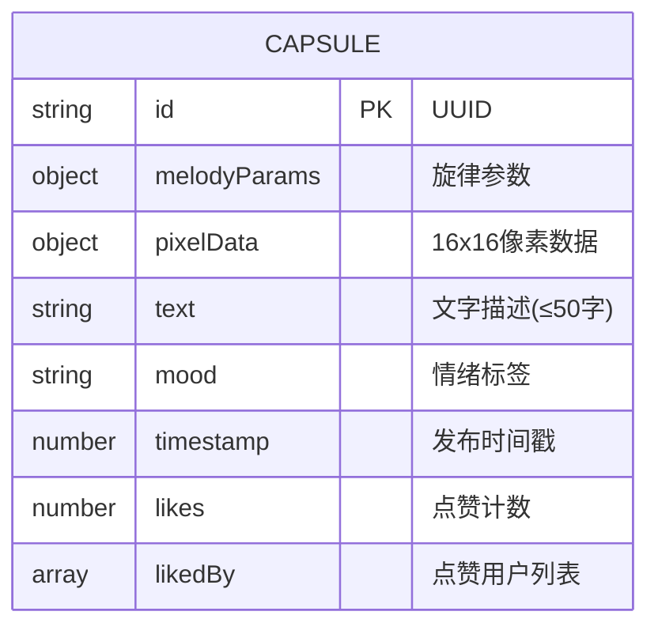

## 1. 架构设计



## 2. 技术说明

- **前端框架**：React@18.2.0 + React DOM@18.2.0
- **构建工具**：Vite@5.4.0 + @vitejs/plugin-react@4.2.0
- **开发语言**：TypeScript@5.5.0 (严格模式, ES2020)
- **后端框架**：Express@4.18.2
- **跨域处理**：cors@2.8.5
- **ID生成**：uuid@9.0.0
- **音频处理**：Web Audio API (原生，无需额外库)
- **图形绘制**：Canvas API (原生，无需额外库)

## 3. 路由定义

前端为单页应用(SPA)，使用内部状态管理页面切换：

| 视图 | 说明 |
|------|------|
| home | 首页：唱片机 + 预设旋律 + 时光轴 |
| create | 制作页：像素画板 + 发布表单 |

## 4. API 定义

### 4.1 类型定义

```typescript
// 旋律参数 - 用于合成8-bit音乐
interface MelodyParams {
  type: 'sine' | 'square';
  notes: Array<{
    frequency: number;
    duration: number; // 秒
    startTime: number; // 相对起始时间
  }>;
  totalDuration: number; // 总时长 2-5秒
}

// 像素数据 - 16x16 RGBA像素数组
type PixelData = string[][]; // 16x16，存储颜色值或空字符串

// 情绪标签类型
type MoodTag = '兴奋' | '平静' | '忧郁' | '怀旧' | '迷幻';

// 胶囊完整数据
interface Capsule {
  id: string; // uuid
  melodyParams: MelodyParams;
  pixelData: PixelData;
  text: string; // 最多50字
  mood: MoodTag;
  timestamp: number; // 发布时间戳
  likes: number; // 点赞数
  likedBy: string[]; // 点赞用户标识(localStorage)
}
```

### 4.2 接口说明

#### GET /api/capsules
获取所有胶囊列表，按发布时间倒序排列

**响应**：
```json
{
  "success": true,
  "data": Capsule[]
}
```

#### POST /api/capsules
创建新的时光胶囊

**请求体**：
```json
{
  "melodyParams": MelodyParams,
  "pixelData": PixelData,
  "text": string,
  "mood": MoodTag
}
```

**响应**：
```json
{
  "success": true,
  "data": { "id": string }
}
```

#### POST /api/capsules/:id/like
对指定胶囊点赞

**请求体**：
```json
{
  "userId": string // 基于localStorage生成的用户标识
}
```

**响应**：
```json
{
  "success": true,
  "data": { "likes": number, "liked": boolean }
}
```

## 5. 服务端架构



## 6. 数据模型

### 6.1 数据结构定义



### 6.2 server/data.json 示例

```json
{
  "capsules": [
    {
      "id": "a1b2c3d4-e5f6-7890-abcd-ef1234567890",
      "melodyParams": {
        "type": "square",
        "notes": [
          { "frequency": 440, "duration": 0.25, "startTime": 0 },
          { "frequency": 523, "duration": 0.25, "startTime": 0.25 }
        ],
        "totalDuration": 2.0
      },
      "pixelData": [["#ff0066", "", ...], ...],
      "text": "夏日午后的阳光",
      "mood": "平静",
      "timestamp": 1717900000000,
      "likes": 3,
      "likedBy": ["user-xxx", "user-yyy", "user-zzz"]
    }
  ]
}
```

## 7. 项目文件结构

```
auto66/
├── package.json          # 根目录依赖和启动脚本
├── index.html            # Vite入口HTML
├── tsconfig.json         # TypeScript配置
├── vite.config.js        # Vite配置(端口3000, proxy到4000)
├── src/
│   ├── App.tsx           # 主应用组件
│   ├── components/
│   │   ├── RecordPlayer.tsx   # 唱片机组件
│   │   ├── PixelEditor.tsx    # 像素画板组件
│   │   └── Timeline.tsx       # 时光轴组件
│   └── utils/
│       └── audioEngine.ts     # 音频引擎工具
└── server/
    ├── package.json      # 后端依赖
    ├── index.js          # Express服务端
    └── data.json         # 数据存储文件
```
