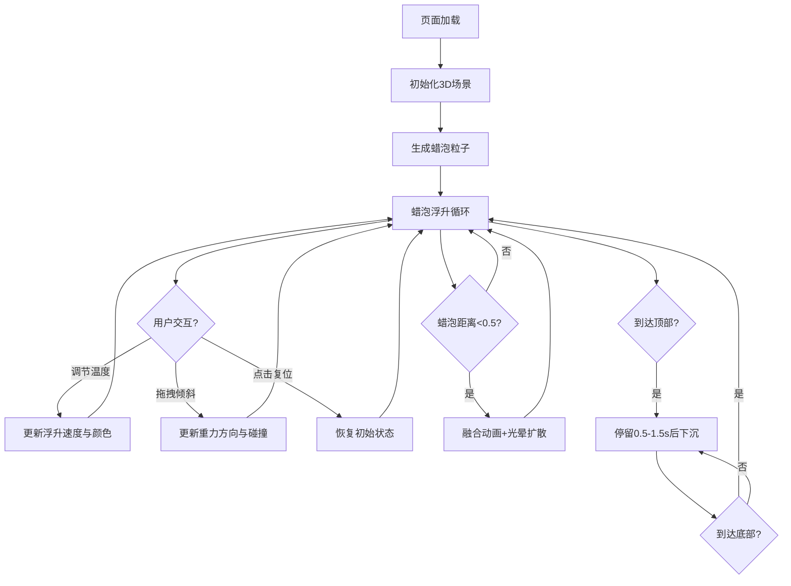

## 1. 产品概述

基于浏览器的虚拟熔岩灯互动艺术应用，让用户化身熔岩艺术师，沉浸式观察彩色蜡泡在玻璃瓶中的浮升、变形、融合与破碎过程，并通过温度调节和瓶身倾斜改变蜡泡的运动模式。

- 目标用户：艺术爱好者、视觉交互体验用户、休闲娱乐用户
- 核心价值：提供沉浸式的熔岩灯视觉体验，通过物理模拟和实时交互创造独特的数字艺术观感

## 2. 核心功能

### 2.1 用户角色

| 角色 | 注册方式 | 核心权限 |
|------|---------|---------|
| 访客用户 | 无需注册 | 体验全部交互功能 |

### 2.2 功能模块

1. **3D熔岩灯渲染模块**：玻璃瓶、液体、蜡泡粒子系统的实时渲染
2. **物理模拟模块**：蜡泡浮升、下沉、变形、融合、碰撞检测
3. **用户交互模块**：鼠标拖拽倾斜瓶身、温度滑块调节、复位按钮
4. **视觉特效模块**：光晕粒子、高光、玻璃质感、霓虹发光效果

### 2.3 功能详情

| 页面名称 | 模块名称 | 功能描述 |
|---------|---------|---------|
| 主界面 | 熔岩灯3D场景 | 居中显示完整熔岩灯，包含玻璃瓶、液体、蜡泡粒子系统 |
| 主界面 | 温度控制面板 | 左上角温度滑块（0-100），实时调节浮升速度和液体颜色 |
| 主界面 | 底部控制栏 | 半透明玻璃拟态风格，包含温度滑块和倾斜复位按钮 |
| 主界面 | 蜡泡物理系统 | 20-30个蜡泡，浮升、下沉、变形、融合动画，碰撞检测 |
| 主界面 | 鼠标交互 | 拖拽瓶身实现0-30度倾斜，蜡泡受重力方向影响 |

## 3. 核心流程

用户打开页面 → 熔岩灯自动开始运行，蜡泡从瓶底浮升 → 用户调节温度滑块改变浮升速度和颜色 → 用户拖拽瓶身倾斜观察蜡泡运动变化 → 蜡泡融合产生光晕特效 → 用户点击复位按钮恢复初始状态

## 4. 用户界面设计

### 4.1 设计风格

- **主色调**：深黑背景 #0a0a0a，霓虹蓝 #00ccff，蜡泡色彩（红#ff3300、紫#aa00ff、橙#ff8800、青#00ffaa）
- **按钮风格**：霓虹蓝按钮，悬停时发光扩散，0.3秒过渡动画
- **字体**：现代无衬线字体，简洁极简风格
- **布局风格**：全屏居中布局，底部半透明控制栏，极简玻璃拟态（glassmorphism）
- **视觉风格**：暗黑霓虹美学，高对比度，柔和光晕过渡

### 4.2 页面设计概览

| 页面名称 | 模块名称 | UI元素 |
|---------|---------|--------|
| 主界面 | 3D场景容器 | 全屏Canvas，深黑背景，熔岩灯居中 |
| 主界面 | 温度滑块 | 左上角，霓虹蓝色调，带温度数值显示 |
| 主界面 | 底部控制栏 | 半透明白色#ffffff22，磨砂玻璃质感，含温度滑块和复位按钮 |
| 主界面 | 复位按钮 | 霓虹蓝#00ccff，悬停发光，0.3s过渡动画 |

### 4.3 响应式设计

- 桌面端优先设计，全屏Canvas自适应窗口尺寸
- 控制面板在小屏幕上自适应布局
- 鼠标拖拽支持桌面端，预留移动端触控扩展能力

### 4.4 3D场景指导

- **环境与氛围**：纯黑背景 #0a0a0a，营造沉浸式暗色氛围
- **灯光设置**：环境光 + 点光源，突出蜡泡高光和玻璃折射感
- **相机设置**：PerspectiveCamera，适度距离，熔岩灯居中完整显示
- **场景构成**：玻璃瓶（半透明圆柱+半球底+金属盖）、内部液体、蜡泡粒子系统
- **交互动画**：蜡泡浮升/下沉循环、形状形变、融合光晕、瓶身倾斜
- **后期效果**：玻璃材质透明度、蜡泡内部高光、融合光晕径向渐变扩散
- **性能预算**：蜡泡≤50个，帧率≥30FPS，每帧物理更新≤5ms
