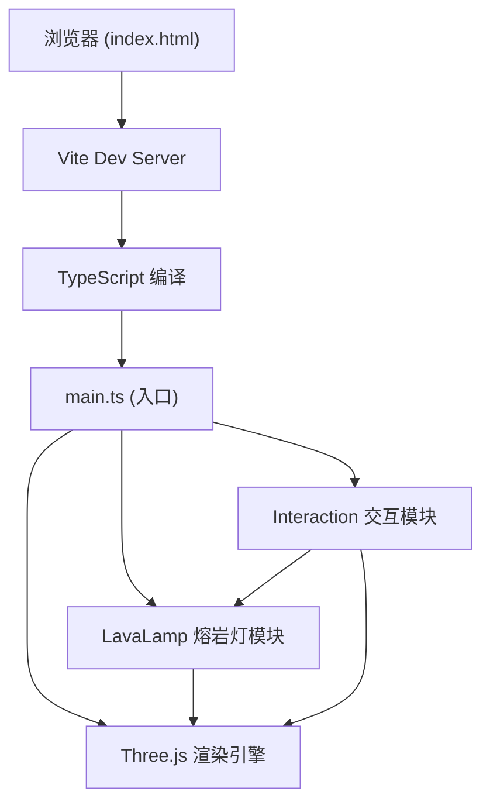

## 1. 架构设计



## 2. 技术说明

- **前端框架**：纯 TypeScript + Three.js（无React/Vue，根据需求使用原生Three.js）
- **构建工具**：Vite@5.4.0
- **语言版本**：TypeScript@5.5.0（严格模式，ES2020目标）
- **3D引擎**：Three.js@0.160.0
- **噪声库**：simplex-noise@3.0.0（用于蜡泡形变）
- **后端**：无（纯前端应用）
- **数据库**：无

## 3. 文件结构

| 文件路径 | 用途 |
|---------|------|
| /package.json | 项目依赖与启动脚本 |
| /index.html | 入口HTML，全屏Canvas，暗色背景 |
| /tsconfig.json | TypeScript严格模式配置 |
| /vite.config.js | Vite构建配置，启用TypeScript |
| /src/main.ts | 应用入口：场景、相机、灯光、渲染循环初始化 |
| /src/lavaLamp.ts | 熔岩灯核心：玻璃瓶创建、蜡泡粒子系统、浮升/变形/融合/碰撞物理 |
| /src/interaction.ts | 用户交互：鼠标拖拽倾斜、温度滑块、控制面板UI |

## 4. 核心模块设计

### 4.1 LavaLamp 模块

```typescript
interface WaxBlob {
  mesh: THREE.Mesh;
  position: THREE.Vector3;
  velocity: THREE.Vector3;
  radius: number;
  baseRadius: number;
  color: THREE.Color;
  phase: 'rising' | 'sinking' | 'resting';
  restTimer: number;
  riseSpeed: number;
  sinkSpeed: number;
  deformationOffset: number;
  scaleMultiplier: THREE.Vector3;
  id: number;
}

interface GlowParticle {
  mesh: THREE.Mesh;
  velocity: THREE.Vector3;
  life: number;
  maxLife: number;
  color: THREE.Color;
}

class LavaLamp {
  container: THREE.Group;
  glass: THREE.Mesh;
  liquid: THREE.Mesh;
  cap: THREE.Mesh;
  blobs: WaxBlob[];
  glowParticles: GlowParticle[];
  temperature: number;
  tiltX: number;
  tiltZ: number;
  
  constructor(scene: THREE.Scene);
  createGlassBottle(): void;
  createLiquid(): void;
  createCap(): void;
  createBlobs(count: number): void;
  createGlowParticles(position: THREE.Vector3, color: THREE.Color, count: number): void;
  update(deltaTime: number): void;
  updateBlobs(deltaTime: number): void;
  updateGlowParticles(deltaTime: number): void;
  checkCollisions(): void;
  mergeBlobs(blobA: WaxBlob, blobB: WaxBlob): void;
  setTemperature(value: number): void;
  setTilt(x: number, z: number): void;
  resetTilt(): void;
}
```

### 4.2 Interaction 模块

```typescript
class InteractionManager {
  lavaLamp: LavaLamp;
  camera: THREE.Camera;
  domElement: HTMLElement;
  isDragging: boolean;
  previousMouse: { x: number; y: number };
  temperatureSlider: HTMLInputElement;
  resetButton: HTMLButtonElement;
  
  constructor(lavaLamp: LavaLamp, camera: THREE.Camera, domElement: HTMLElement);
  setupUI(): void;
  setupMouseDrag(): void;
  setupTemperatureSlider(): void;
  setupResetButton(): void;
  onMouseDown(event: MouseEvent): void;
  onMouseMove(event: MouseEvent): void;
  onMouseUp(event: MouseEvent): void;
}
```

## 5. 性能优化策略

1. **蜡泡数量限制**：总数≤50个（含融合后大蜡泡），初始20-30个
2. **几何复用**：使用SphereGeometry实例复用，避免重复创建
3. **材质复用**：相同颜色蜡泡共享材质实例
4. **碰撞优化**：空间分块检测，避免O(n²)全量检测
5. **帧率目标**：稳定30FPS以上，使用requestAnimationFrame
6. **物理更新**：每帧物理计算≤5ms，简化数学运算

## 6. 物理参数配置

| 参数 | 值范围 | 说明 |
|-----|--------|------|
| 蜡泡初始半径 | 0.15-0.4 | 随机椭球体大小 |
| 浮升速度 | 0.3-0.8 单位/秒 | 受温度乘数1.0-2.0影响 |
| 下沉速度 | 0.2-0.4 单位/秒 | 相对稳定 |
| 融合阈值 | 0.5 单位 | 两蜡泡距离小于此值触发融合 |
| 融合时间 | 0.5 秒 | 融合动画持续时间 |
| 顶部停留时间 | 0.5-1.5 秒 | 随机停留 |
| 倾斜角度范围 | 0-30 度 | X/Z轴 |
| 温度范围 | 0-100 | 影响速度与颜色 |
| 形变缩放 | 0.8-1.2 | 浮升时随机形变 |
| 光晕粒子数 | 10个/次 | 融合时产生 |
| 光晕寿命 | 1 秒 | 消散时间 |
