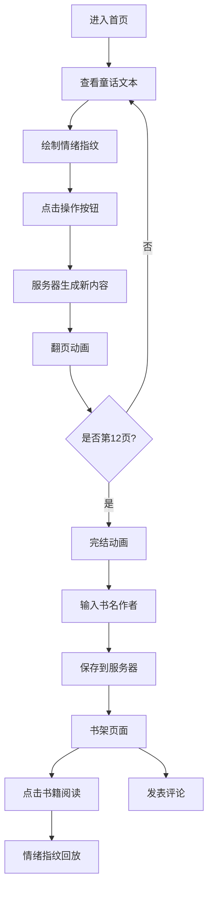

## 1. 产品概述
虚拟童话故事书共创与情绪指纹应用，用户可共同编织随触摸展开的互动童话，并留下独特的情绪色彩。
- 解决用户无法共同创作互动童话、无法在故事中留下个性化情绪印记的问题
- 面向喜欢创意写作、童话爱好者、亲子互动的用户群体

## 2. 核心功能

### 2.1 功能模块
1. **首页（创作页）**：3D/2D 童话书展示、情绪指纹绘制、故事生成按钮
2. **书架页面**：已完成书籍展示、评论气泡、只读阅读模式
3. **阅读页面**：翻页浏览、情绪指纹动态回放

### 2.2 页面详情
| 页面名称 | 模块名称 | 功能描述 |
|---------|---------|---------|
| 首页 | 3D童话书 | Three.js 渲染 3D 书本模型，书页渐变，封面烫金纹理 |
| 首页 | 童话文本 | 左侧动态生成童话文本段落（4-6行） |
| 首页 | 情绪指纹 | Canvas 粒子轨迹绘制，颜色随拖拽速度变化，3秒后淡出 |
| 首页 | 操作按钮 | "延续情节"、"添加角色"、"改变场景"三个水晶按钮 |
| 首页 | 翻页动画 | 0.6秒书页翻转，纸张弯曲变形效果 |
| 首页 | 完结动画 | 书本合拢，情绪指纹融合图案，书名作者输入 |
| 书架页 | 书籍网格 | 3行4列响应式布局，Canvas 绘制微缩书本封面 |
| 书架页 | 评论气泡 | 封面上方浮动评论气泡，颜色取自用户情绪指纹平均色 |
| 阅读页 | 只读浏览 | 翻页查看全部内容 |
| 阅读页 | 情绪回放 | 彩色粒子轨迹按时间顺序2倍速重演 |

## 3. 核心流程
用户进入首页 → 查看当前童话文本 → 在右侧页面拖拽绘制情绪指纹 → 点击操作按钮生成新内容 → 触发翻页动画 → 重复直到完成12页 → 输入书名作者保存 → 在书架查看所有作品 → 可评论其他作品

## 4. 用户界面设计
### 4.1 设计风格
- **主色**：米白 #f5eedc、浅棕 #d4c4a8、深棕 #8b6f47、暗棕 #6b4e3a、红色 #c0392b
- **辅色**：蓝 #4488ff、绿 #44cc88、红 #ff6644（情绪粒子色）
- **按钮**：水晶质感，弹性缩放反馈（scale 0.95 → 1.05）
- **字体**：Playfair Display（衬线体）
- **布局**：桌面端 3D 书本，移动端 CSS 3D 模拟纸片翻转
- **图标**：童话风格装饰元素

### 4.2 页面设计概览
| 页面名称 | 模块名称 | UI 元素 |
|---------|---------|---------|
| 首页 | 3D童话书 | Three.js 场景，书页渐变，古铜烫金封面，环境光照 |
| 首页 | 情绪画布 | 透明 Canvas 叠加，半透明彩色粒子轨迹 |
| 首页 | 水晶按钮 | 底部居中排列，渐变背景，阴影，hover 发光效果 |
| 书架页 | 书籍网格 | 响应式网格布局，Canvas 微缩书本，悬浮倾斜效果 |
| 书架页 | 评论气泡 | 浮动小气泡，渐隐渐现，颜色与情绪关联 |
| 阅读页 | 回放控制 | 播放/暂停按钮，时间进度指示 |

### 4.3 响应式设计
- **桌面端**（>768px）：Three.js 3D 书本模型，4列书架
- **平板端**（480-768px）：CSS 3D 2D 翻页，3列书架
- **手机端**（<480px）：CSS 3D 2D 翻页，2列书架
- **触摸优化**：所有交互元素热区放大 1.2x（padding 8px）
- **动画缓动**：翻页 cubic-bezier(0.25, 0.46, 0.45, 0.94)，粒子淡出 ease-out

### 4.4 3D 场景指南
- **环境**：温馨书房氛围，柔和暖色调环境光
- **光照**：AmbientLight + DirectionalLight，模拟台灯效果
- **相机**：PerspectiveCamera，45° FOV，轻微俯视角度
- **构图**：书本居中，周围留白，聚焦书页内容
- **交互**：鼠标悬停轻微倾斜，翻页时相机轻微推进
- **后期**：轻微泛光（Bloom）增强水晶按钮和烫金质感
- **性能**：书本低面数模型，粒子限制 300 以内，保持 60fps
