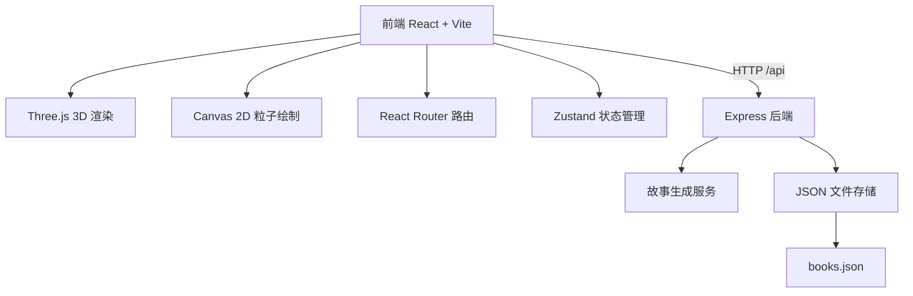
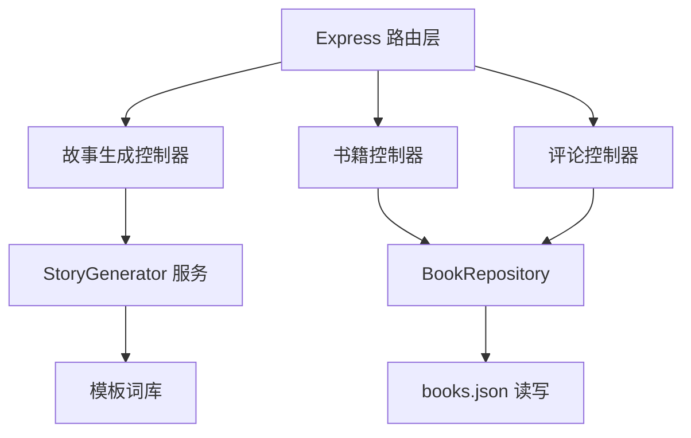
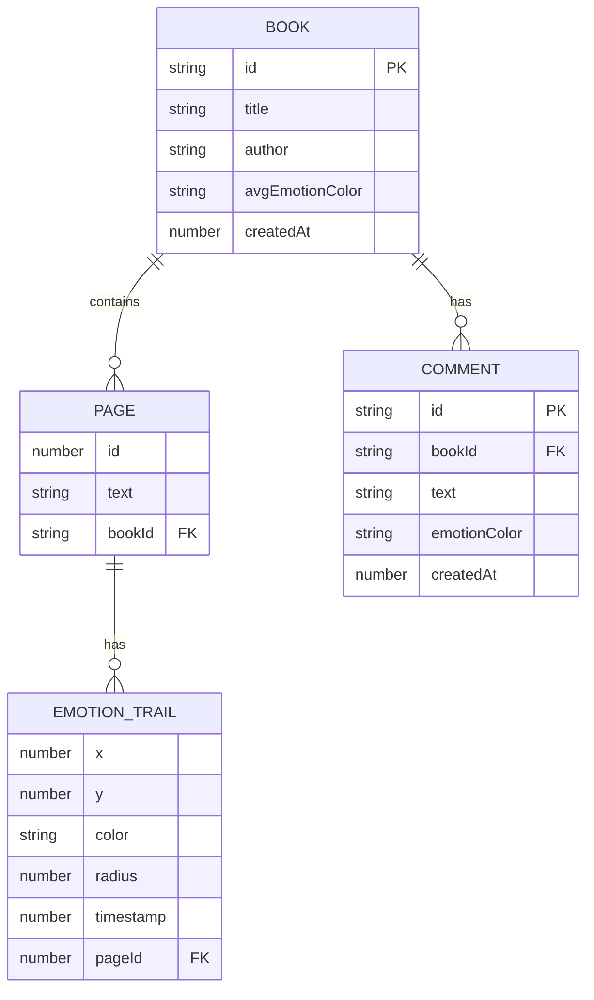

## 1. 架构设计


## 2. 技术描述
- **前端**：React@18.2.0 + TypeScript@5.5.0 + Vite@5.4.0
- **3D 渲染**：Three.js@0.160.0
- **后端**：Express@4.18.2 + TypeScript
- **数据存储**：JSON 文件（books.json）
- **样式**：原生 CSS + CSS 变量（复古童话配色）
- **字体**：Google Fonts Playfair Display
- **状态管理**：Zustand（轻量级全局状态）

## 3. 路由定义
| 路由 | 用途 |
|-----|-----|
| / | 首页（创作页面，3D 童话书 + 情绪指纹） |
| /bookshelf | 公共书架（展示所有完成的童话书） |
| /read/:id | 只读阅读模式（翻页 + 情绪指纹回放） |

## 4. API 定义
```typescript
// 故事页面
interface StoryPage {
  id: number;
  text: string;
  emotionTrails: EmotionTrail[];
}

// 情绪轨迹
interface EmotionTrail {
  x: number;
  y: number;
  color: string;
  radius: number;
  timestamp: number;
}

// 书籍
interface Book {
  id: string;
  title: string;
  author: string;
  pages: StoryPage[];
  avgEmotionColor: string;
  createdAt: number;
  comments: Comment[];
}

// 评论
interface Comment {
  id: string;
  bookId: string;
  text: string;
  emotionColor: string;
  createdAt: number;
}

// 请求类型
type GenerateType = 'continue' | 'character' | 'scene';

interface GenerateRequest {
  currentText: string;
  type: GenerateType;
  pageNumber: number;
}

interface GenerateResponse {
  text: string;
}

interface SaveBookRequest {
  title: string;
  author: string;
  pages: StoryPage[];
  avgEmotionColor: string;
}

interface CommentRequest {
  bookId: string;
  text: string;
  emotionColor: string;
}
```

| API 路径 | 方法 | 描述 |
|---------|------|-----|
| /api/generate | POST | 生成新的故事段落/角色/场景 |
| /api/books | GET | 获取所有已完成的书籍列表 |
| /api/books/:id | GET | 获取单本书详情 |
| /api/books | POST | 保存新完成的书籍 |
| /api/books/:id/comments | POST | 为书籍添加评论 |

## 5. 服务端架构图


## 6. 数据模型

### 6.1 数据模型定义


### 6.2 books.json 初始数据
```json
[]
```
